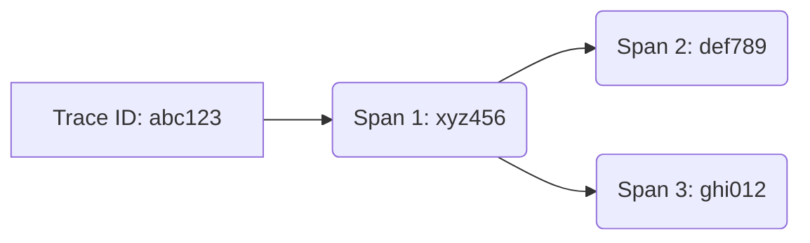

# 追踪ID与Span ID

在分布式系统中，一个用户请求可能会跨越多个服务。为了理解请求的完整路径和性能瓶颈，我们需要一种机制来追踪请求的流动。Jaeger作为分布式追踪系统，通过**Trace ID**和**Span ID**实现了这一目标。本文将详细介绍这两个核心概念。

## 什么是Trace ID和Span ID？

- **Trace ID**：唯一标识一个完整的请求链路。所有属于同一请求的Span共享相同的Trace ID。
- **Span ID**：标识请求链路中的一个特定操作（如服务调用或数据库查询）。每个Span有唯一的Span ID。

:::note 类比理解
想象Trace ID是快递单号，Span ID是包裹在运输过程中每个中转站的记录编号。通过单号可以追踪整个运输过程，而每个中转站记录则提供了详细节点信息。
:::

## 结构解析

### Trace ID
- 通常为128位或64位十六进制字符串（如 `3e1a6e6e8e3b4e2a`）
- 全局唯一，贯穿整个请求生命周期

### Span ID
- 通常为64位十六进制字符串（如 `5b8a1e2e3d4f6a2b`）
- 仅在当前Trace上下文中唯一

## 父子关系

Span之间通过父子关系形成调用链：



上图中：
- 所有Span共享Trace ID `abc123`
- Span 1是根Span
- Span 2和Span 3是Span 1的子Span

## 代码示例

以下是使用OpenTelemetry SDK创建Span的示例：

```python
from opentelemetry import trace

tracer = trace.get_tracer("my.tracer")

# 创建新Trace（自动生成Trace ID）
with tracer.start_as_current_span("parent-span") as parent:
    # 获取当前Trace ID和Span ID
    ctx = parent.get_span_context()
    print(f"Trace ID: {ctx.trace_id:x}")
    print(f"Parent Span ID: {ctx.span_id:x}")
    
    # 创建子Span
    with tracer.start_as_current_span("child-span") as child:
        ctx = child.get_span_context()
        print(f"Child Span ID: {ctx.span_id:x}")
```

可能的输出：
```
Trace ID: 3e1a6e6e8e3b4e2a
Parent Span ID: 5b8a1e2e3d4f6a2b
Child Span ID: 7c9b2f3e4d5e6f7a
```

## 实际应用场景

### 问题诊断
当电商网站出现支付延迟时：
1. 通过Trace ID找到完整请求链路
2. 检查各Span ID对应的操作耗时
3. 发现数据库查询Span耗时异常

### 服务拓扑分析
通过分析Trace ID关联的Span ID分布，可以自动绘制服务依赖图。

## 总结

关键要点：
1. Trace ID是请求的全局标识符
2. Span ID标识特定操作
3. 父子关系形成调用链
4. 两者协同工作提供完整的分布式追踪能力

:::tip 实践建议
1. 在日志中统一记录Trace ID，便于关联分析
2. Span命名应具有描述性（如 `checkout-process` 而非 `span-1`）
3. 合理设置Span粒度（通常每个重要操作一个Span）
:::

## 扩展学习

1. 尝试在Jaeger UI中追踪一个示例请求，观察ID的显示方式
2. 实现一个简单的多服务调用链，验证ID传播机制
3. 阅读[OpenTelemetry规范](https://opentelemetry.io/docs/concepts/observability-primer/)了解更多上下文传播细节