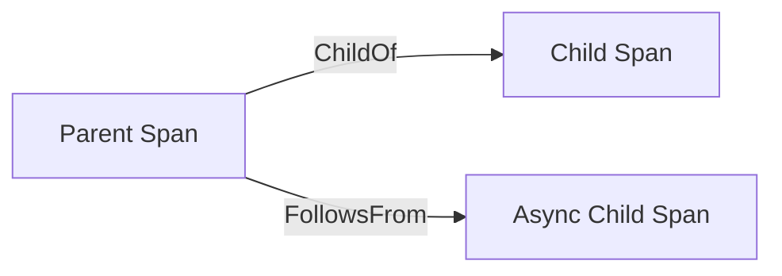
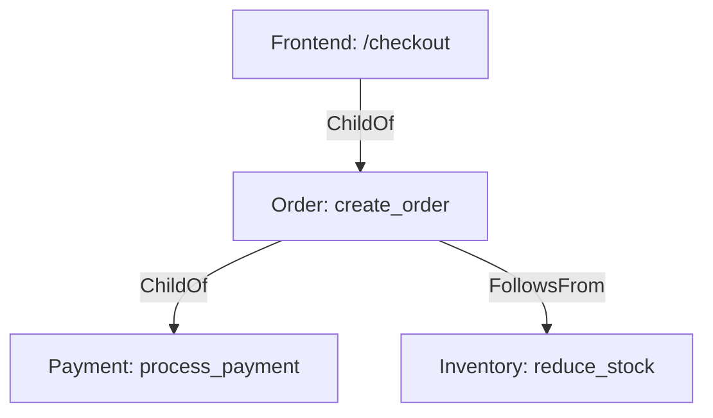

## 介绍

在分布式系统中，一个请求可能跨越多个服务，形成复杂的调用链。Jaeger通过**父子关系模型（Parent-Child Relationship）**来组织这些调用链中的Span（追踪的基本单元），帮助开发者直观地理解请求的流转路径。

父子关系模型的核心是：
- **父Span（Parent Span）**：发起操作的Span（例如HTTP请求的客户端）。
- **子Span（Child Span）**：被父Span直接调用的操作（例如服务端处理请求的Span）。

:::tip
父子关系是**直接调用关系**，而非时间上的先后关系。子Span必须在父Span的上下文内创建。
:::

---

## 基础概念

### 1. Span的层级类型
Jaeger支持以下两种层级关系：
1. **ChildOf**：子Span依赖父Span的结果（同步调用，如HTTP请求）。
2. **FollowsFrom**：子Span与父Span是松散的时序关系（异步调用，如消息队列）。



### 2. 上下文传递
父Span通过`trace_id`和`span_id`将上下文传递给子Span，确保链路完整。例如：
- HTTP请求通过`traceparent`头部传递上下文。
- gRPC通过元数据（metadata）传递。

---

## 代码示例

### 场景：HTTP服务调用链
假设有一个订单服务（Order Service）调用支付服务（Payment Service）。

#### 1. 父Span（Order Service）
```python
from opentelemetry import trace
from opentelemetry.sdk.trace import TracerProvider

trace.set_tracer_provider(TracerProvider())
tracer = trace.get_tracer("order.service")

# 创建父Span
with tracer.start_as_current_span("create_order") as parent_span:
    # 模拟业务逻辑
    headers = {"traceparent": trace.propagation.format_traceparent(parent_span.get_span_context())}
    # 调用支付服务（子Span）
    call_payment_service(headers)
```

#### 2. 子Span（Payment Service）
```python
def call_payment_service(headers):
    ctx = trace.propagation.extract(headers)
    with tracer.start_as_current_span("process_payment", context=ctx) as child_span:
        print(f"Processing payment under trace: {child_span.context.trace_id}")
```

---

## 实际案例

### 电商系统中的调用链
一个用户下单请求的完整父子关系链：
1. **前端**发起`/checkout`请求（Root Span）。
2. **订单服务**创建子Span `create_order`，并调用支付服务。
3. **支付服务**创建子Span `process_payment`。
4. **库存服务**异步扣减库存（`FollowsFrom`关系）。



---

## 总结

- 父子关系模型是Jaeger组织Span的核心方式，反映服务间的直接调用依赖。
- 使用`ChildOf`或`FollowsFrom`明确Span关系，避免链路歧义。
- 上下文传递（如HTTP头部）是跨服务追踪的关键。

---

## 扩展练习
1. 尝试用Jaeger UI查看一个真实请求的父子Span层级。
2. 修改代码，模拟一个异步消息队列的`FollowsFrom`场景。

:::note
深入学习：参考[OpenTelemetry Span文档](https://opentelemetry.io/docs/concepts/signals/spans/)。
:::