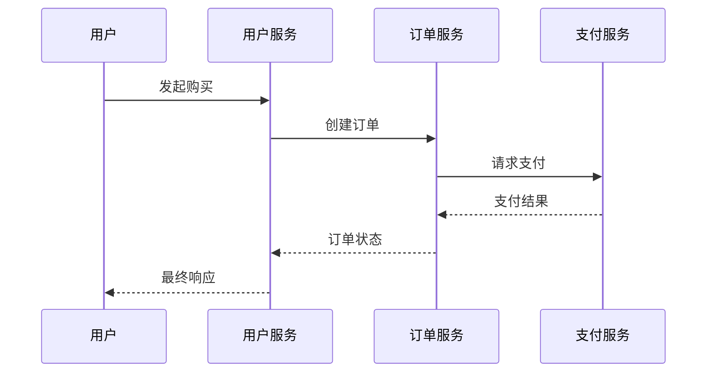
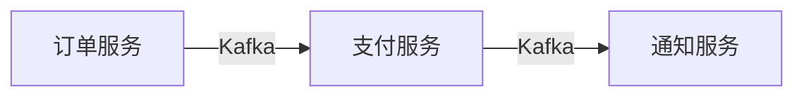

# 微服务追踪挑战

## 介绍

在微服务架构中，一个用户请求可能跨越多个服务，每个服务又可能调用其他服务或数据库。这种分布式特性使得**追踪请求的完整生命周期**变得异常困难。本文将探讨微服务追踪的核心挑战，并通过实际案例和代码示例展示如何用Jaeger等工具应对这些挑战。

---

## 为什么需要分布式追踪？

假设一个电商应用包含以下服务：
1. **用户服务**（验证用户）
2. **订单服务**（创建订单）
3. **支付服务**（处理付款）

当用户点击"购买"时，请求会依次经过这三个服务。如果支付失败，如何快速定位是网络问题、库存不足，还是支付网关超时？这就是分布式追踪要解决的问题。



---

## 核心挑战

### 1. 跨服务上下文传递

每个服务需要自动传递**追踪上下文**（如Trace ID、Span ID），否则无法关联请求。

:::caution 常见错误
手动在每个HTTP请求头中添加`X-Trace-Id`容易遗漏，导致链路断裂：
```go
// 错误示例：手动传递（易遗漏）
req.Header.Add("X-Trace-Id", traceID)
```
:::

**解决方案**：使用OpenTelemetry等库自动注入上下文：
```go
// 正确示例：自动注入（推荐）
import "go.opentelemetry.io/otel"
tracer := otel.Tracer("order-service")
ctx, span := tracer.Start(ctx, "process_order")
defer span.End()
```

---

### 2. 采样与性能开销

全量收集追踪数据可能带来性能损耗，尤其是高频服务。

:::tip 平衡策略
- **头部采样**：在入口服务决定是否采样（如1%请求）
- **尾部采样**：先收集所有数据，后期按规则过滤
:::

Jaeger配置示例：
```yaml
sampling:
  strategies:
    - type: probabilistic
      param: 0.01  # 1%采样率
```

---

### 3. 异步调用追踪

消息队列（如Kafka）中的异步调用会打破直接关联。

**案例**：订单服务发送支付事件后不等待响应：


**解决方案**：通过消息头传递追踪上下文：
```python
# Python示例（使用OpenTelemetry）
from opentelemetry.propagate import inject
headers = {}
inject(headers)
producer.send("payments", value=data, headers=headers)
```

---

### 4. 多语言支持

微服务可能用不同语言编写（如Go+Java+Python），需要统一的追踪标准。

**Jaeger的优势**：
- 支持[10+种语言的SDK](https://www.jaegertracing.io/docs/latest/client-libraries/)
- 基于OpenTracing/OpenTelemetry标准

---

## 真实案例：诊断延迟问题

**现象**：电商平台结账时偶发5秒延迟。

**追踪过程**：
1. 发现所有慢请求都在`支付服务`阶段耗时高
2. 进一步查看Span，发现调用`第三方支付网关`的95分位耗时4.8秒
3. 根本原因：第三方API未设置超时

**修复代码**：
```java
// 原问题代码（无超时）
PaymentResponse response = gateway.process(request);

// 修复后
HttpClient client = HttpClient.newBuilder()
    .connectTimeout(Duration.ofSeconds(1))
    .build();  // 设置1秒超时
```

---

## 总结

| 挑战 | 解决方案 |
|------|----------|
| 上下文传递 | 自动注入Trace ID |
| 性能开销 | 智能采样策略 |
| 异步调用 | 消息头传播上下文 |
| 多语言 | 标准化SDK |

**下一步学习**：
- [Jaeger官方文档](https://www.jaegertracing.io/docs/latest/)
- 动手实验：部署Jaeger并追踪一个Python+Go混合应用

:::warning 注意
生产环境避免全量采样！建议从0.1%采样率开始，根据资源情况调整。
:::