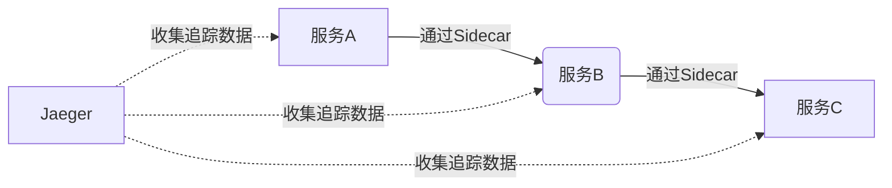

# 服务网格集成

## 介绍

服务网格（Service Mesh）是微服务架构中管理服务间通信的基础设施层，而Jaeger作为分布式追踪系统，能够可视化服务调用的全链路。二者的集成可以帮助开发者快速定位性能瓶颈和故障点。本文将介绍如何将Jaeger与Istio等服务网格集成，并通过实际案例展示其价值。

:::note 关键概念
- **服务网格**：如Istio、Linkerd，负责流量管理、安全性和可观测性。
- **Jaeger**：开源的端到端分布式追踪工具，兼容OpenTelemetry标准。
:::

---

## 为什么需要集成？

在服务网格中，所有服务间的通信都通过Sidecar代理（如Envoy）进行。集成Jaeger后：
1. 自动捕获服务间调用的追踪数据
2. 无需修改业务代码即可获得全链路追踪
3. 统一监控网格内外的服务性能



---

## 集成步骤（以Istio为例）

### 1. 安装Jaeger Collector
```bash
kubectl apply -f https://raw.githubusercontent.com/jaegertracing/jaeger-operator/main/deploy/crds/jaegertracing.io_jaegers_crd.yaml
kubectl apply -f https://raw.githubusercontent.com/jaegertracing/jaeger-operator/main/deploy/operator.yaml
```

### 2. 配置Istio发送追踪数据
修改Istio配置`istio-configmap.yaml`：
```yaml
apiVersion: v1
kind: ConfigMap
metadata:
  name: istio
data:
  mesh: |-
    enableTracing: true
    defaultConfig:
      tracing:
        sampling: 10%  # 采样率
        zipkin:
          address: jaeger-collector:9411
```

### 3. 验证集成
访问Jaeger UI：
```bash
kubectl port-forward svc/jaeger-query 16686:16686
```
打开浏览器访问 `http://localhost:16686`

---

## 实际案例：电商系统追踪

假设我们有一个包含以下服务的系统：
- `product-service`
- `order-service`
- `payment-service`

通过集成后，单个订单请求的追踪数据会显示：
1. 用户请求进入Ingress Gateway
2. 经过各个服务的完整调用链
3. 每个步骤的耗时和状态码

:::tip 采样策略建议
生产环境中推荐动态采样：
```yaml
apiVersion: jaegertracing.io/v1
kind: Jaeger
metadata:
  name: with-sampling
spec:
  strategy: production
  sampling:
    options:
      default_strategy:
        type: probabilistic
        param: 0.1  # 10%采样率
```
:::

---

## 常见问题排查

### 问题1：看不到追踪数据
- 检查Sidecar注入状态：`kubectl get pods -n <namespace> -o jsonpath='{.items[*].spec.containers[*].name}' | grep istio-proxy`
- 验证Jaeger Collector日志：`kubectl logs -l app=jaeger -c collector`

### 问题2：数据不完整
- 确保所有服务都启用了Istio自动注入
- 检查采样率配置是否过低

---

## 总结

通过将Jaeger与服务网格集成：
- 获得开箱即用的分布式追踪能力
- 统一监控服务网格内外流量
- 快速定位跨服务性能问题

## 扩展学习

1. [Jaeger官方文档](https://www.jaegertracing.io/docs/)
2. [Istio分布式追踪指南](https://istio.io/latest/docs/tasks/observability/distributed-tracing/)
3. 动手练习：尝试在Minikube环境中部署Istio+Jaeger并追踪示例应用

```mermaid
flowchart TD
    A[部署服务网格] --> B[安装Jaeger]
    B --> C[配置追踪采样]
    C --> D[分析追踪数据]