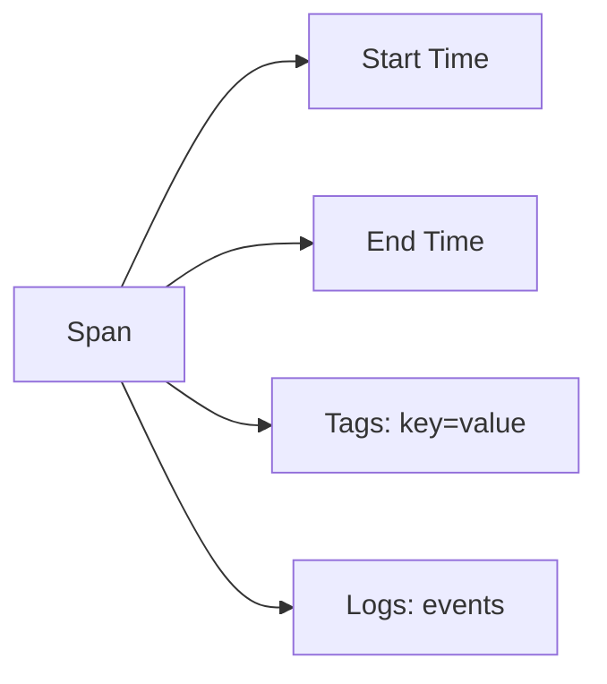
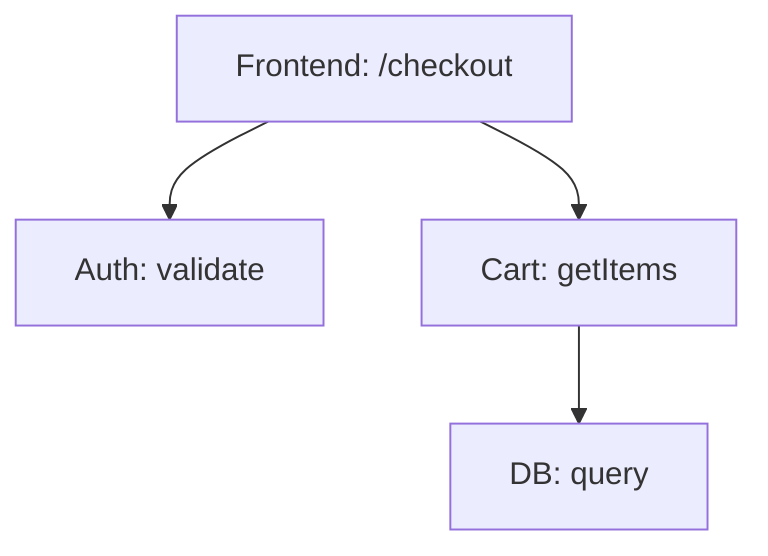
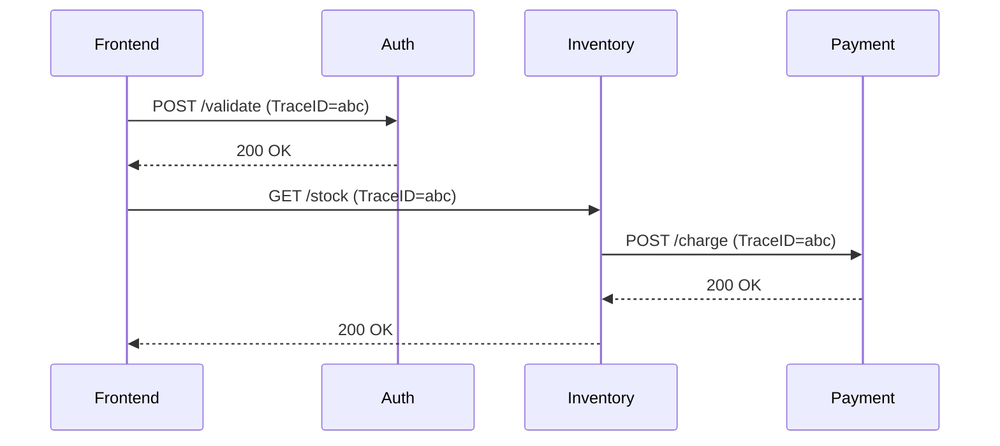

# 分布式系统追踪模式

## 引言

在微服务架构中，一个用户请求可能跨越多个服务，如何快速定位性能瓶颈或故障点成为关键挑战。分布式追踪通过记录请求在系统中的完整路径，帮助开发者可视化调用链路、分析延迟问题。本文将介绍分布式追踪的核心模式，并结合Jaeger工具进行实战演示。

## 核心概念

### 1. Span（跨度）
Span是追踪的基本单元，代表一个独立的工作单元（如HTTP请求、数据库调用）。每个Span包含：
- 操作名称（如`GET /api/users`）
- 开始和结束时间戳
- 键值对形式的标签（Tags）
- 日志事件（Logs）



### 2. Trace（追踪）
Trace是由多个Span组成的有向无环图（DAG），表示一个完整请求的生命周期。例如：



## 追踪模式详解

### 1. 上下文传播（Context Propagation）
通过HTTP头或消息头将追踪上下文（Trace ID, Span ID）在服务间传递：

```go
// Go示例：从HTTP请求头提取上下文
ctx, span := tracer.Start(
    httptrace.Extract(ctx, req.Header),
    "handle_request",
)
defer span.End()
```

### 2. 采样策略（Sampling）
平衡性能与数据完整性的常见策略：
- **头部采样**：在Trace开始时决定是否记录（如1%的请求）
- **尾部采样**：根据Trace结果决定（如只记录错误请求）

```yaml
# Jaeger 采样配置示例
sampling:
  strategies:
    - type: probabilistic
      param: 0.1  # 10%采样率
```

### 3. 标记与日志（Tagging & Logging）
通过标签记录关键元数据：

```java
// Java示例：添加标签和日志
span.setTag("http.status_code", 200);
span.log(Map.of("event", "cache_hit", "key", "user_123"));
```

## 实际案例：电商订单流程

假设一个订单流程涉及4个服务：
1. **Frontend** 接收用户请求
2. **Auth** 验证权限
3. **Inventory** 检查库存
4. **Payment** 处理支付



在Jaeger UI中可以看到：
- 每个服务的耗时
- 跨服务调用的层级关系
- 错误标记（如支付失败）

## 总结与练习

### 关键总结
- 分布式追踪通过Span和Trace建模请求链路
- 上下文传播是实现跨服务追踪的基础
- 合理采样策略对生产环境至关重要

### 动手练习
1. 使用Jaeger本地实例追踪一个Python Flask应用链
2. 在Span中添加自定义标签（如`user_id`）
3. 配置采样率只记录慢请求（>500ms）

### 扩展阅读
- [OpenTelemetry规范](https://opentelemetry.io/)
- [Jaeger官方文档](https://www.jaegertracing.io/docs/)
- 《Distributed Systems Observability》电子书

:::tip 小技巧
在开发环境使用`const sampler = new ConstSampler(true)`启用全量采样，确保不丢失任何追踪数据。
:::