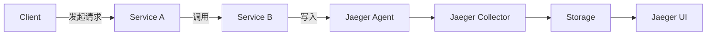
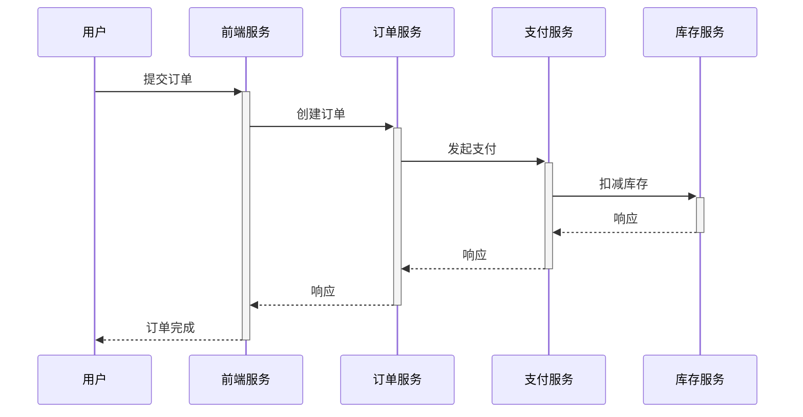

# 云原生追踪

## 什么是云原生追踪？

在微服务架构中，一个用户请求可能跨越多个服务，这使得问题排查变得复杂。云原生追踪（Distributed Tracing）通过记录请求在系统中的完整流转路径，帮助开发者可视化请求链路、分析性能瓶颈。

:::tip 核心概念
- **Span**：代表一个独立的工作单元（如一次API调用）
- **Trace**：由多个Span组成的完整请求链路
- **Context Propagation**：跨服务传递追踪上下文
:::

## Jaeger 架构概览



## 快速开始示例

### 1. 安装Jaeger

使用Docker快速启动Jaeger全组件：

```bash
docker run -d --name jaeger \
  -p 16686:16686 \
  -p 6831:6831/udp \
  jaegertracing/all-in-one:latest
```

### 2. 初始化Tracer

以下是Node.js服务的初始化示例：

```javascript
const { initTracer } = require('jaeger-client');

const config = {
  serviceName: 'my-service',
  sampler: {
    type: 'const',
    param: 1,
  },
  reporter: {
    logSpans: true,
    agentHost: 'localhost',
  },
};

const tracer = initTracer(config);
```

### 3. 创建Span

记录一个数据库查询操作：

```javascript
const span = tracer.startSpan('database_query');
span.setTag('query', 'SELECT * FROM users');
// ...执行查询操作
span.finish();
```

## 实际应用场景

### 电商订单流程追踪



通过Jaeger UI可以看到：
1. 每个服务的处理耗时
2. 哪个环节出现异常
3. 跨服务调用的依赖关系

## 上下文传播机制

关键头信息在服务间传递：
```
uber-trace-id: 7a3a2b1c4d5e6f7a
```

Java Spring Cloud示例：

```java
@GetMapping("/order")
public String createOrder(@RequestHeader HttpHeaders headers) {
  SpanContext context = tracer.extract(
    Format.Builtin.HTTP_HEADERS,
    new TextMapExtractAdapter(headers.toSingleValueMap())
  );
  Span span = tracer.buildSpan("process_order").asChildOf(context).start();
  // ...
}
```

## 最佳实践

:::caution 注意事项
1. 采样率设置：生产环境建议动态采样
2. Span命名规范：使用`service.operation`格式
3. 避免过度追踪：只记录关键路径
:::

## 总结与扩展

### 关键收获
- 分布式追踪是微服务可观测性的核心组件
- Jaeger提供了完整的追踪解决方案
- 上下文传播是实现端到端追踪的关键

### 后续学习
1. 尝试集成OpenTelemetry标准
2. 结合Metrics和Logging实现三位一体监控
3. 探索服务网格(如Istio)中的追踪集成

:::note 练习任务
1. 在本地的两个微服务间实现追踪上下文传递
2. 在Jaeger UI中分析一个包含3个以上服务的完整Trace
3. 为关键Span添加自定义标签和日志
:::