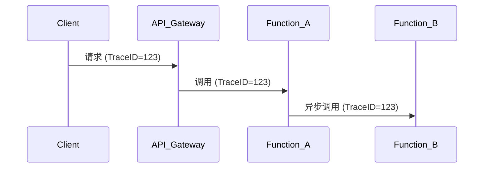

# 无服务器追踪

## 介绍

无服务器（Serverless）架构通过事件驱动的方式执行函数，但这也使得请求的流转路径变得难以追踪。**无服务器追踪**（Serverless Tracing）利用分布式追踪工具（如Jaeger）可视化函数间的调用关系，帮助开发者快速定位性能瓶颈和故障点。

:::note 关键概念
- **无服务器架构**：开发者无需管理服务器，只需编写函数（如AWS Lambda、Azure Functions）。
- **分布式追踪**：记录请求在多个服务/函数间的流转路径，形成完整的调用链。
:::

## 为什么需要无服务器追踪？

在传统单体应用中，所有逻辑集中在一个进程中，调试相对简单。而在无服务器架构中：
- 一个请求可能触发多个函数调用。
- 函数是短暂存在的（冷启动问题）。
- 跨云服务商的调用更复杂。

分布式追踪通过**唯一Trace ID**关联所有调用，例如：



## 使用Jaeger实现追踪

### 步骤1：安装Jaeger客户端
以Node.js函数为例，安装Jaeger客户端库：
```bash
npm install jaeger-client
```

### 步骤2：初始化追踪器
```javascript
const { initTracer } = require('jaeger-client');

const config = {
  serviceName: 'my-serverless-function',
  sampler: {
    type: 'const',
    param: 1,
  },
  reporter: {
    logSpans: true,
    agentHost: 'jaeger-agent.example.com',
  },
};
const tracer = initTracer(config);
```

### 步骤3：追踪函数调用
```javascript
exports.handler = async (event) => {
  const span = tracer.startSpan('handle-request');
  span.setTag('event', JSON.stringify(event));

  try {
    // 业务逻辑
    const result = await processEvent(event);
    span.finish();
    return result;
  } catch (err) {
    span.setTag('error', true);
    span.log({ 'error.message': err.message });
    span.finish();
    throw err;
  }
};
```

## 实际案例：电商订单处理

假设一个无服务器订单处理流程：
1. API网关接收订单请求
2. 调用**库存检查函数**
3. 异步触发**支付处理函数**
4. 最后调用**物流通知函数**

在Jaeger中看到的追踪结果：
```json
{
  "traceID": "abc123",
  "spans": [
    { "operation": "api-gateway", "duration": 50 },
    { "operation": "check-inventory", "duration": 120 },
    { "operation": "process-payment", "duration": 300 },
    { "operation": "notify-shipping", "duration": 80 }
  ]
}
```

:::tip 性能优化
通过追踪发现`process-payment`耗时最长，可以：
- 检查是否因冷启动导致延迟
- 优化数据库查询
- 考虑预置并发实例
:::

## 总结

无服务器追踪的核心价值：
- 可视化跨函数调用链
- 识别性能瓶颈（如高延迟函数）
- 快速定位错误源头（通过Span日志）

## 扩展练习

1. 在本地部署Jaeger并追踪一个简单的AWS Lambda函数链
2. 尝试为追踪数据添加自定义标签（如用户ID）
3. 模拟一个错误场景，观察Jaeger如何显示错误Span

## 附加资源

- [Jaeger官方文档](https://www.jaegertracing.io/docs/)
- [OpenTelemetry无服务器集成指南](https://opentelemetry.io/docs/instrumentation/js/)
- 《分布式系统观测：理论与实践》第三章