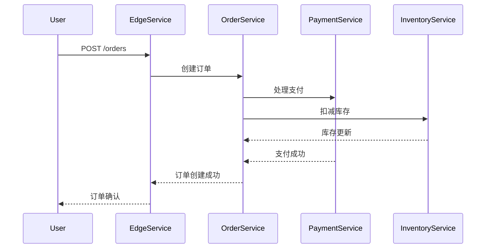

# 边缘服务追踪

## 介绍

在现代微服务架构中，请求通常需要经过多个服务的处理才能完成。**边缘服务追踪**（Edge Service Tracing）是一种监控技术，用于跟踪请求从边缘服务（如API网关）进入系统后的完整调用链路。通过追踪这些请求，开发者可以快速定位性能瓶颈、调试错误以及优化系统架构。

Jaeger是一个开源的分布式追踪系统，由Uber开发并贡献给Cloud Native Computing Foundation（CNCF）。它可以帮助你收集、存储和可视化微服务之间的调用关系。

## 为什么需要边缘服务追踪？

在分布式系统中，一个用户请求可能会涉及多个服务。例如：

1. 用户通过API网关发送请求。
2. API网关调用用户服务。
3. 用户服务调用订单服务。
4. 订单服务调用库存服务。

如果没有追踪机制，当请求失败或变慢时，很难确定是哪个环节出了问题。边缘服务追踪通过为每个请求分配唯一的**Trace ID**，并在服务间传递上下文信息，使得整个调用链路变得透明。

## 基本概念

### 1. Trace（追踪）
一个**Trace**代表一个完整的请求链路，包含从开始到结束的所有操作。例如，从API网关到最终响应的所有服务调用。

### 2. Span（跨度）
一个**Span**代表Trace中的一个独立操作单元。例如，一个服务调用数据库或另一个服务都会生成一个Span。Span包含以下信息：
- 操作名称
- 开始时间和结束时间
- 标签（Key-Value形式的元数据）
- 日志（用于记录事件）

### 3. Context（上下文）
**Context**用于在服务间传递追踪信息，通常包含Trace ID和Span ID。Jaeger使用HTTP头或gRPC元数据传递上下文。

## 代码示例

以下是一个简单的Node.js示例，展示如何在边缘服务（如Express应用）中集成Jaeger：

### 安装依赖
```bash
npm install jaeger-client express opentracing
```

### 初始化Jaeger Tracer
```javascript
const { initTracer } = require('jaeger-client');
const opentracing = require('opentracing');

const config = {
  serviceName: 'edge-service',
  reporter: {
    agentHost: 'jaeger-agent', // Jaeger Agent地址
    agentPort: 6832, // UDP端口
  },
  sampler: {
    type: 'const',
    param: 1,
  },
};

const tracer = initTracer(config);
opentracing.initGlobalTracer(tracer);
```

### 创建Express中间件
```javascript
const express = require('express');
const app = express();

app.use((req, res, next) => {
  const span = tracer.startSpan('edge-service-request');
  span.setTag('http.method', req.method);
  span.setTag('http.url', req.url);

  // 将Span上下文注入请求对象
  req.span = span;

  res.on('finish', () => {
    span.setTag('http.status_code', res.statusCode);
    span.finish();
  });

  next();
});

app.get('/api', (req, res) => {
  const span = req.span;
  span.log({ event: 'handling_request' });

  // 模拟调用其他服务
  const childSpan = tracer.startSpan('call-user-service', { childOf: span });
  setTimeout(() => {
    childSpan.finish();
    res.json({ status: 'ok' });
  }, 100);
});

app.listen(3000, () => {
  console.log('Edge service running on port 3000');
});
```

### 输出
当请求 `/api` 时，Jaeger会记录以下信息：
- 一个Trace包含两个Span：`edge-service-request` 和 `call-user-service`。
- 每个Span包含时间戳、标签和日志。

## 实际案例

### 场景：电商平台的订单流程
假设一个电商平台的订单流程如下：
1. 用户通过边缘服务（API网关）提交订单。
2. 边缘服务调用订单服务。
3. 订单服务调用支付服务和库存服务。

使用Jaeger追踪后，你可以看到：
- 每个服务的耗时。
- 如果支付服务响应慢，可以快速定位问题。
- 如果库存服务调用失败，可以查看相关日志。



:::tip
在实际项目中，你可以通过Jaeger UI查看完整的调用链路图，并分析每个Span的详细信息。
:::

## 总结

边缘服务追踪是微服务架构中不可或缺的一部分，它帮助你：
- 可视化请求链路。
- 快速定位性能问题。
- 调试分布式系统中的错误。

Jaeger提供了强大的工具来简化追踪的实现和数据分析。对于初学者来说，从边缘服务开始集成Jaeger是一个很好的起点。

## 附加资源

1. [Jaeger官方文档](https://www.jaegertracing.io/docs/)
2. [OpenTracing标准](https://opentracing.io/)
3. 练习：尝试在本地部署Jaeger并运行上面的示例代码。

:::caution
确保在生产环境中合理配置Sampler（采样率），避免追踪数据过多影响性能。
:::