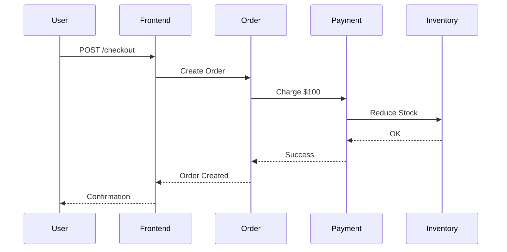

## 介绍

在现代微服务架构中，服务之间的调用链日益复杂。**Istio**作为服务网格（Service Mesh）的核心组件，负责管理服务间的通信，而**Jaeger**是一个开源的分布式追踪系统，用于监控和诊断跨服务的请求流。两者的结合为微服务提供了强大的可观测性能力。

:::tip 关键概念
- **Istio**：通过Sidecar代理（Envoy）控制流量，提供熔断、负载均衡等功能。
- **Jaeger**：可视化请求链路，帮助定位延迟或故障点。
:::

---

## 为什么需要Istio与Jaeger集成？

微服务中，一个用户请求可能涉及多个服务调用。例如：
1. 用户请求 → 订单服务 → 支付服务 → 库存服务  
2. 若支付服务响应慢，如何快速定位问题？

传统日志难以追踪跨服务请求，而**Istio自动生成追踪数据**，**Jaeger将其可视化**，形成完整调用链。

---

## 安装与配置

### 1. 安装Istio并启用追踪
```bash
# 下载Istio
curl -L https://istio.io/downloadIstio | sh -
# 安装时启用追踪
istioctl install --set values.tracing.enabled=true
```

### 2. 部署Jaeger
```bash
# 使用Istio内置的Jaeger
kubectl apply -f samples/addons/jaeger.yaml
```

---

## 代码示例：注入追踪头

Istio自动为HTTP请求注入追踪头（如`x-b3-traceid`），但开发者需在服务间传递这些头。以下是Python示例：

```python
from flask import Flask, request
import requests

app = Flask(__name__)

@app.route('/order')
def order():
    # 获取上游传递的追踪头
    headers = {k: v for k, v in request.headers if k.startswith('x-b3-')}
    # 调用支付服务时传递头
    payment_response = requests.get('http://payment-service/pay', headers=headers)
    return "Order processed with " + payment_response.text
```

---

## 实际案例：电商系统追踪

假设有一个电商系统，用户下单时涉及以下服务：
1. **Frontend** → **Order** → **Payment** → **Inventory**

通过Jaeger UI（通常访问`http://localhost:16686`），可以看到：
- 每个服务的耗时。
- 是否存在异常（如Payment服务超时）。



---

## 总结

- **Istio**自动化了追踪数据的收集，**Jaeger**提供了分析工具。
- 开发者需确保传递追踪头以保持链路完整。
- 结合两者可快速定位延迟或故障服务。

---

## 附加资源

1. [Istio官方文档](https://istio.io/latest/docs/tasks/observability/distributed-tracing/)
2. [Jaeger官方示例](https://www.jaegertracing.io/docs/1.41/getting-started/)
3. 练习：在本地Minikube集群中部署Istio和Jaeger，并模拟一个慢服务查看追踪结果。