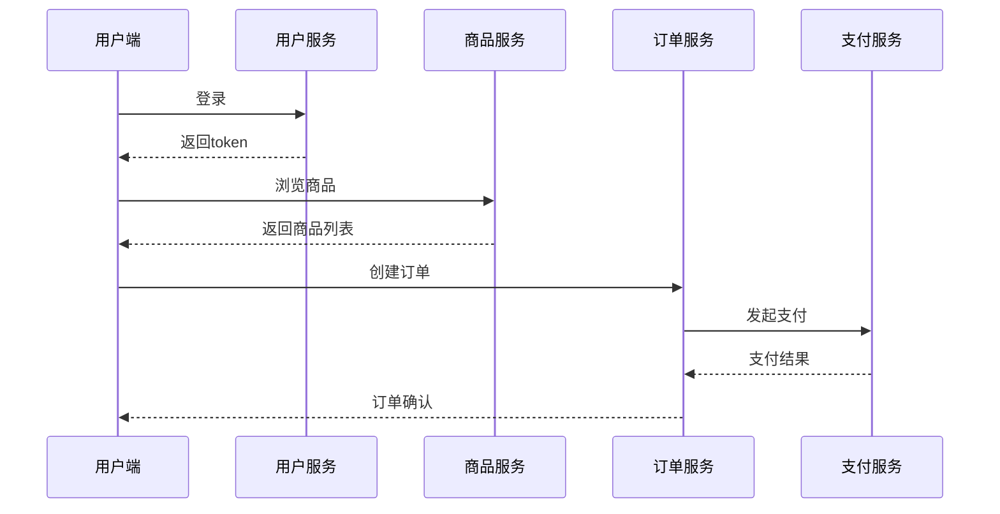

# Kubernetes与Jaeger

## 介绍

在现代微服务架构中，服务之间的调用关系复杂，排查问题变得困难。Jaeger作为开源的分布式追踪系统，能够帮助开发者可视化请求在多个服务间的流转路径。而Kubernetes作为容器编排平台，是部署微服务的理想环境。本文将介绍如何在Kubernetes中集成Jaeger，实现端到端的请求追踪。

:::tip 关键概念
- **Jaeger**: Uber开源的分布式追踪工具，用于监控和诊断微服务架构
- **Kubernetes**: 容器编排平台，自动化部署、扩展和管理容器化应用
- **OpenTracing**: Jaeger遵循的分布式追踪标准
:::

## 为什么需要Kubernetes与Jaeger集成？

当微服务运行在Kubernetes集群中时：
1. 服务实例动态变化（扩缩容、滚动更新）
2. 跨服务调用路径复杂
3. 传统日志难以关联全链路请求

Jaeger通过追踪每个请求的完整生命周期，提供了：
- 服务依赖图
- 调用延迟分析
- 错误根源定位

## 部署Jaeger到Kubernetes

### 1. 使用Jaeger Operator（推荐方式）

```bash
# 添加Jaeger Operator Helm仓库
helm repo add jaegertracing https://jaegertracing.github.io/helm-charts
helm install jaeger-operator jaegertracing/jaeger-operator
```

### 2. 部署Jaeger实例

```yaml
# jaeger-instance.yaml
apiVersion: jaegertracing.io/v1
kind: Jaeger
metadata:
  name: simplest
spec:
  strategy: allInOne
  storage:
    type: memory
```

应用配置：
```bash
kubectl apply -f jaeger-instance.yaml
```

### 3. 验证部署

```bash
kubectl get pods -l app.kubernetes.io/instance=simplest
```

预期输出：
```
NAME                        READY   STATUS    RESTARTS   AGE
simplest-849d4b846b-2h5x7   1/1     Running   0          2m
```

## 在应用中集成Jaeger客户端

以Node.js服务为例：

```javascript
const { initTracer } = require('jaeger-client');

// 配置Jaeger客户端
const config = {
  serviceName: 'my-service',
  sampler: {
    type: 'const',
    param: 1,
  },
  reporter: {
    logSpans: true,
    agentHost: process.env.JAEGER_AGENT_HOST || 'simplest-agent.default.svc.cluster.local',
  },
};

const tracer = initTracer(config);

// 创建span追踪请求
app.get('/api', (req, res) => {
  const span = tracer.startSpan('handle_request');
  // ...业务逻辑
  span.finish();
  res.send('Hello Jaeger!');
});
```

## 实际案例：电商微服务追踪

假设我们有一个包含以下服务的电商平台：
1. 用户服务
2. 商品服务
3. 订单服务
4. 支付服务



在Jaeger UI中，我们可以看到：
1. 完整的请求链路
2. 每个服务的处理时间
3. 可能出现的错误节点

## 访问Jaeger UI

默认情况下，Jaeger UI会通过Service暴露：

```bash
kubectl port-forward svc/simplest-query 16686:16686
```

然后访问 http://localhost:16686 即可查看追踪数据。

## 生产环境建议

:::caution 生产注意事项
1. 不要使用`allInOne`模式（仅适合开发）
2. 使用Elasticsearch等持久化存储替代内存存储
3. 配置适当的采样率（非100%采样）
4. 考虑使用Service Mesh（如Istio）集成
:::

## 总结

通过将Jaeger部署到Kubernetes：
- 获得了微服务的全链路可见性
- 能够快速定位性能瓶颈
- 可以分析服务间的依赖关系
- 提高了系统可观测性

## 扩展学习

1. 尝试将Jaeger与你的现有服务集成
2. 比较不同采样策略的影响
3. 探索Jaeger与Prometheus/Grafana的集成
4. 研究OpenTelemetry作为新一代标准

:::note 附加资源
- [Jaeger官方文档](https://www.jaegertracing.io/docs/)
- [Kubernetes监控最佳实践](https://kubernetes.io/docs/concepts/cluster-administration/monitoring/)
- 《分布式追踪：微服务监控核心技术》书籍推荐
:::