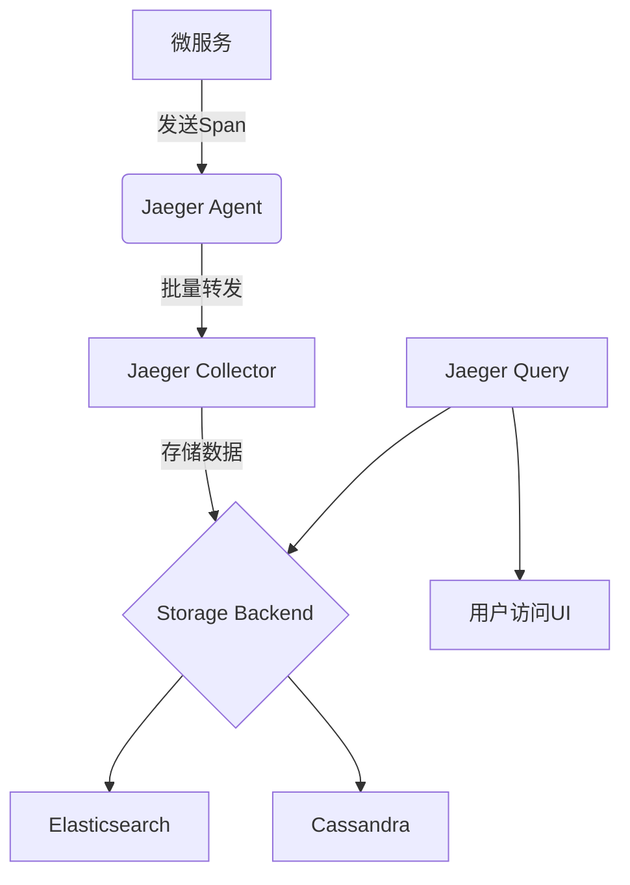
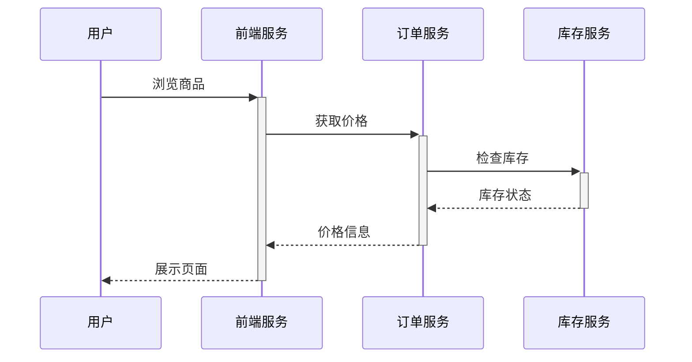

## 引言

在现代微服务架构中，分布式追踪系统（如Jaeger）对监控服务间调用链路至关重要。而容器化部署（如Docker）已成为微服务运行的主流方式。本章将指导你如何在容器环境中部署Jaeger，从单机Docker到Kubernetes集群的完整流程。

## 容器化基础概念

**容器**是轻量级的、可移植的软件单元，将代码及其依赖项打包在一起。与虚拟机不同，容器共享主机操作系统内核，因此启动更快、资源占用更少。

:::tip 为什么选择容器部署Jaeger？
- **环境一致性**：避免"在我机器上能运行"的问题
- **快速扩展**：轻松复制实例应对高负载
- **依赖隔离**：Jaeger组件（Collector/Agent/Storage）可独立管理
:::

## 单机Docker部署

### 1. 安装Docker
确保已安装Docker引擎：
```bash
docker --version
# 输出示例: Docker version 24.0.5, build 24.0.5-0ubuntu1~22.04.1
```

### 2. 运行Jaeger All-in-One
开发环境可使用All-in-One镜像（不适用于生产）：
```bash
docker run -d --name jaeger \
  -p 16686:16686 \    # UI端口
  -p 6831:6831/udp \  # UDP接收端口
  jaegertracing/all-in-one:1.53
```

访问 `http://localhost:16686` 即可打开Jaeger UI。

### 3. 验证服务状态
```bash
docker ps --filter "name=jaeger"
# 应看到STATUS为"Up"
```

## 生产级部署方案

实际生产环境需要分离Jaeger组件：



### 1. 使用Docker Compose
创建 `docker-compose.yml`：

```yaml
version: '3'
services:
  jaeger-collector:
    image: jaegertracing/jaeger-collector:1.53
    ports:
      - "14269:14269" # 健康检查
      - "14268:14268" # HTTP接收
      - "14250:14250" # GRPC接收
    environment:
      - SPAN_STORAGE_TYPE=cassandra
      - CASSANDRA_SERVERS=cassandra

  jaeger-query:
    image: jaegertracing/jaeger-query:1.53
    ports:
      - "16686:16686" # UI
    depends_on:
      - jaeger-collector

  cassandra:
    image: cassandra:4
    ports:
      - "9042:9042"
```

启动集群：
```bash
docker-compose up -d
```

## Kubernetes部署（Helm Chart）

对于Kubernetes环境，推荐使用官方Helm Chart：

```bash
helm repo add jaegertracing https://jaegertracing.github.io/helm-charts
helm install my-jaeger jaegertracing/jaeger \
  --set storage.type=elasticsearch \
  --set elasticsearch.hosts[0]=http://elasticsearch:9200
```

:::warning 生产环境注意
- 必须配置持久化存储（如ES/Cassandra）
- 为Agent设置DaemonSet确保每个Node有实例
- 限制资源请求/限制（CPU/Memory）
:::

## 实际案例：电商微服务追踪

假设我们有如下服务调用链：


部署步骤：
1. 每个服务的Pod中注入Jaeger Agent边车容器
2. 配置环境变量启用追踪：
```yaml
env:
- name: JAEGER_AGENT_HOST
  valueFrom:
    fieldRef:
      fieldPath: status.hostIP
- name: JAEGER_SAMPLER_TYPE
  value: "const"
- name: JAEGER_SAMPLER_PARAM
  value: "1"
```

## 常见问题排查

1. **Agent无法连接Collector**：
   - 检查网络策略是否允许跨Pod通信
   - 验证Collector服务DNS名称解析

2. **存储空间不足**：
   ```bash
   # Elasticsearch磁盘使用查询
   curl -XGET 'http://elasticsearch:9200/_cat/allocation?v'
   ```

3. **高延迟问题**：
   - 调整Agent的 `JAEGER_REPORTER_FLUSH_INTERVAL`（默认1秒）
   - 增加Collector副本数

## 总结与进阶

通过本章你已学会：
- 使用Docker快速启动Jaeger测试环境
- 生产级分布式部署架构
- Kubernetes中的最佳实践
- 真实微服务场景的集成方法

**延伸学习**：
- [Jaeger官方文档](https://www.jaegertracing.io/docs/)
- 《Distributed Tracing in Practice》书籍
- 练习：尝试将Jaeger与你的Spring Boot/Django应用集成