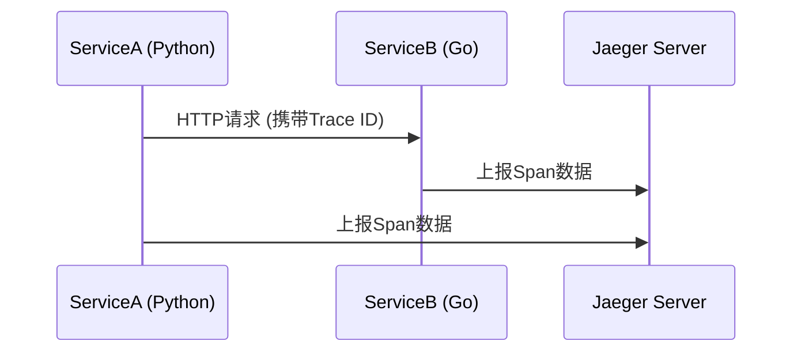

# 多语言服务追踪

## 介绍

在现代微服务架构中，一个请求可能跨越多个用不同语言编写的服务（如Python、Go、Java等）。**多语言服务追踪**通过统一的追踪系统（如Jaeger）将这些服务的调用链路可视化，帮助开发者快速定位性能瓶颈和故障点。本文将介绍如何在不同语言的服务中集成Jaeger客户端，并实现跨服务的上下文传播。

:::note 关键概念
- **Span**：代表一个独立的工作单元（如HTTP请求）。
- **Trace**：由多个Span组成的调用树，表示完整的请求链路。
- **Context Propagation**：跨服务传递追踪上下文（如Trace ID）。
:::

## 核心原理

Jaeger通过以下组件实现多语言追踪：
1. **客户端库**：各语言专用的SDK（如`jaeger-client-python`）。
2. **上下文传播**：通过HTTP头（如`uber-trace-id`）传递Trace信息。
3. **数据上报**：客户端将Span数据发送到Jaeger Collector。



## 代码示例

### Python服务示例
安装Python客户端库：
```bash
pip install jaeger-client opentracing-instrumentation
```

初始化Tracer：
```python
from jaeger_client import Config

def init_tracer(service_name):
    config = Config(
        config={'sampler': {'type': 'const', 'param': 1}},
        service_name=service_name,
    )
    return config.initialize_tracer()

tracer = init_tracer("payment-service")
```

创建Span：
```python
with tracer.start_span('process_payment') as span:
    span.set_tag('payment_amount', 100)
    # 业务逻辑...
```

### Go服务示例
安装Go客户端库：
```bash
go get github.com/uber/jaeger-client-go
```

初始化Tracer：
```go
package main

import (
	"github.com/opentracing/opentracing-go"
	"github.com/uber/jaeger-client-go"
	jaegercfg "github.com/uber/jaeger-client-go/config"
)

func initTracer(serviceName string) (opentracing.Tracer, error) {
	cfg := jaegercfg.Configuration{
		Sampler: &jaegercfg.SamplerConfig{
			Type:  jaeger.SamplerTypeConst,
			Param: 1,
		},
	}
	return cfg.New(serviceName)
}
```

## 上下文传播实战

当Python服务调用Go服务时，需要传递追踪上下文：

1. **Python侧注入HTTP头**：
```python
import requests
from opentracing.propagation import Format

headers = {}
tracer.inject(span, Format.HTTP_HEADERS, headers)
response = requests.get("http://go-service/api", headers=headers)
```

2. **Go侧提取上下文**：
```go
func handler(w http.ResponseWriter, req *http.Request) {
	spanCtx, _ := tracer.Extract(opentracing.HTTPHeaders, opentracing.HTTPHeadersCarrier(req.Header))
	span := tracer.StartSpan("go-api", ext.RPCServerOption(spanCtx))
	defer span.Finish()
	// 业务逻辑...
}
```

## 实际案例：电商系统

假设一个订单流程涉及以下服务：
1. **Python**：用户服务（认证）
2. **Java**：订单服务（创建订单）
3. **Go**：支付服务（处理支付）

通过Jaeger追踪，可以看到：
- 每个服务的耗时
- 跨服务的错误传递（如支付失败影响订单状态）

## 总结

多语言服务追踪的核心步骤：
1. 各服务初始化Jaeger Tracer
2. 通过HTTP头自动传播上下文
3. 在关键操作中创建Span

:::tip 练习建议
1. 用两种语言编写模拟服务并集成Jaeger
2. 尝试在Span中添加自定义标签（如`user_id`）
3. 使用Jaeger UI分析追踪数据
:::

## 扩展资源
- [Jaeger官方文档](https://www.jaegertracing.io/docs/)
- [OpenTracing标准](https://opentracing.io/)