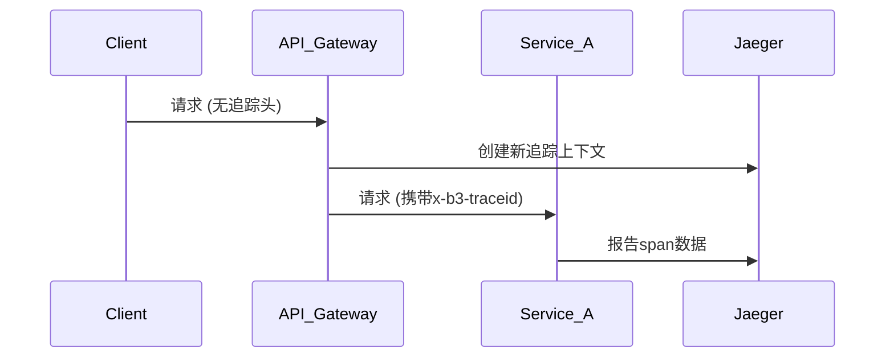

# API网关集成

## 介绍

在现代微服务架构中，API网关作为所有客户端请求的单一入口，承担着路由、认证、限流等重要职责。当我们需要排查跨服务的性能问题时，将分布式追踪系统（如Jaeger）与API网关集成变得至关重要。本文将带你逐步理解这一集成过程。

## 为什么需要集成？

1. **端到端可见性**：网关是请求的第一站，集成后能捕获完整的调用链
2. **上下文传播**：确保追踪ID（traceID）能正确传递给下游服务
3. **性能分析**：识别网关本身可能成为瓶颈的情况

## 核心概念

### 追踪上下文传播

API网关需要处理以下HTTP头信息以实现追踪上下文传递：

- `x-request-id`
- `x-b3-traceid` (Zipkin格式)
- `traceparent` (W3C Trace Context标准)



## 实践示例

### 使用Kong网关集成

以下是在Kong网关中配置Jaeger插件的示例：

```lua
-- kong.conf 配置
plugins = bundled,jaeger

-- 启用Jaeger插件
curl -X POST http://localhost:8001/plugins \
  --data "name=jaeger" \
  --data "config.http_endpoint=http://jaeger-collector:14268/api/traces" \
  --data "config.sample_rate=1"
```

### 验证配置

发送测试请求后，你可以在Jaeger UI中看到类似这样的追踪数据：

```
TraceID: 4a92f4e8f5d1b2c3
Span树:
├─ API Gateway (15ms)
│  ├─ Auth Service (8ms)
│  └─ Product Service (12ms)
```

## 真实案例：电商平台

某电商平台在黑色星期五期间发现结账流程变慢，通过网关集成Jaeger后：

1. 发现30%的延迟来自网关到支付服务的调用
2. 识别出支付服务的认证中间件是瓶颈
3. 优化后平均响应时间从450ms降至210ms

## 常见问题

:::caution 注意采样率
生产环境中不建议设置`sample_rate=1`（100%采样），这可能导致性能问题。建议从0.1开始逐步调整。
:::

:::tip 上下文丢失排查
如果发现追踪链断裂，检查：
1. 网关是否正确转发HTTP头
2. 下游服务是否配置了追踪中间件
3. 网络防火墙是否阻止了Jaeger代理通信
:::

## 总结

API网关与Jaeger的集成是微服务可观测性的关键一环。通过本文你学到了：

- 集成的基本原理和必要性
- 具体的配置方法（以Kong为例）
- 实际问题的排查思路

## 延伸学习

1. 尝试在Nginx或Envoy中实现类似集成
2. 比较Zipkin与Jaeger的B3头处理差异
3. 使用Grafana将网关指标与追踪数据关联展示

## 练习

1. 在本地的Docker环境中部署Kong+Jaeger
2. 配置一个路由/service1 -> http://service1:8080
3. 验证追踪数据是否出现在Jaeger UI中
4. 尝试在请求头中手动添加`x-b3-traceid`观察行为变化