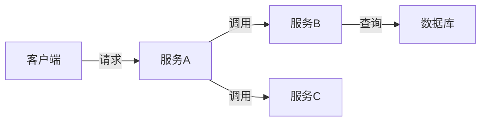
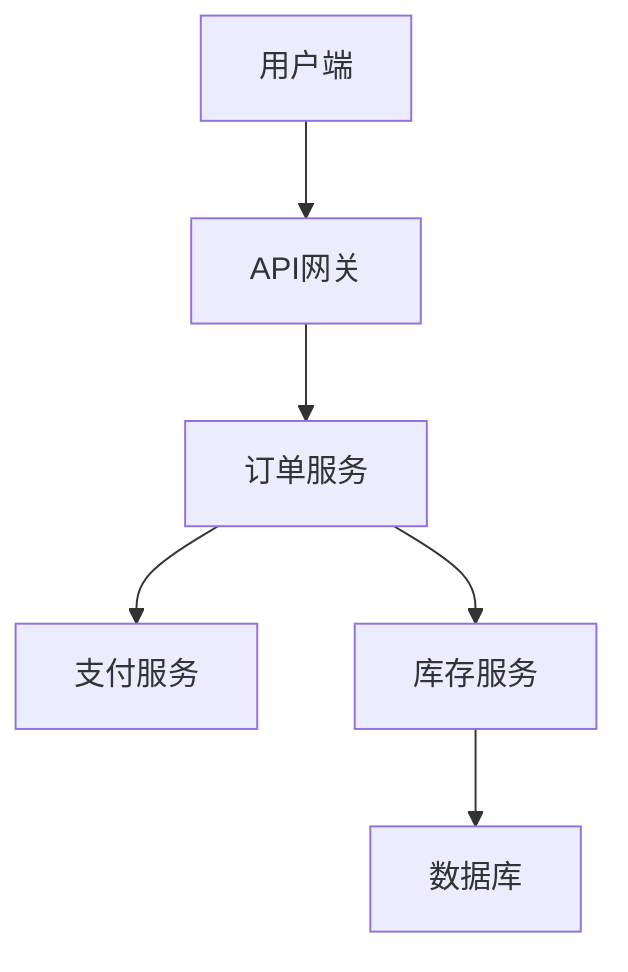

## 什么是服务依赖发现？

在微服务架构中，一个用户请求可能涉及多个服务的协作。**服务依赖发现**是指通过追踪工具（如Jaeger）自动识别这些服务之间的调用关系，并生成依赖关系图的过程。这对于理解系统拓扑、排查性能瓶颈至关重要。

:::tip 为什么需要它？
- 当服务数量增多时，手动维护依赖关系变得困难
- 帮助发现意外的服务调用链（如循环依赖）
- 为容量规划和故障隔离提供依据
```

## 核心原理

Jaeger通过收集**分布式追踪数据**来分析服务依赖：

1. **Span**：代表一个服务中的操作单元
2. **Trace**：由多个Span组成的调用链
3. **上下文传播**：通过HTTP头等机制传递Trace ID



## 实战示例

### 1. 准备Jaeger环境

使用Docker快速启动Jaeger：

```bash
docker run -d --name jaeger \
  -p 16686:16686 \
  -p 6831:6831/udp \
  jaegertracing/all-in-one:latest
```

### 2. 代码埋点示例（Node.js）

安装必要的库：

```bash
npm install jaeger-client opentracing
```

创建基础追踪器：

```javascript
const { initTracer } = require('jaeger-client');

const tracer = initTracer({
  serviceName: 'payment-service',
  sampler: {
    type: 'const',
    param: 1,
  },
  reporter: {
    logSpans: true,
    agentHost: 'localhost',
  },
});
```

记录跨服务调用：

```javascript
// 在HTTP请求中注入追踪上下文
const span = tracer.startSpan('process_payment');
const headers = {};
tracer.inject(span, FORMAT_HTTP_HEADERS, headers);

// 向下游服务传递headers
await fetch('http://inventory-service/update', { 
  method: 'POST',
  headers: headers 
});
span.finish();
```

## 查看依赖图

访问Jaeger UI（通常为 `http://localhost:16686`）可以看到：

1. **服务列表**：所有上报的服务名称
2. **依赖图**：可视化服务调用关系
3. **调用频率**：服务之间的请求量统计

:::caution 常见问题
- 确保所有服务使用相同的追踪后端
- 跨语言服务需要统一Trace ID格式
- 生产环境应降低采样率（sampling rate）
```

## 真实案例：电商系统

假设一个订单创建流程涉及以下服务：



通过Jaeger发现的异常情况：
- 订单服务直接调用了数据库（应通过库存服务）
- 支付服务与风控服务存在循环依赖

## 总结与练习

**关键收获**：
- 服务依赖发现是微服务可观测性的重要组成部分
- Jaeger通过收集分布式追踪数据自动构建依赖图
- 需要正确配置跨服务上下文传播

**练习建议**：
1. 在本机部署Jaeger并上报两个相互调用的服务
2. 尝试在Jaeger UI中找到强制依赖关系的方法
3. 模拟一个循环依赖场景并观察可视化效果

**延伸阅读**：
- OpenTracing标准文档
- Jaeger官方文档中的DAG（有向无环图）分析
- 分布式追踪中的上下文传播协议