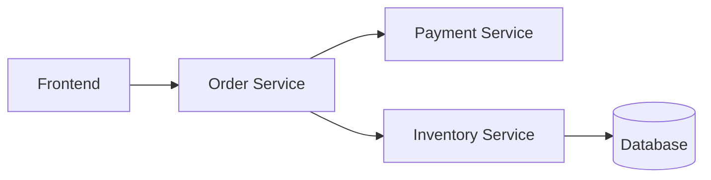

# 微服务性能分析

## 介绍

在微服务架构中，一个用户请求可能涉及多个服务的调用链。随着服务数量的增加，性能问题可能出现在任何环节，而传统的日志监控难以快速定位问题。**分布式追踪**（如Jaeger）通过记录请求在服务间的流转路径和耗时，帮助开发者直观分析性能瓶颈。

:::note 关键概念
- **Span**：代表一个独立的工作单元（如API调用、数据库操作）。
- **Trace**：由多个Span组成的调用链，反映完整请求的生命周期。
- **Context Propagation**：跨服务传递追踪上下文（如Trace ID）。
:::

## Jaeger 基础配置

以下是一个使用Jaeger客户端（Node.js示例）的初始化代码：

```javascript
const { initTracer } = require('jaeger-client');
const opentracing = require('opentracing');

const config = {
  serviceName: 'order-service',
  sampler: { type: 'const', param: 1 },
  reporter: { 
    logSpans: true,
    agentHost: 'jaeger-agent' // Jaeger代理地址
  }
};

const tracer = initTracer(config);
```

## 追踪实战示例

### 1. 创建根Span（入口服务）

```javascript
app.get('/checkout', (req, res) => {
  const span = tracer.startSpan('checkout_request');
  span.setTag('http.method', 'GET');
  
  // 模拟业务逻辑
  setTimeout(() => {
    span.finish();
    res.send('Order processed!');
  }, 100);
});
```

### 2. 跨服务上下文传递

当服务A调用服务B时，需要注入和提取上下文：

```javascript
// 服务A（调用方）
const headers = {};
tracer.inject(span, opentracing.FORMAT_HTTP_HEADERS, headers);
axios.get('http://inventory-service/check', { headers });

// 服务B（被调用方）
const parentSpan = tracer.extract(opentracing.FORMAT_HTTP_HEADERS, req.headers);
const childSpan = tracer.startSpan('inventory_check', { childOf: parentSpan });
```

## 性能分析实战

通过Jaeger UI可以观察到以下关键信息：

1. **耗时分布**：识别最耗时的服务或数据库调用
2. **错误标记**：红色标记失败的Span
3. **依赖图**：可视化服务间调用关系



## 真实案例：电商延迟分析

**问题现象**：用户提交订单平均响应时间超过2秒。

**分析过程**：
1. 发现`/checkout` Trace中存在多个`inventory_service`调用
2. 80%耗时集中在库存服务的Redis查询
3. 进一步检查发现未使用连接池

**优化方案**：引入Redis连接池后，延迟降低至300ms。

## 总结与练习

### 核心要点
- Jaeger通过Trace/Span模型可视化调用链
- 上下文传播是跨服务追踪的关键
- 性能分析需关注：长尾延迟、错误率、资源竞争

### 动手练习
1. 在本地的Docker环境部署Jaeger
2. 为现有微服务添加基础追踪
3. 模拟高延迟场景并分析Trace

### 扩展阅读
- [Jaeger官方文档](https://www.jaegertracing.io/docs/)
- 《分布式服务架构：原理、设计与实战》第七章