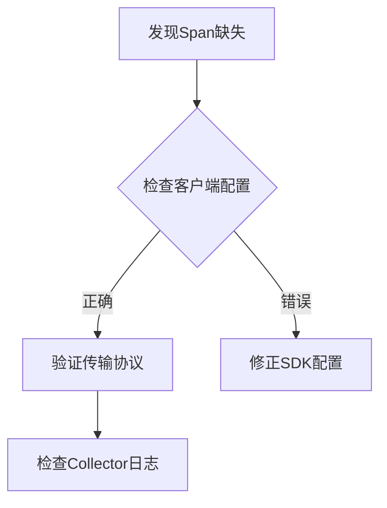

# Jaeger 故障排除：常见问题诊断

## 介绍

Jaeger作为分布式追踪系统，在微服务架构中帮助开发者监控请求链路。但在实际使用中，初学者常会遇到配置错误、数据丢失或查询失败等问题。本文将逐步分析典型故障场景，并提供可操作的解决方案。

## 1. 连接类问题

### 1.1 Agent与Collector通信失败

**症状**：  
- Jaeger UI中无最新数据  
- Agent日志出现`"Failed to send spans"`错误  

**诊断步骤**：
1. 检查Agent配置中的Collector地址：
```bash
jaeger-agent --collector.host-port=jaeger-collector:14267
```
2. 验证网络连通性：
```bash
telnet jaeger-collector 14267
# 或使用现代工具
nc -zv jaeger-collector 14267
```

:::tip
如果使用Docker，确保容器在同一个网络：
```bash
docker network create jaeger-net
docker run --network=jaeger-net jaegertracing/jaeger-collector
```
:::

### 1.2 采样率配置错误

**实际案例**：  
某服务部署后Jaeger无数据，发现采样率被误设为0：
```yaml
# 错误配置
sampling:
  strategies:
    - type: probabilistic
      param: 0  # 0%采样率
```

修正为合理值：
```yaml
param: 0.1  # 10%采样率
```

## 2. 数据类问题

### 2.1 跨度(Span)缺失

**诊断流程图**：


### 2.2 标签(Tags)未显示

**代码示例**（Go语言）：  
错误实现：
```go
span := tracer.StartSpan("operation")
defer span.Finish()
// 忘记设置标签
```

正确实现：
```go
span.SetTag("http.method", "GET")
span.SetTag("user.id", userID)
```

## 3. 查询类问题

### 3.1 搜索无结果

**常见原因**：  
- 时间范围设置错误  
- 服务名大小写不匹配（Jaeger默认区分大小写）  

**验证方法**：  
直接查询存储后端（如Elasticsearch）：
```bash
curl -XGET 'http://elasticsearch:9200/jaeger-span-*/_search?q=service:frontend'
```

### 3.2 依赖关系图不完整

:::caution
依赖图需要满足：  
1. 至少两个服务存在调用关系  
2. 所有相关Span包含正确的`parent-span-id`
:::

## 4. 性能问题排查

### 4.1 高延迟场景分析

**典型日志模式**：  
```
WARN [io.jaeger.agent] Queue is full: spans=1000, drops=10
```

**解决方案**：  
1. 调整Agent队列大小：
```bash
jaeger-agent --processor.jaeger-compact.server-queue-size=2000
```
2. 增加Collector实例

## 总结

通过本文，我们系统学习了：

1. 连接问题的网络诊断方法  
2. 数据完整性的验证流程  
3. 查询异常的排查技巧  
4. 性能瓶颈的优化方向  

**延伸练习**：  
1. 故意配置错误的采样率，观察UI变化  
2. 在本地部署中模拟网络断开，测试Agent重试机制  

**推荐资源**：  
- Jaeger官方文档的[Troubleshooting指南](https://www.jaegertracing.io/docs/latest/troubleshooting/)  
- 《分布式系统观测》第三章