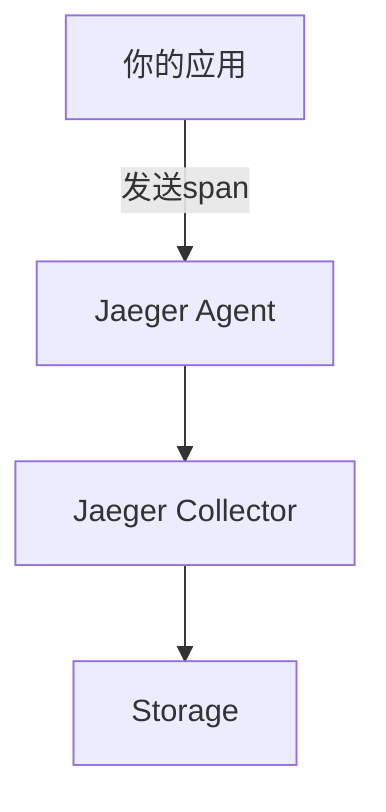

# Jaeger 连接问题解决

## 介绍

Jaeger是一个开源的分布式追踪系统，用于监控和排查微服务架构中的性能问题。在使用Jaeger时，连接问题是初学者最常见的障碍之一。本指南将帮助你理解连接问题的根源，并提供逐步解决方案。

## 常见连接问题类型

Jaeger连接问题通常分为以下几类：
1. **客户端配置错误**：SDK参数不正确
2. **网络问题**：防火墙或路由限制
3. **端口冲突**：Jaeger组件端口被占用
4. **TLS/SSL问题**：证书配置错误

## 诊断步骤

### 1. 验证客户端配置

检查你的应用程序是否使用了正确的Jaeger客户端配置。以下是Go语言的示例：

```go
import (
    "github.com/uber/jaeger-client-go"
    "github.com/uber/jaeger-client-go/config"
)

func initJaeger(service string) (opentracing.Tracer, io.Closer, error) {
    cfg := &config.Configuration{
        ServiceName: service,
        Sampler: &config.SamplerConfig{
            Type:  "const",
            Param: 1,
        },
        Reporter: &config.ReporterConfig{
            LogSpans:           true,
            LocalAgentHostPort: "jaeger-agent:6831", // 关键配置
        },
    }
    return cfg.NewTracer()
}
```

:::caution 注意
确保 `LocalAgentHostPort` 指向正确的Jaeger Agent地址和端口（默认6831用于UDP）
:::

### 2. 检查网络连接

使用基础网络工具验证连通性：

```bash
# 检查是否能解析主机名
ping jaeger-agent

# 检查端口是否开放
telnet jaeger-agent 6831

# 或者使用nc
nc -zv jaeger-agent 6831
```

### 3. 端口验证

Jaeger使用多个关键端口：
- **6831**：Agent UDP接收span
- **6832**：Agent UDP接收压缩span
- **16686**：Web UI端口

使用以下命令检查端口占用情况：

```bash
# Linux/macOS
lsof -i :6831

# Windows
netstat -ano | findstr "6831"
```

## 实际案例

### 案例1：Docker环境中的连接问题



问题现象：应用日志显示 `"Failed to send spans: dial udp: lookup jaeger-agent on 127.0.0.11:53: no such host"`

解决方案：
1. 确认docker-compose网络配置：
```yaml
services:
  myapp:
    networks:
      - jaeger-network
  jaeger-agent:
    networks:
      - jaeger-network
```

2. 使用容器名而非IP进行连接

### 案例2：Kubernetes环境中的服务发现

```yaml
# 正确的Kubernetes服务定义
apiVersion: v1
kind: Service
metadata:
  name: jaeger-agent
spec:
  ports:
  - protocol: UDP
    port: 6831
    name: agent-udp
```

:::tip Kubernetes提示
在K8s中，确保Service类型和端口协议（UDP/TCP）正确匹配
:::

## 高级排查

如果基础检查都通过但仍存在问题：

1. 启用Jaeger客户端调试日志：
```go
import (
    "github.com/opentracing/opentracing-go"
    "github.com/uber/jaeger-client-go/log"
)

cfg, _ := config.FromEnv()
cfg.Reporter.LogSpans = true
tracer, closer, _ := cfg.NewTracer(
    config.Logger(log.StdLogger),
)
```

2. 检查Jaeger Agent日志：
```bash
docker logs jaeger-agent
```

3. 使用Jaeger All-in-one镜像测试：
```bash
docker run -d --name jaeger \
  -p 6831:6831/udp \
  -p 16686:16686 \
  jaegertracing/all-in-one:latest
```

## 总结

解决Jaeger连接问题的关键步骤：
1. 验证客户端配置
2. 检查网络连通性
3. 确认端口可用性
4. 检查环境特定配置（Docker/K8s）

## 附加资源

- [Jaeger官方文档](https://www.jaegertracing.io/docs/)
- [Jaeger GitHub仓库](https://github.com/jaegertracing/jaeger)
- [OpenTracing规范](https://opentracing.io/specification/)

## 练习

1. 在你的本地环境部署Jaeger All-in-one容器并连接一个示例应用
2. 故意错误配置客户端参数，观察产生的错误信息
3. 使用Wireshark或tcpdump捕获6831端口的UDP流量