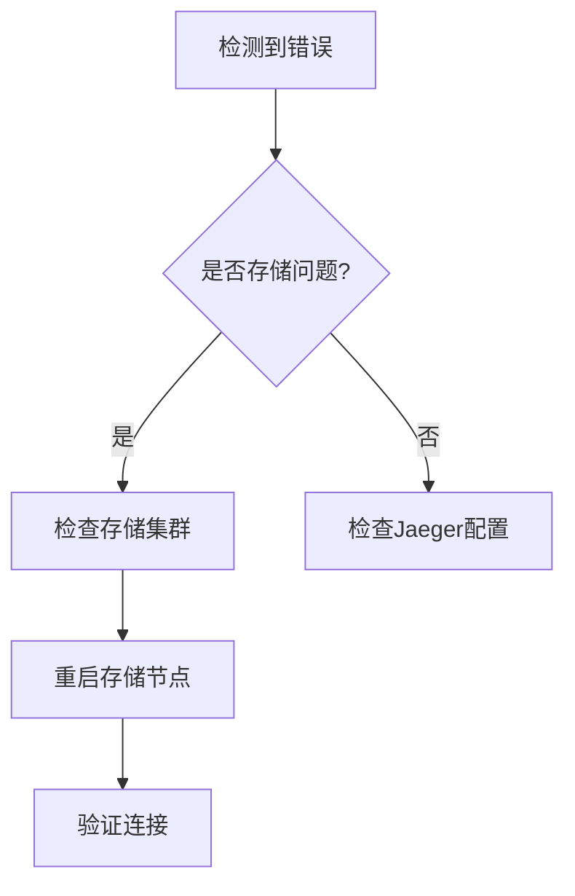

# 系统恢复策略

## 介绍

在分布式系统中，故障是不可避免的。Jaeger作为一款分布式追踪系统，其高可用性依赖于完善的**系统恢复策略**。本文将介绍如何设计并实施这些策略，帮助初学者理解从故障检测到恢复的完整流程。

:::note 关键概念
系统恢复策略包括：**故障检测**、**影响分析**、**恢复动作**和**验证机制**。
:::

---

## 1. 故障检测

### 1.1 健康检查
Jaeger组件（如Collector、Query）通常提供健康检查接口。通过定期调用这些接口，可以快速发现故障：
```bash
# 检查Collector健康状态
curl http://jaeger-collector:14269/health
```
**输出示例**：
```json
{"status":"OK"}
```

### 1.2 日志监控
Jaeger组件日志中的错误模式（如`"level":"error"`）可通过工具（如ELK）实时捕获：
```go
// 示例：Jaeger Collector的典型错误日志
{
  "level": "error",
  "msg": "Failed to save span",
  "error": "database connection refused"
}
```

---

## 2. 恢复流程设计

### 2.1 自动恢复策略
使用Kubernetes的`livenessProbe`实现容器级恢复：
```yaml
# Kubernetes部署片段示例
livenessProbe:
  httpGet:
    path: /health
    port: 14269
  initialDelaySeconds: 30
  periodSeconds: 10
```

### 2.2 手动恢复步骤
当自动恢复失败时，按优先级执行：
1. **重启组件**：`kubectl rollout restart deployment/jaeger-collector`
2. **检查依赖服务**（如存储后端）
3. **回滚版本**（如果近期有更新）

---

## 3. 实际案例

### 案例：存储连接失败
**场景**：Jaeger Collector无法连接Cassandra存储。

**恢复步骤**：
1. 检测到日志错误：`"error":"no hosts available in the pool"`
2. 验证Cassandra集群状态：
   ```bash
   nodetool status
   ```
3. 恢复动作：
   - 重启Cassandra节点
   - 临时切换存储到备用集群（通过更新`SPAN_STORAGE_TYPE`环境变量）



---

## 4. 总结与练习

### 关键总结
- 系统恢复需要**分层设计**（组件级、服务级、基础设施级）
- 结合**自动化工具**和**人工验证**
- 定期通过**故障注入测试**验证恢复策略

### 练习建议
1. 在测试环境中模拟Jaeger Collector崩溃，观察Kubernetes如何自动恢复
2. 编写一个脚本，解析Jaeger日志并触发告警（使用`jq`处理JSON日志）

:::tip 扩展学习
- Jaeger官方文档：[故障排除指南](https://jaegertracing.io/docs/latest/troubleshooting/)
- 书籍推荐：《Site Reliability Engineering》中"故障响应"章节
:::