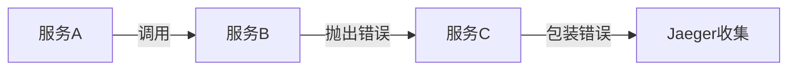

# 错误解码

## 介绍

在分布式系统监控中，Jaeger作为流行的分布式追踪系统，能够帮助开发者可视化请求流程。当服务出现异常时，Jaeger会捕获并存储错误信息，但原始错误数据往往需要经过**解码**才能变成人类可读的形式。本文将详细介绍错误解码的概念、实现方法和实际应用。

## 什么是错误解码？

错误解码是指将Jaeger收集到的二进制或编码错误信息，转换为开发者能够理解的格式的过程。这些错误可能包括：
- HTTP状态码（如500 Internal Server Error）
- gRPC错误码
- 自定义业务错误码
- 堆栈跟踪信息

:::tip 为什么需要解码？
原始错误信息通常是压缩或编码的，解码后可以：
1. 快速定位问题根源
2. 理解错误上下文
3. 提高调试效率
:::

## 基础解码方法

### 1. HTTP错误解码示例

当Jaeger捕获HTTP错误时，原始数据可能如下：

```json
{
  "error": {
    "code": 500,
    "message": "Internal Server Error",
    "details": "0x1a3f5c..."
  }
}
```

使用Jaeger UI的内置解码器：

```javascript
function decodeHTTPError(encodedError) {
  const errorMap = {
    '0x1a3f5c': 'Database connection timeout',
    '0x2b4e6d': 'Invalid API key'
  };
  return errorMap[encodedError] || encodedError;
}
```

**输入/输出示例：**
```
输入: 0x1a3f5c
输出: Database connection timeout
```

### 2. gRPC错误解码

gRPC错误通常使用状态码和二进制详情：

```go
import (
  "google.golang.org/grpc/codes"
  "google.golang.org/grpc/status"
)

func decodeGRPCError(err error) string {
  if st, ok := status.FromError(err); ok {
    return fmt.Sprintf("gRPC错误: %s (代码: %d)", 
      st.Message(), st.Code())
  }
  return err.Error()
}
```

## 高级错误处理

### 错误链解码

现代微服务中，错误往往在服务间传播形成错误链：



解码这类错误需要：

1. 展开错误堆栈
2. 保留原始上下文
3. 标准化错误格式

```python
def decode_error_chain(jaeger_error):
    errors = []
    current = jaeger_error
    while hasattr(current, '__cause__') and current.__cause__:
        errors.append({
            'service': current.service,
            'message': str(current),
            'timestamp': current.timestamp
        })
        current = current.__cause__
    return errors
```

## 实际案例

### 电商系统订单失败分析

**场景描述：**
用户下单失败，Jaeger追踪显示错误码 `0x7d2f`。

**解码过程：**
1. 查询错误码注册表，发现对应 `PAYMENT_GATEWAY_TIMEOUT`
2. 检查关联服务：
   - 订单服务 → 支付服务 → 第三方支付网关
3. 解码完整错误链：

```json
[
  {
    "service": "payment-service",
    "code": "GW_TIMEOUT",
    "suggestion": "增加支付网关超时阈值或实现重试机制"
  }
]
```

## 总结

错误解码是Jaeger故障排除中的关键技能：
- 基础解码处理简单错误码映射
- 高级解码能处理分布式错误传播
- 结合实际上下文才能做出准确诊断

## 延伸学习

1. 练习：尝试解码以下Jaeger错误数据
```json
{
  "error": {
    "code": "0x4e2a",
    "context": {
      "service": "inventory",
      "request_id": "req-789"
    }
  }
}
```
（提示：0x4e2a对应库存不足错误）

2. 推荐资源：
- Jaeger官方文档的错误处理章节
- OpenTelemetry错误规范
- 分布式系统错误处理模式

:::caution 注意
生产环境中，建议将错误解码逻辑集中管理，避免不同服务使用不同的解码方案
:::