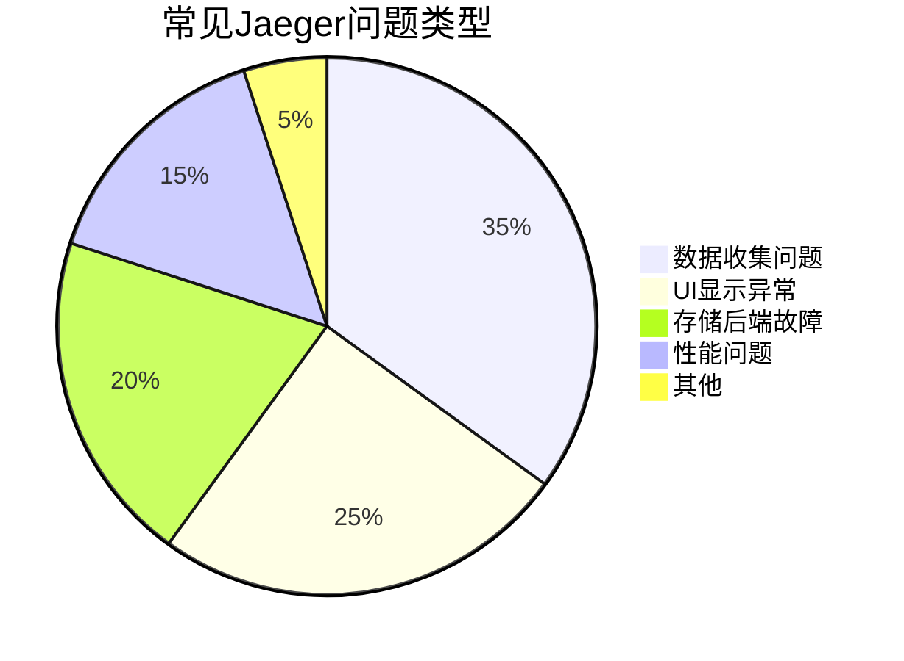

# 问题上报流程

## 介绍

在分布式系统中，Jaeger作为关键的追踪工具，其故障可能影响整个监控体系。**问题上报流程**是开发者与维护团队协作解决问题的标准化路径。本指南将帮助你：

1. 准确识别问题类型
2. 收集必要的诊断信息
3. 通过正确渠道提交问题
4. 跟踪问题解决进度

:::tip 为什么需要规范流程？
- 减少来回沟通成本
- 加速问题解决速度
- 帮助维护团队复现问题
- 建立可搜索的问题知识库
:::

## 第一步：问题分类

在提交问题前，先确定问题类型：



主要类别说明：

1. **数据收集问题**
   - Span未出现在Jaeger UI中
   - 采样率异常

2. **UI显示异常**
   - 图表渲染错误
   - 搜索功能失效

3. **存储后端故障**
   - Cassandra/Elasticsearch连接问题
   - 数据持久化失败

## 第二步：收集必要信息

### 基础环境信息

使用以下命令收集环境信息：

```bash
# 获取Jaeger客户端版本
jaeger-client version

# 获取Collector状态
curl http://jaeger-collector:14269/health
```

典型输出示例：
```json
{
  "status": "UP",
  "components": {
    "queue": {...},
    "storage": {...}
  }
}
```

### 关键日志收集

:::caution 注意
确保不包含敏感信息！使用以下命令过滤：
```bash
grep -v 'password\|token' /var/log/jaeger/*.log
```
:::

必要日志文件：
1. Collector日志
2. Agent日志
3. 客户端SDK调试日志（如设置`JAEGER_DEBUG=true`）

## 第三步：问题重现步骤

提供清晰的重现步骤模板：

1. 环境配置
   ```yaml
   # docker-compose.yml片段
   services:
     jaeger:
       image: jaegertracing/all-in-one:1.35
       ports:
         - "16686:16686"
   ```

2. 操作序列
   ```plaintext
   1. 启动服务A（版本v1.2.3）
   2. 调用API /example 3次
   3. 等待2分钟
   4. Jaeger UI无数据显示
   ```

3. 预期与实际结果对比
   ```
   预期：应显示3条trace记录
   实际：显示0条记录
   ```

## 实际案例演示

**场景**：微服务调用链数据丢失

1. **现象**：
   - 服务A调用服务B的trace记录缺失

2. **收集证据**：
   - 服务A日志显示正常发送span
   ```json
   {"level":"info","msg":"Span emitted",
    "traceID":"3a4b5c6d7e8f9a0b"}
   ```

   - Jaeger Agent日志显示接收异常
   ```log
   ERROR: failed to process span: rpc error: code = Unavailable
   ```

3. **上报内容**：
   - 完整的docker-compose配置
   - 网络拓扑图（使用mermaid绘制）
   ```mermaid
   graph LR
     A[ServiceA] -->|gRPC| B[Jaeger Agent]
     B --> C[Collector]
     C --> D[Storage]
   ```

## 问题上报模板

使用GitHub Issue模板示例：

````markdown
**描述问题**
清晰简洁地描述问题现象

**重现步骤**
1. ...
2. ...

**环境信息**
- Jaeger版本：`1.35.0`
- 存储后端：`Elasticsearch 7.10.2`
- 操作系统：`Ubuntu 20.04 LTS`

**日志片段**
```log
[ERROR] Failed to send batch: ...
```

**附加信息**
- 已尝试的解决方案：重启Collector服务
- 相关PR/Issue链接：#1234
````

## 总结与最佳实践

1. **上报前检查**：
   - 查阅[官方文档](https://www.jaegertracing.io/docs/)
   - 搜索现有Issue

2. **沟通礼仪**：
   - 使用清晰的技术术语
   - 避免模糊描述如"不工作了"

3. **后续跟踪**：
   - 定期更新问题状态
   - 验证修复方案后及时关闭

## 扩展练习

1. 模拟一个数据收集失败场景，按照流程收集信息
2. 在本地Jaeger实例中故意配置错误参数，练习问题诊断
3. 阅读一个真实的Jaeger Issue，分析其上报质量

:::note 推荐资源
- [Jaeger官方故障排除指南](https://www.jaegertracing.io/docs/latest/troubleshooting/)
- [如何写好GitHub Issue](https://guides.github.com/features/issues/)
:::