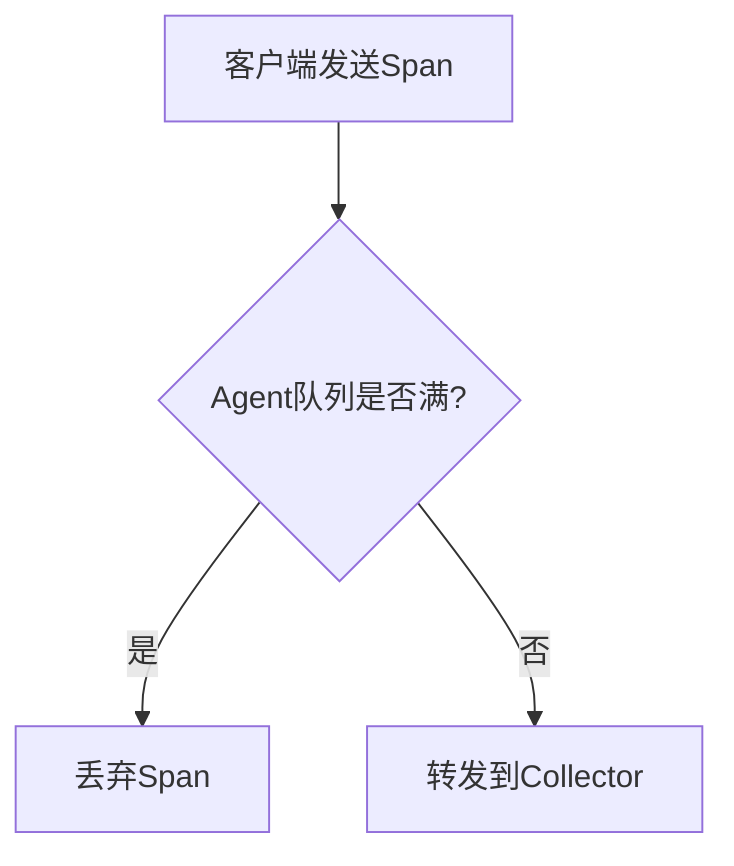

# 数据丢失调查

## 介绍

在分布式系统中，Jaeger作为一款流行的追踪工具，帮助开发者监控请求链路。然而，数据丢失是常见问题之一，可能导致关键信息缺失，影响故障诊断。本文将介绍数据丢失的常见原因、调查方法以及解决方案，适合初学者逐步掌握排查技巧。

---

## 为什么数据会发生丢失？

Jaeger数据丢失通常由以下原因引起：

1. **采样率配置不当**：Jaeger默认或自定义的采样率可能过滤掉部分追踪数据。
2. **网络问题**：Agent与Collector之间的通信失败。
3. **存储后端故障**：如Elasticsearch或Cassandra不可用。
4. **资源不足**：队列溢出或内存限制导致数据丢弃。

:::tip
使用 `jaeger-agent --log-level=debug` 可查看详细日志，帮助定位问题。
:::

---

## 逐步调查方法

### 1. 检查采样配置
Jaeger客户端采样率可能过低。例如，Go客户端的初始化代码中：
```go
import (
    "github.com/uber/jaeger-client-go/config"
)

func initTracer() (opentracing.Tracer, error) {
    cfg := config.Configuration{
        Sampler: &config.SamplerConfig{
            Type:  "probabilistic",
            Param: 0.1, // 10%采样率可能导致数据不全
        },
    }
    return cfg.NewTracer()
}
```
将 `Param` 调整为 `1.0`（100%采样）可临时验证是否为采样问题。

### 2. 验证Agent日志
运行以下命令查看Agent是否报告错误：
```bash
docker logs <jaeger-agent-container-id> | grep -i "error"
```
常见错误如 `"failed to send spans"` 可能指向网络或Collector问题。

### 3. 检查存储后端状态
若使用Elasticsearch，通过API检查健康状态：
```bash
curl -X GET "localhost:9200/_cluster/health?pretty"
```
响应中的 `"status"` 应为 `"green"` 或 `"yellow"`。

---

## 实际案例

### 案例：因队列满导致数据丢失
某团队发现部分HTTP请求的追踪丢失，Jaeger Agent日志显示：
```
WARN: queue full, dropping spans
```
**解决方案**：
1. 增加Agent队列大小（通过 `--processor.jaeger-binary.server-queue-size` 参数）。
2. 升级Agent资源分配。



---

## 总结

数据丢失问题需系统性排查：
1. 优先验证采样配置。
2. 检查Agent和Collector日志。
3. 确保存储后端正常运行。

## 扩展练习
1. 在本地部署Jaeger，故意设置低采样率，观察数据丢失现象。
2. 使用 `tcpdump` 抓包分析Agent与Collector间的通信。

## 附加资源
- [Jaeger官方文档：采样配置](https://www.jaegertracing.io/docs/latest/sampling/)
- 《分布式追踪实战》Chapter 5: Troubleshooting