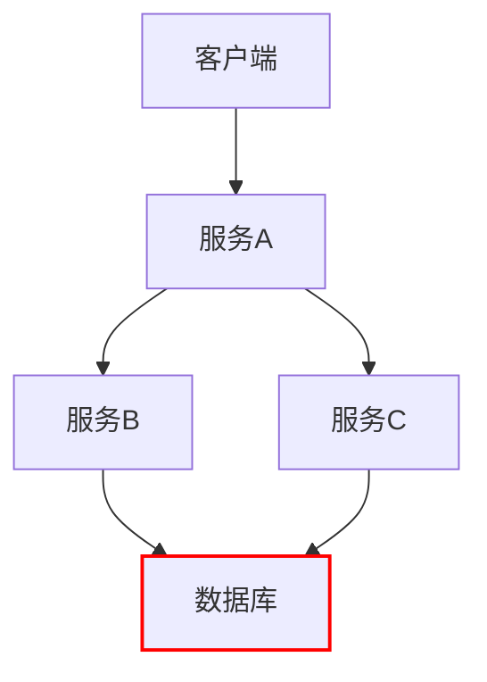
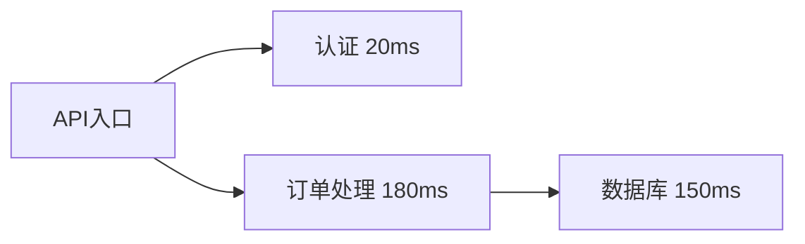

# 性能瓶颈分析

## 介绍

性能瓶颈分析是分布式系统调试中的重要环节，它帮助我们找到系统中拖慢整体性能的关键路径。Jaeger 作为分布式追踪工具，能够可视化请求在微服务架构中的流转过程，并通过火焰图（Flame Graph）等工具直观展示耗时最长的操作。

:::note 什么是性能瓶颈？
性能瓶颈是指系统中限制整体性能的组件或操作，可能是数据库查询、网络延迟或计算密集型任务。
:::

## Jaeger 中的性能分析基础

在 Jaeger UI 中，每个追踪（Trace）会显示以下关键信息：

1. **Span 持续时间**：单个操作的耗时
2. **关键路径（Critical Path）**：从请求开始到结束的最长链路
3. **服务依赖**：微服务之间的调用关系



上图中红色标注的数据库操作可能就是瓶颈所在。

## 实战分析步骤

### 步骤 1：识别长耗时 Span

在 Jaeger UI 中：
1. 打开一个追踪详情
2. 按持续时间排序 Span
3. 注意 `operationName` 和 `duration` 字段

示例输出（JSON 片段）：
```json
{
  "operationName": "databaseQuery",
  "duration": 450,
  "tags": [
    {"key": "query", "value": "SELECT * FROM large_table"}
  ]
}
```

### 步骤 2：分析关键路径

关键路径计算示例：
```javascript
// 伪代码：计算关键路径
function findCriticalPath(spans) {
  return spans.sort((a,b) => b.duration - a.duration)[0];
}
```

:::tip 实际案例
电商系统中，一个订单创建请求涉及：
1. 库存服务（50ms）
2. 支付服务（200ms）
3. 物流服务（120ms）

Jaeger 显示支付服务耗时占比超过50%，通过优化支付网关连接池，整体延迟降低40%。
:::

### 步骤 3：对比基准性能

建立性能基准很重要：
```bash
# 使用 wrk 进行基准测试
wrk -t4 -c100 -d30s http://api.example.com/order
```

## 高级技巧

### 火焰图分析

Jaeger 的火焰图可以：
- 垂直方向显示调用栈
- 横向宽度代表耗时比例
- 快速定位最宽的"叶片"



### 标签过滤

使用标签快速定位问题：
```sql
-- Jaeger 查询语法
operation="databaseQuery" AND tags.query="SELECT%"
```

## 总结

通过 Jaeger 进行性能瓶颈分析的关键点：
1. 优先关注持续时间最长的 Span
2. 分析关键路径上的服务
3. 结合业务逻辑判断是否合理
4. 建立性能基准进行比较

## 延伸练习

1. 在本地 Jaeger 实例中导入示例追踪数据
2. 尝试找出虚构电商系统中的瓶颈服务
3. 使用标签系统标记高延迟操作

## 附加资源

- [Jaeger 官方文档 - 性能分析](https://www.jaegertracing.io/docs/performance-tuning/)
- 《分布式系统观测》第三章：追踪分析
- 开源项目：`jaeger-analytics` 工具包
``` 

注意：实际使用时请移除最外层的 