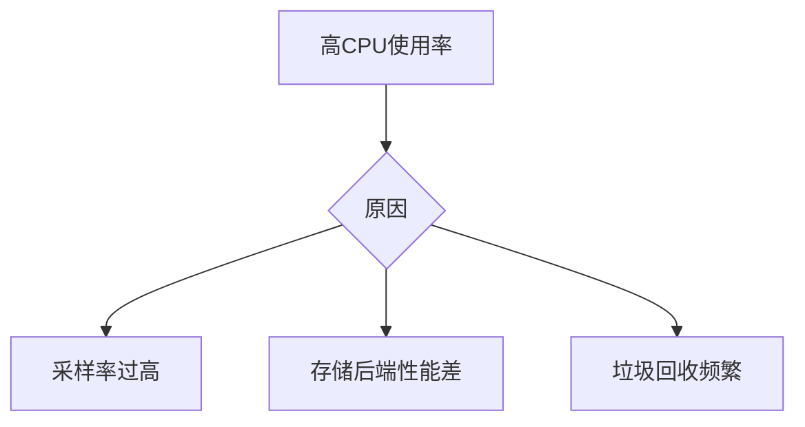

# 资源不足处理

## 介绍

在运行Jaeger分布式追踪系统时，资源不足是常见的性能瓶颈之一。资源不足可能表现为内存耗尽、CPU过载或存储空间不足，导致服务响应变慢甚至崩溃。本文将从初学者角度，逐步讲解如何识别、诊断和解决Jaeger中的资源不足问题。

:::note 关键概念
- **资源类型**：内存、CPU、磁盘I/O、网络带宽
- **常见症状**：高延迟、OOM错误、存储写入失败
:::

---

## 识别资源不足问题

### 1. 监控指标检查
使用以下命令查看Jaeger组件的资源使用情况（以Docker为例）：
```bash
docker stats jaeger-collector jaeger-query jaeger-agent
```
输出示例：
```
CONTAINER   CPU %   MEM USAGE / LIMIT
jaeger-collector   85%     1.2GB / 2GB
jaeger-query       45%     800MB / 1GB
```

### 2. 日志分析
检查Jaeger组件日志中的警告：
```bash
docker logs jaeger-collector | grep -i "error\|warning"
```

---

## 常见场景与解决方案

### 场景1：内存不足
**症状**：频繁的OOM（Out Of Memory）错误

**解决方案**：
1. 调整JVM参数（适用于Java组件）：
```yaml
# docker-compose.yml示例
environment:
  - JAVA_OPTS=-Xmx1g -Xms512m
```

2. 限制采样率（减少数据量）：
```yaml
# jaeger-agent配置
sampling:
  strategies-reload-interval: 60s
  strategies:
    type: probabilistic
    param: 0.1  # 只采样10%的请求
```

### 场景2：CPU过载
**症状**：处理延迟高，`/metrics`端点显示高CPU使用率

**优化方案**：


调整方案：
- 降低`jaeger-collector`的队列大小：
```yaml
collector:
  queue-size: 1000  # 默认5000
```

### 场景3：存储空间不足
**症状**：`span-storage`写入失败

**解决方案**：
1. 调整Elasticsearch索引策略（如果使用ES存储）：
```bash
# 创建生命周期策略
PUT _ilm/policy/jaeger-rollover
{
  "policy": {
    "phases": {
      "hot": {"actions": {"rollover": {"max_size": "50GB"}}},
      "delete": {"min_age": "7d", "actions": {"delete": {}}}
    }
  }
}
```

2. 使用Cassandra时压缩数据：
```cql
ALTER TABLE jaeger.traces WITH compaction = {
  'class': 'TimeWindowCompactionStrategy',
  'compaction_window_unit': 'DAYS',
  'compaction_window_size': 1
};
```

---

## 真实案例

### 案例：电商平台的高峰期问题
**现象**：
- 黑五期间Jaeger Collector频繁崩溃
- 日志显示`GC overhead limit exceeded`

**解决步骤**：
1. 通过`kubectl top pods`确认内存使用达上限
2. 动态调整采样策略：
```go
// 自适应采样示例
func adaptiveSampler() {
  if systemMemory > 80% {
    setSamplingRate(0.05)
  }
}
```
3. 最终效果：内存使用下降60%，系统恢复稳定。

---

## 总结与练习

### 关键要点
- 监控是发现资源问题的第一步
- 采样率调整是最直接的缓解手段
- 不同存储后端需要特定的优化策略

### 练习建议
1. 使用`stress-ng`工具模拟高负载：
```bash
stress-ng --cpu 4 --vm 2 --vm-bytes 1G --timeout 60s
```
2. 观察Jaeger各组件的资源使用变化
3. 尝试调整本文提到的参数并记录效果差异

### 扩展阅读
- Jaeger官方文档：Resource Planning章节
- 《分布式系统观测》第5章