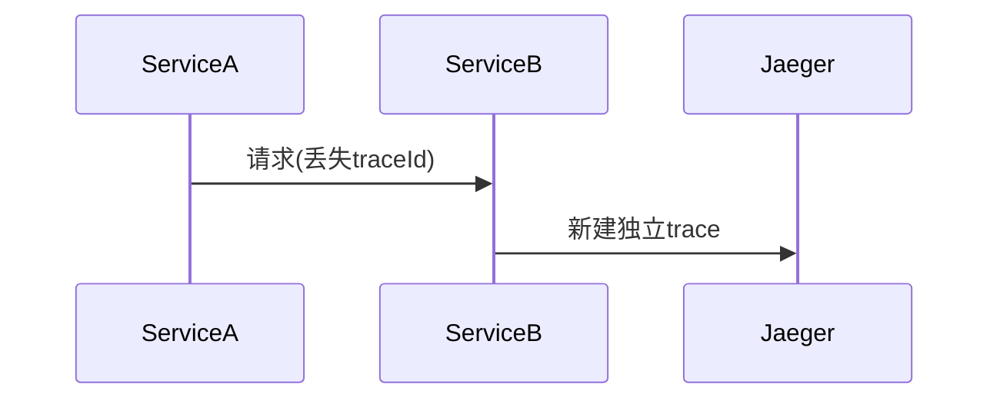

# Jaeger 客户端问题

## 介绍

Jaeger是一个开源的分布式追踪系统，用于监控和排查微服务架构中的问题。客户端问题是开发者在集成Jaeger时最常遇到的挑战之一。本文将介绍常见的Jaeger客户端问题、原因分析以及解决方法，帮助初学者快速定位和修复问题。

## 常见客户端问题

### 1. 连接配置错误

**问题描述**：客户端无法连接到Jaeger Collector或Agent。

**示例错误**：
```bash
Error: Failed to send spans: connection refused
```

**解决方法**：
1. 检查客户端配置中的`JAEGER_AGENT_HOST`和`JAEGER_AGENT_PORT`是否正确。
2. 验证网络连接是否通畅（例如使用`telnet`或`nc`测试端口）。

**正确配置示例**：
```javascript
const { initTracer } = require('jaeger-client');

const config = {
  serviceName: 'my-service',
  reporter: {
    agentHost: 'localhost', // 确保与Jaeger Agent地址一致
    agentPort: 6832,        // 默认UDP端口
  },
};
```

### 2. 采样率配置问题

**问题描述**：没有生成预期的追踪数据。

**原因分析**：采样率(`sampler`)配置可能导致部分请求未被记录。

**配置示例**：
```javascript
const config = {
  sampler: {
    type: 'const',
    param: 1, // 1=记录所有请求，0=不记录
  },
  // ...其他配置
};
```

:::tip
生产环境中建议使用`probabilistic`（概率采样）而非`const`，例如：
```javascript
sampler: { type: 'probabilistic', param: 0.1 } // 记录10%的请求
```
:::

### 3. 上下文传播失败

**问题描述**：跨服务调用时追踪链断裂。

**典型场景**：


**解决方法**：
确保在HTTP头中传播上下文：
```javascript
// 客户端发送请求时
const headers = {};
tracer.inject(span.context(), FORMAT_HTTP_HEADERS, headers);
// 将headers附加到请求中

// 服务端接收请求时
const parentSpan = tracer.extract(FORMAT_HTTP_HEADERS, headers);
```

## 实际案例

### 案例：Express应用中的中间件配置错误

**问题现象**：Express应用生成的trace不包含路由信息。

**错误配置**：
```javascript
app.use(jaegerMiddleware); // 错误：应在路由之前初始化
app.use('/api', router);
```

**正确配置**：
```javascript
const express = require('express');
const { createTracerMiddleware } = require('jaeger-client');

// 先初始化tracer
const tracer = initTracer(config);

// 然后添加中间件
app.use(createTracerMiddleware({ tracer }));
app.use('/api', router); // 路由在后
```

## 调试技巧

1. **启用调试日志**：
```javascript
const config = {
  logger: {
    info: console.log,
    error: console.error,
    debug: console.debug, // 输出详细调试信息
  }
};
```

2. **验证配置**：
```bash
# 检查Jaeger Agent是否运行
curl http://localhost:14268/api/traces -X POST
```

## 总结

常见的Jaeger客户端问题主要包括：
- 连接配置错误
- 采样率设置不当
- 上下文传播失败
- 中间件初始化顺序错误

通过系统检查配置、验证网络连接和正确传播上下文，可以解决大多数客户端问题。

## 延伸资源

1. [Jaeger官方文档 - 客户端配置](https://www.jaegertracing.io/docs/latest/client-features/)
2. [OpenTracing传播协议标准](https://opentracing.io/docs/overview/inject-extract/)
3. 练习：尝试在不同采样率下运行应用，观察Jaeger UI中的追踪数据变化