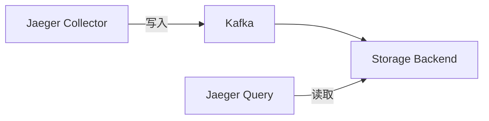
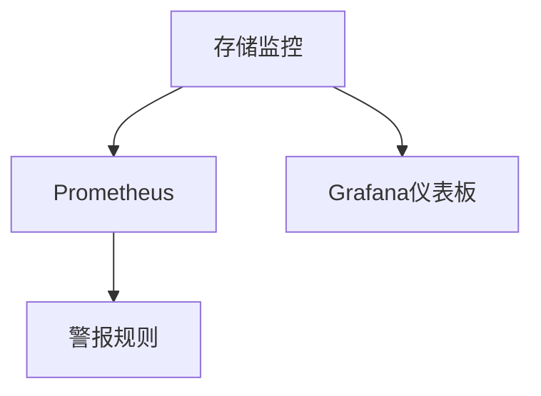

# Jaeger 存储问题故障排除

## 介绍

在分布式系统中，Jaeger作为流行的追踪工具，依赖后端存储来持久化追踪数据。当存储组件出现问题时，可能导致数据丢失、查询失败或性能下降。本文将帮助初学者理解Jaeger存储架构，识别常见问题，并提供解决方案。

## Jaeger 存储架构概述

Jaeger支持多种存储后端，包括：

- 内存存储（仅用于测试）
- Cassandra
- Elasticsearch
- Kafka（作为缓冲层）
- 关系型数据库（如MySQL）



## 常见存储问题

### 1. 连接失败

**症状**：Jaeger组件日志中出现连接超时或拒绝连接错误。

**检查步骤**：
1. 验证存储服务是否运行：
   ```bash
   # 检查Cassandra
   nc -zv cassandra-host 9042

   # 检查Elasticsearch
   curl http://elasticsearch-host:9200
   ```
2. 检查Jaeger配置中的连接字符串：
   ```yaml
   # 示例Cassandra配置
   storage:
     cassandra:
       servers: "cassandra-host:9042"
       keyspace: "jaeger_v1_test"
   ```

:::caution
确保网络防火墙允许Jaeger组件与存储后端之间的通信。
:::

### 2. 磁盘空间不足

**症状**：写入操作失败，存储服务日志显示"no space left"错误。

**解决方案**：
- 扩展存储容量
- 设置数据保留策略（以Elasticsearch为例）：
  ```json
  PUT /jaeger-*/_settings
  {
    "index.lifecycle.name": "jaeger-ilm-policy"
  }
  ```

### 3. 性能问题

**症状**：查询响应缓慢，UI加载时间长。

**优化建议**：
1. 为频繁查询的字段添加索引（Elasticsearch）：
   ```json
   PUT /jaeger-span-000001
   {
     "mappings": {
       "properties": {
         "operationName": { "type": "keyword" }
       }
     }
   }
   ```
2. 调整批量写入大小（示例配置）：
   ```yaml
   collector:
     options:
       es:
         bulk:
           size: 1000000  # 1MB
           workers: 10
   ```

## 实际案例

### 案例：Cassandra超时问题

**场景**：在峰值负载期间，Jaeger Collector日志显示`WriteTimeoutException`。

**根本原因**：Cassandra节点过载，无法及时处理写入请求。

**解决方案**：
1. 增加Cassandra超时设置：
   ```yaml
   storage:
     cassandra:
       timeout: 30s  # 默认是2s
   ```
2. 实施降级策略：
   ```yaml
   collector:
     options:
       dependencies:
         storage: "none"  # 在压力大时禁用依赖关系计算
   ```

## 监控存储健康状态

建议监控以下关键指标：

- 存储延迟（P99写入/查询时间）
- 错误率（存储操作失败比例）
- 队列深度（待处理操作数量）



## 总结

Jaeger存储问题的排查需要：

1. 理解您的存储后端类型和配置
2. 监控关键性能指标
3. 合理设置容量规划和保留策略
4. 了解存储系统的限制和最佳实践

## 附加资源

- [Jaeger官方文档 - 存储后端](https://www.jaegertracing.io/docs/latest/deployment/#storage-backends)
- [Elasticsearch性能调优指南](https://www.elastic.co/guide/en/elasticsearch/reference/current/tune-for-indexing-speed.html)
- [Cassandra故障排除手册](https://cassandra.apache.org/doc/latest/operating/troubleshooting.html)

## 练习

1. 使用Jaeger的`--help`参数检查您部署版本的存储配置选项
2. 在测试环境中模拟存储故障，观察系统行为
3. 为您的存储后端创建一个简单的健康检查脚本