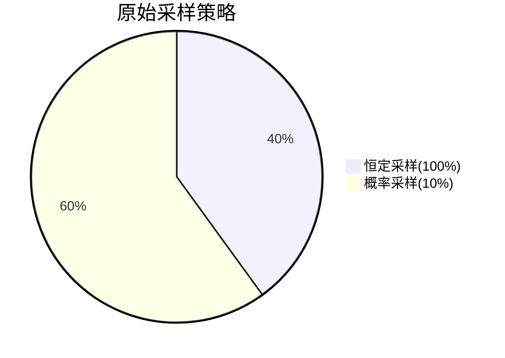

# Jaeger 采样问题

## 简介

采样（Sampling）是分布式追踪系统中的关键机制，它决定了哪些请求的追踪数据会被收集和存储。Jaeger作为流行的分布式追踪系统，提供了灵活的采样配置选项。本文将介绍Jaeger的采样原理、常见问题及解决方案。

## 采样基础

Jaeger支持以下几种采样策略：

1. **恒定采样（Constant）**：固定比例采样（如100%或1%）
2. **概率采样（Probabilistic）**：基于概率的随机采样
3. **限流采样（Rate Limiting）**：限制每秒采样数
4. **自适应采样（Adaptive）**：根据系统负载动态调整

:::tip
采样率的选择需要在数据完整性和系统开销之间取得平衡。生产环境通常使用`<1%`的采样率。
:::

## 常见采样问题

### 1. 采样配置未生效

**症状**：所有或没有请求被采样，与预期不符。

**解决方案**：
检查Jaeger客户端初始化代码是否正确配置采样器：

```javascript
// Node.js示例
const { initTracer } = require('jaeger-client');

const config = {
  serviceName: 'my-service',
  sampler: {
    type: 'probabilistic',
    param: 0.1, // 10%的采样率
  },
};
const tracer = initTracer(config);
```

确保服务启动时加载了正确的配置，可通过Jaeger UI检查采样率是否匹配。

### 2. 采样率过高导致存储压力

**症状**：存储后端（如Elasticsearch）负载过高，Jaeger收集器性能下降。

**解决方案**：
调整采样率并监控系统指标：

```yaml
# Jaeger 客户端配置示例（YAML格式）
sampler:
  type: probabilistic
  param: 0.01 # 降为1%采样率
```

:::caution
突然降低采样率可能导致重要请求的追踪数据丢失，建议逐步调整。
:::

### 3. 不同服务的采样率不一致

**症状**：跨服务追踪不完整，部分服务缺少数据。

**解决方案**：
在服务网格或API网关层统一配置采样：

```go
// Go示例：使用相同配置初始化所有服务
cfg := jaegercfg.Configuration{
  ServiceName: serviceName,
  Sampler: &jaegercfg.SamplerConfig{
    Type:  jaeger.SamplerTypeRemote,
    Param: 0.05,
  },
}
```

### 4. 重要请求未被采样

**症状**：关键业务请求的追踪数据缺失。

**解决方案**：
使用优先级采样或自定义采样逻辑：

```java
// Java示例：对特定路由提高采样率
Tracer tracer = new Configuration("my-service")
  .withSampler(new SamplerConfiguration()
    .withType("probabilistic")
    .withParam(0.5)) // 50%采样率
  .getTracer();

// 对重要路由
if (request.getPath().startsWith("/api/payment")) {
  Span span = tracer.buildSpan("payment-process")
    .withTag("sampling.priority", 1) // 提高采样优先级
    .start();
}
```

## 实际案例

### 电商平台采样优化

某电商平台在双十一期间遇到Jaeger存储压力问题。原始配置为：



优化方案：
1. 将商品浏览等高频请求降为1%采样
2. 支付流程保持10%采样
3. 库存管理关键路径使用自适应采样

优化后存储成本降低70%，同时保留了关键业务数据。

## 总结

Jaeger采样问题的核心在于平衡数据价值和系统开销。关键要点：

1. 根据业务重要性分层配置采样率
2. 生产环境推荐使用概率或自适应采样
3. 跨服务追踪需要协调采样策略
4. 定期审查采样配置和存储使用情况

## 延伸学习

1. Jaeger官方文档：[Sampling](https://www.jaegertracing.io/docs/latest/sampling/)
2. 实践练习：使用Docker部署Jaeger并测试不同采样策略
3. 高级话题：实现自定义采样器接口

通过合理配置采样策略，可以显著提高分布式追踪系统的效率和实用性。