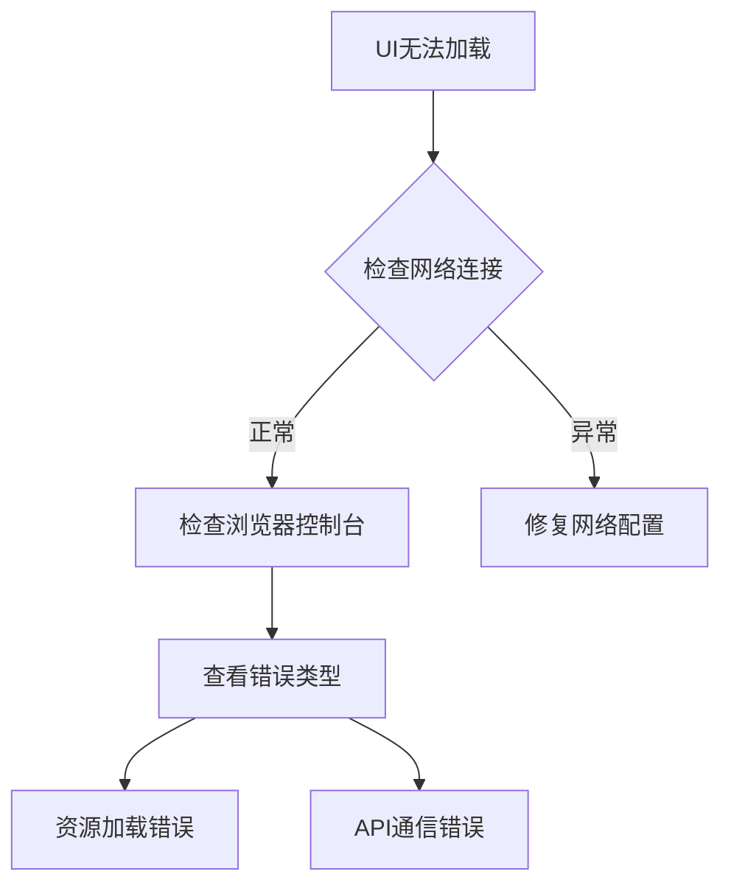

# Jaeger UI故障修复指南

## 介绍

Jaeger的Web界面是分布式追踪系统的重要交互入口。当UI出现故障时，可能导致无法查看追踪数据或使用分析功能。本指南将帮助初学者识别常见UI问题，并通过逐步排错流程恢复功能。

## 常见症状诊断



## 基础排查步骤

### 1. 浏览器控制台检查
按 `F12` 打开开发者工具，观察以下标签页：
- **Console**: JavaScript错误
- **Network**: 失败的资源请求
- **Application**: 存储和缓存问题

:::tip
典型错误示例：
```
Failed to load resource: net::ERR_CONNECTION_REFUSED
Uncaught TypeError: Cannot read property 'map' of undefined
```
:::

### 2. API连通性测试
在终端使用 `curl` 测试后端服务：
```bash
curl -v http://your-jaeger-host:16686/api/traces?service=frontend
```
正常响应应包含JSON格式的追踪数据。

### 3. 版本兼容性验证
确保UI版本与后端匹配：
```javascript
// 在浏览器控制台执行
fetch('/api/version').then(res => res.json()).then(console.log)
```
比较输出中的 `jaeger-ui` 和 `jaeger` 版本号。

## 实际案例解析

### 案例1：空白页面问题
**现象**：加载后只显示空白页面，控制台出现：
```
Uncaught ReferenceError: process is not defined
```

**解决方案**：
1. 确认使用的是官方Docker镜像或正确构建的静态资源
2. 如果是自行构建，检查webpack配置：
```javascript
// webpack.config.js
plugins: [
  new webpack.DefinePlugin({
    'process.env': JSON.stringify({})
  })
]
```

### 案例2：图表渲染异常
**现象**：时间轴图表显示错乱，出现NaN错误

**修复步骤**：
1. 检查追踪数据中的时间戳格式
2. 添加数据验证：
```javascript
function normalizeTimestamp(ts) {
  if (!ts || isNaN(ts)) {
    return Date.now() * 1000; // 微秒单位
  }
  return typeof ts === 'string' ? parseInt(ts) : ts;
}
```

## 高级调试技巧

### 使用Redux DevTools
Jaeger UI使用Redux管理状态，安装浏览器插件后可：
- 查看完整的应用状态树
- 回放用户操作序列
- 导出状态快照用于问题复现

### 自定义代理配置
当遇到CORS问题时，可配置开发服务器代理：
```javascript
// vite.config.js
export default {
  server: {
    proxy: {
      '/api': {
        target: 'http://jaeger-backend:16686',
        changeOrigin: true
      }
    }
  }
}
```

## 总结与练习

### 关键要点
- 始终从浏览器控制台开始诊断
- 验证前后端版本兼容性
- 使用网络工具检查API通信

### 巩固练习
1. 故意修改Jaeger的Docker容器端口，观察UI错误表现
2. 编写一个测试脚本模拟API返回异常数据
3. 对比不同浏览器下的渲染差异

### 扩展资源
- [Jaeger官方故障排查文档](https://www.jaegertracing.io/docs/latest/troubleshooting/)
- [Chrome开发者工具官方指南](https://developer.chrome.com/docs/devtools/)
- [React错误边界实战](https://reactjs.org/docs/error-boundaries.html)