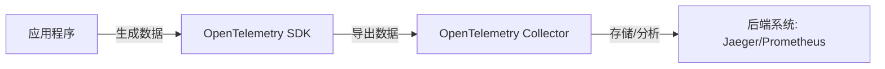
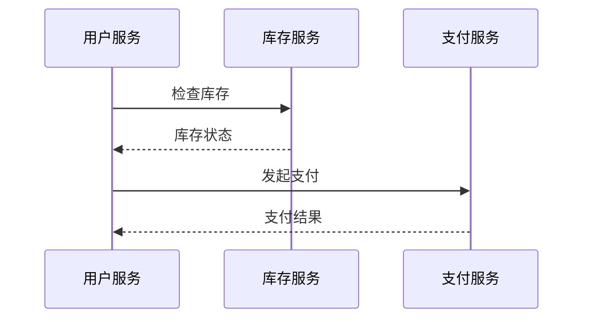

# OpenTelemetry概述

## 介绍

OpenTelemetry（简称OTel）是一个开源的**可观测性框架**，用于生成、收集和管理**遥测数据**（如日志、指标和链路追踪）。它是CNCF（云原生计算基金会）的毕业项目，旨在为分布式系统提供统一的标准工具链。

:::note 关键术语
- **遥测数据（Telemetry）**：从系统中自动收集的数据，用于监控和分析。
- **分布式追踪（Distributed Tracing）**：记录请求在多个服务间的流转路径。
:::

## 为什么需要OpenTelemetry？

现代应用通常是**微服务架构**，一个用户请求可能涉及多个服务。传统监控工具难以追踪跨服务的请求，而OpenTelemetry通过以下方式解决问题：
1. **标准化**：统一数据格式（如OTLP协议）。
2. **多语言支持**：提供Java、Go、Python等SDK。
3. **可扩展性**：支持与Jaeger、Prometheus等后端集成。

## 核心组件



1. **SDK（客户端库）**  
   嵌入到应用程序中，负责生成遥测数据。  
   示例（Python）：
   ```python
   from opentelemetry import trace
   tracer = trace.get_tracer("my.tracer")
   with tracer.start_as_current_span("hello"):
       print("Hello, OpenTelemetry!")
   ```

2. **Collector（收集器）**  
   接收、处理并转发数据到后端。配置文件示例：
   ```yaml
   receivers:
     otlp:
       protocols:
         grpc:
   exporters:
     logging:
       logLevel: debug
   service:
     pipelines:
       traces:
         receivers: [otlp]
         exporters: [logging]
   ```

3. **OTLP协议**  
   统一的数据传输格式，支持gRPC和HTTP。

## 实际案例：电商系统追踪

假设一个电商订单流程涉及`用户服务`、`库存服务`和`支付服务`。OpenTelemetry可以追踪请求的完整路径：



通过Jaeger的UI可以看到每个服务的耗时和错误（如支付超时）。

## 总结

OpenTelemetry的核心价值：
- **统一**：避免厂商锁定，标准化数据采集。
- **灵活**：支持多种编程语言和后端系统。
- **高效**：低性能开销的SDK实现。

:::tip 下一步学习
1. 尝试安装OpenTelemetry Collector并导出数据到Jaeger。
2. 用你熟悉的语言SDK生成自定义指标（如HTTP请求数）。
3. 阅读[官方文档](https://opentelemetry.io/docs/)。
:::