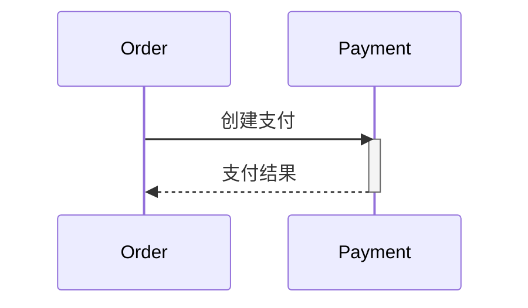

# 迁移到OpenTelemetry

## 介绍

OpenTelemetry（简称OTel）是一个开源的观测性框架，用于生成、收集和管理遥测数据（如指标、日志和追踪）。它逐渐成为云原生领域的标准，取代了Jaeger、Zipkin等独立工具。本文将指导你如何从Jaeger迁移到OpenTelemetry，并解释其优势。

:::note 为什么选择OpenTelemetry？
- **统一标准**：整合了追踪、指标和日志的API。
- **厂商中立**：支持多种后端（如Jaeger、Prometheus）。
- **社区活跃**：CNCF毕业项目，持续迭代。
:::

---

## 核心概念对比

### Jaeger vs OpenTelemetry
| 特性                | Jaeger               | OpenTelemetry                     |
|---------------------|----------------------|-----------------------------------|
| **数据收集**         | 仅追踪               | 追踪、指标、日志                  |
| **协议支持**         | Jaeger原生协议       | OTLP（OpenTelemetry协议）、兼容Jaeger |
| **扩展性**           | 有限                 | 高（支持多种语言和插件）           |

---

## 迁移步骤

### 1. 安装OpenTelemetry SDK
以Python为例，安装必要的库：
```bash
pip install opentelemetry-api opentelemetry-sdk opentelemetry-exporter-otlp
```

### 2. 配置导出器
将Jaeger的导出器替换为OTLP导出器：
```python
from opentelemetry import trace
from opentelemetry.sdk.trace import TracerProvider
from opentelemetry.sdk.trace.export import BatchSpanProcessor
from opentelemetry.exporter.otlp.proto.grpc.trace_exporter import OTLPSpanExporter

provider = TracerProvider()
processor = BatchSpanProcessor(OTLPSpanExporter(endpoint="http://otel-collector:4317"))
provider.add_span_processor(processor)
trace.set_tracer_provider(provider)
```

### 3. 适配原有代码
将Jaeger的追踪代码替换为OpenTelemetry的API：
```python
# Jaeger 旧代码
from jaeger_client import Config
config = Config(config={}, service_name="my-app")
tracer = config.initialize_tracer()

# OpenTelemetry新代码
tracer = trace.get_tracer("my-app")
```

---

## 实际案例

### 场景：微服务调用追踪
假设你有一个订单服务（Order）和支付服务（Payment），原先通过Jaeger追踪调用链。迁移后，OpenTelemetry会自动关联跨服务的Span：



迁移后的代码会生成兼容W3C Trace Context的标头，确保跨服务链路完整。

---

## 总结

迁移到OpenTelemetry能带来更统一的观测体验，但需注意：
1. **逐步迁移**：先试点单个服务。
2. **验证数据**：确保导出到Jaeger或OTel后端的数据一致。
3. **利用社区工具**：如OpenTelemetry Collector帮助协议转换。

:::tip 附加资源
- [OpenTelemetry官方文档](https://opentelemetry.io/docs/)
- [Jaeger与OTel兼容性指南](https://www.jaegertracing.io/docs/latest/opentelemetry/)
:::

**练习**：尝试将你的Jaeger客户端替换为OpenTelemetry，并导出数据到本地Jaeger实例。