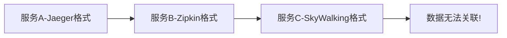
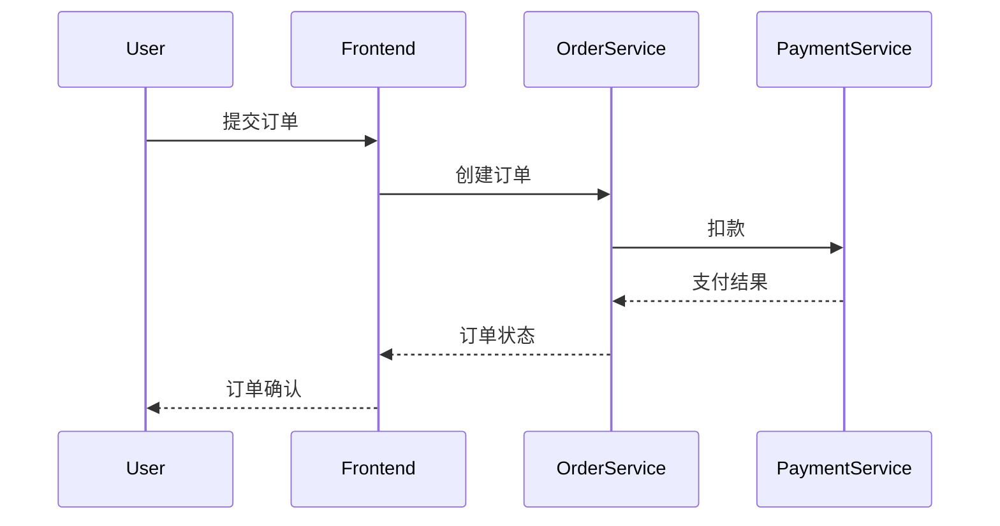

# 标准化追踪

## 引言

在现代分布式系统中，一个用户请求可能跨越多个服务。**标准化追踪**通过统一的格式和协议，使得不同团队、不同技术栈的服务能够无缝共享追踪数据。本文将介绍：

- 为什么需要标准化追踪
- OpenTelemetry的标准化模型
- 如何在Jaeger中实践标准化追踪

## 为什么需要标准化？

在没有标准之前，不同追踪系统（如Zipkin、Jaeger、SkyWalking）使用各自的数据格式：



标准化解决了：
1. **跨系统兼容性**：不同团队可使用不同工具但共享数据
2. **减少重复工作**：避免为每个系统编写适配器
3. **未来可扩展**：新工具只需支持标准协议

## OpenTelemetry的标准化模型

OpenTelemetry（简称OTel）定义了三大核心标准：

### 1. 追踪数据模型
```protobuf
message Span {
    bytes trace_id = 1;    // 16字节全局唯一ID
    bytes span_id = 2;     // 8字节跨度ID
    string name = 3;       // 操作名称（如"HTTP GET"）
    uint64 start_time = 4; // 开始时间戳（纳秒）
    uint64 end_time = 5;   // 结束时间戳
    repeated KeyValue attributes = 6; // 自定义属性
    Status status = 7;     // 状态码（OK/ERROR）
}
```

### 2. 上下文传播标准
通过HTTP头或gRPC元数据传递追踪上下文：
```bash
# HTTP头示例
traceparent: 00-0af7651916cd43dd8448eb211c80319c-b7ad6b7169203331-01
```

### 3. 传输协议（OTLP）
统一的数据上报协议：
```go
// Go示例：通过OTLP导出数据
provider := sdktrace.NewTracerProvider(
    sdktrace.WithBatcher(
        otlptracegrpc.NewExporter(
            otlptracegrpc.WithEndpoint("collector:4317"),
            otlptracegrpc.WithInsecure(),
        ),
    ),
)
```

## Jaeger 中的标准化实践

### 场景：电商订单流程


### 代码实现
使用OpenTelemetry SDK生成标准化数据，Jaeger作为后端：

```python
# Python示例
from opentelemetry import trace
from opentelemetry.sdk.trace import TracerProvider
from opentelemetry.sdk.trace.export import BatchSpanProcessor
from opentelemetry.exporter.jaeger.thrift import JaegerExporter

# 设置标准化导出器
provider = TracerProvider()
jaeger_exporter = JaegerExporter(
    agent_host_name="jaeger-agent",
    agent_port=6831,
)
provider.add_span_processor(BatchSpanProcessor(jaeger_exporter))
trace.set_tracer_provider(provider)

# 创建跨服务追踪
tracer = trace.get_tracer("order.service")
with tracer.start_as_current_span("process_order") as span:
    span.set_attribute("order.id", "12345")
    # 调用支付服务（自动传递上下文）
    call_payment_service()
```

:::tip 上下文传播
在HTTP调用中，OTel会自动注入`traceparent`头，无需手动处理：
```python
requests.get("http://payment/api", headers={
    "traceparent": trace.propagate.extract()
})
```
:::

## 实际案例：故障诊断

**问题现象**：用户投诉支付成功率下降，但各服务日志显示正常。

**标准化追踪的价值**：
1. 在Jaeger中查询`payment/process`跨度
2. 发现耗时分布：
   ```mermaid
   pie
       title 支付耗时分布
       "数据库查询" : 45
       "风控检查" : 30
       "网络IO" : 15
       "其他" : 10
   ```
3. 定位到新版风控服务引入了额外检查

## 总结与练习

### 关键要点
- 标准化追踪通过统一的数据模型和协议实现跨系统观测
- OpenTelemetry是当前事实上的标准
- Jaeger完全兼容OTel标准协议

### 动手练习
1. 使用Docker快速启动Jaeger和OTel Collector：
   ```bash
   docker run -d --name jaeger \
     -p 16686:16686 -p 6831:6831/udp \
     jaegertracing/all-in-one:latest
   ```
2. 修改你的微服务，配置OTel导出到Jaeger
3. 在Jaeger UI中尝试：
   - 查看完整的跨服务调用链
   - 使用标签搜索特定请求

### 扩展阅读
- [OpenTelemetry官方文档](https://opentelemetry.io/docs/)
- [Jaeger支持的标准协议](https://www.jaegertracing.io/docs/latest/apis/#opentelemetry-protocol)
- [W3C Trace Context标准](https://www.w3.org/TR/trace-context/)