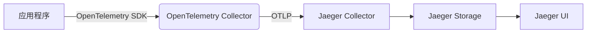

# 混合部署模式

## 介绍

在现代分布式系统中，**混合部署模式**是指同时使用[Jaeger](https://jaegertracing.io/)和[OpenTelemetry](https://opentelemetry.io/)两种工具来实现分布式追踪的架构方案。这种模式结合了Jaeger的高效存储与查询能力，以及OpenTelemetry的标准化数据采集能力，为开发者提供了灵活且强大的观测能力。

对于初学者来说，理解混合部署的核心思想是：
1. **OpenTelemetry**负责**数据采集和标准化**（通过OTLP协议）。
2. **Jaeger**负责**存储、分析和可视化**追踪数据。

:::tip 为什么需要混合部署？
- OpenTelemetry提供了厂商中立的API/SDK，但后端实现较弱
- Jaeger有成熟的存储和UI，但数据采集能力有限
- 混合模式可以发挥两者的优势
:::

## 架构原理



关键组件说明：
1. **OpenTelemetry SDK**：集成在应用中，生成追踪数据
2. **OpenTelemetry Collector**：接收、处理并转发遥测数据
3. **Jaeger Collector**：接收OTLP格式数据并写入存储
4. **Jaeger Storage**：通常使用Elasticsearch或Cassandra
5. **Jaeger UI**：可视化追踪数据

## 实现步骤

### 1. 安装必要组件

```bash
# 安装OpenTelemetry Collector
docker run -p 4317:4317 otel/opentelemetry-collector

# 安装Jaeger全组件
docker run -d --name jaeger \
  -e COLLECTOR_OTLP_ENABLED=true \
  -p 16686:16686 \
  -p 4317:4317 \
  jaegertracing/all-in-one:latest
```

### 2. 配置OpenTelemetry SDK

以Node.js应用为例：

```javascript
const { NodeTracerProvider } = require('@opentelemetry/sdk-trace-node');
const { OTLPTraceExporter } = require('@opentelemetry/exporter-trace-otlp-grpc');
const { Resource } = require('@opentelemetry/resources');
const { SemanticResourceAttributes } = require('@opentelemetry/semantic-conventions');

const provider = new NodeTracerProvider({
  resource: new Resource({
    [SemanticResourceAttributes.SERVICE_NAME]: 'my-service'
  })
});

const exporter = new OTLPTraceExporter({
  url: 'http://localhost:4317' // OTel Collector地址
});

provider.addSpanProcessor(new BatchSpanProcessor(exporter));
provider.register();
```

### 3. 配置OpenTelemetry Collector

创建`otel-collector-config.yaml`:

```yaml
receivers:
  otlp:
    protocols:
      grpc:
      http:

exporters:
  otlp/jaeger:
    endpoint: "jaeger:4317"
    tls:
      insecure: true

service:
  pipelines:
    traces:
      receivers: [otlp]
      exporters: [otlp/jaeger]
```

## 实际案例

### 电商系统追踪

假设我们有一个包含以下服务的电商系统：
- 用户服务
- 商品服务
- 订单服务
- 支付服务

使用混合部署模式后：
1. 所有服务使用OpenTelemetry SDK生成追踪数据
2. 数据通过OTLP协议发送到OpenTelemetry Collector
3. Collector将数据转发到Jaeger
4. 在Jaeger UI中可以看到完整的调用链：

```
用户请求 → 商品服务 → 订单服务 → 支付服务
```

:::note 性能考量
混合模式下，建议：
- OpenTelemetry Collector做简单过滤和采样
- 复杂处理放在Jaeger侧
- 生产环境使用独立存储(如Elasticsearch集群)
:::

## 常见问题解决

**问题1**：Jaeger UI中看不到数据
- 检查OpenTelemetry Collector日志
- 验证端口配置(4317 for OTLP)
- 确保服务名称一致

**问题2**：高负载下数据丢失
```yaml
# 在Collector配置中添加批处理设置
processors:
  batch:
    timeout: 5s
    send_batch_size: 1000
```

## 总结

混合部署模式结合了OpenTelemetry和Jaeger的优势：
✓ 标准化数据采集(OpenTelemetry)
✓ 强大的存储和可视化(Jaeger)
✓ 灵活的架构选择

## 扩展学习

推荐练习：
1. 在本机使用Docker搭建混合环境
2. 创建一个Python服务并接入此追踪系统
3. 在Jaeger UI中分析服务调用关系

附加资源：
- [OpenTelemetry官方文档](https://opentelemetry.io/docs/)
- [Jaeger与OpenTelemetry集成指南](https://www.jaegertracing.io/docs/1.41/opentelemetry/)
- [分布式追踪模式详解](https://microservices.io/patterns/observability/distributed-tracing.html)