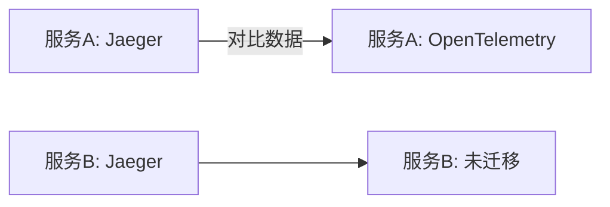

# 渐进式迁移

## 介绍

渐进式迁移是一种将系统从旧技术栈逐步过渡到新技术栈的策略，尤其适用于监控和追踪领域。当从 **Jaeger** 迁移到 **OpenTelemetry** 时，渐进式迁移可以最小化风险，允许团队在保持现有功能的同时逐步验证新组件的稳定性。

:::note 为什么选择渐进式迁移？
- **降低风险**：避免一次性全量迁移导致的不可预测问题。<br />
- **并行验证**：新旧系统可同时运行，对比数据一致性。<br />
- **灵活回滚**：发现问题时可快速切换回旧方案。
:::

## 迁移策略

### 阶段1：双数据管道
同时配置 Jaeger 和 OpenTelemetry 的导出器（Exporters），将数据发送到两个后端。

```go
// 示例：Go 中配置双导出器
import (
    "go.opentelemetry.io/otel/exporters/jaeger"
    "go.opentelemetry.io/otel/sdk/trace"
)

func initTracer() *trace.TracerProvider {
    // Jaeger 导出器
    jaegerExporter, _ := jaeger.New(jaeger.WithCollectorEndpoint())
    
    // OpenTelemetry 导出器（假设使用OTLP协议）
    otlpExporter, _ := otlptrace.New(context.Background(), otlptracegrpc.NewClient())
    
    // 组合多个导出器
    provider := trace.NewTracerProvider(
        trace.WithBatcher(jaegerExporter),
        trace.WithBatcher(otlpExporter),
    )
    return provider
}
```

### 阶段2：逐步替换组件
按服务或功能模块逐步替换 Jaeger SDK 为 OpenTelemetry SDK。例如：
1. 先迁移非核心服务（如内部工具）。
2. 验证无异常后迁移核心业务服务。



### 阶段3：统一数据处理
当所有服务迁移完成后，关闭 Jaeger 导出器，并统一使用 OpenTelemetry Collector 处理数据流：

```yaml
# OpenTelemetry Collector 配置示例
receivers:
  otlp:
    protocols:
      grpc:
exporters:
  jaeger:  # 临时保留（如需回滚）
    endpoint: "jaeger:14250"
  logging:  # 调试用
    logLevel: debug
service:
  pipelines:
    traces:
      receivers: [otlp]
      exporters: [logging, jaeger]  # 后期移除jaeger
```

## 实际案例

**电商平台迁移场景**：
1. **第1周**：在订单服务中启用双导出，对比 Jaeger 和 OpenTelemetry 的追踪数据差异。
2. **第2月**：迁移支付服务，利用 OpenTelemetry 的 Baggage 功能传递跨服务参数（如用户ID）。
3. **第3月**：关闭所有 Jaeger 导出器，使用 OpenTelemetry 的采样策略优化性能。

:::tip 数据对比技巧
通过以下查询验证数据一致性：
```bash
# Jaeger 查询最近1小时错误
curl "http://jaeger-query/api/traces?service=order&limit=20&lookback=1h&tags={\"error\":\"true\"}"

# OpenTelemetry 等效查询
curl "http://otel-collector/traces?service.name=order&attribute.error=true"
```
:::

## 总结

渐进式迁移的关键在于：
1. **并行运行**：新旧系统共存期是必要的安全网。
2. **小步验证**：按模块或服务逐步推进。
3. **自动化比对**：确保数据一致性后再切换流量。

## 扩展资源
- [OpenTelemetry 迁移指南](https://opentelemetry.io/docs/concepts/migration/)
- Jaeger 与 OpenTelemetry 的 [协议兼容性矩阵](https://github.com/open-telemetry/opentelemetry-specification/blob/main/specification/compatibility/jaeger.md)

**练习**：在本地环境中部署一个双导出器的 demo 服务，并使用 Jaeger UI 和 OpenTelemetry Collector 分别查看生成的追踪数据。