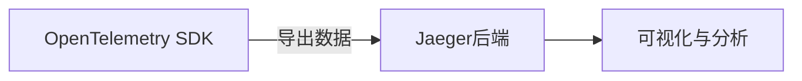
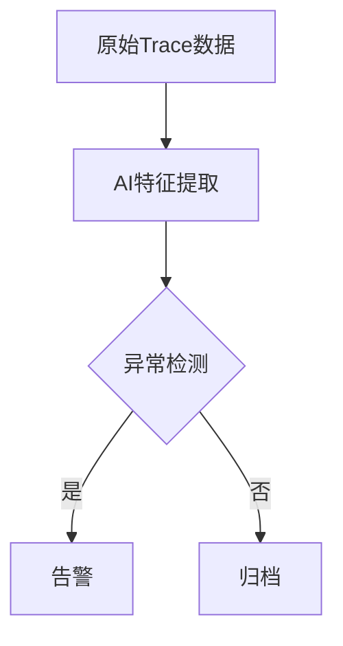

## 引言

在现代微服务架构中，分布式追踪（Distributed Tracing）是理解系统行为、诊断性能问题的关键工具。Jaeger和OpenTelemetry作为该领域的核心开源项目，正在持续演进。本文将分析它们的未来发展趋势，帮助初学者理解技术方向。

:::note 关键术语
- **Jaeger**: 由Uber开源的高性能分布式追踪系统。
- **OpenTelemetry**: CNCF主导的标准化观测框架，统一了追踪、指标和日志的采集。
:::

---

## 1. 技术整合：从竞争到协作

### 当前状态
Jaeger最初是独立的追踪后端，而OpenTelemetry提供厂商中立的SDK和采集器。两者过去存在功能重叠，但现在正走向深度整合：



### 未来方向
- **OpenTelemetry作为标准采集层**：Jaeger将专注于存储与可视化，逐步淡化原生SDK。
- **统一协议支持**：Jaeger将全面适配OpenTelemetry Protocol (OTLP)，取代旧有传输格式。

:::tip 代码示例：OTLP导出配置
```go
// 使用Go语言的OpenTelemetry SDK配置Jaeger导出
provider := sdktrace.NewTracerProvider(
    sdktrace.WithBatcher(
        otlptracegrpc.NewExporter(
            otlptracegrpc.WithEndpoint("jaeger-collector:4317"),
            otlptracegrpc.WithInsecure(),
        ),
    ),
)
```
:::

---

## 2. 云原生深度集成

### Kubernetes与Service Mesh
未来版本将优化对云原生环境的支持：
- **自动注入Sidecar**：在Istio/Linkerd环境中实现零配置追踪。
- **eBPF技术应用**：通过内核层数据采集减少性能损耗。

### 实际案例
某电商平台通过以下组合实现全链路追踪：
1. OpenTelemetry Operator自动注入Agent
2. Jaeger的Tempo替代方案存储数据
3. 基于Trace的自动扩缩容决策

---

## 3. 人工智能辅助分析

### 预测性监控
未来的Jaeger UI可能集成AI功能：
- 自动识别异常Span模式
- 预测潜在故障点（如数据库慢查询趋势）



---

## 4. 标准化与生态系统

### OpenTelemetry的统治地位
- **W3C TraceContext规范**将成为所有语言的默认标准
- **Jaeger插件体系**：支持更多分析插件（如日志关联、安全审计）

:::warning 兼容性注意
旧版Jaeger客户端（如`jaeger-client-java`）将在2024年后停止维护，应优先使用OpenTelemetry SDK。
:::

---

## 5. 性能优化方向

### 关键改进
| 技术          | 当前瓶颈       | 未来目标       |
|---------------|----------------|----------------|
| 存储查询      | 分钟级延迟     | 亚秒级响应     |
| 采样策略      | 静态规则       | 动态自适应采样 |
| 数据传输      | 多协议并存     | 纯OTLP         |

---

## 总结与练习

### 核心趋势总结
1. OpenTelemetry成为事实标准采集层
2. Jaeger转型为高性能存储/可视化专用工具
3. 云原生与AI深度集成

### 动手练习
1. 使用Docker Compose部署Jaeger+OpenTelemetry Collector的测试环境
2. 修改采样配置，对比全量采集与动态采样的性能差异
3. 尝试通过Trace数据生成服务依赖图

### 扩展资源
- [OpenTelemetry官方路线图](https://opentelemetry.io/roadmap/)
- Jaeger社区会议记录（GitHub Discussions）
- 《Distributed Tracing in Practice》书籍（O'Reilly）