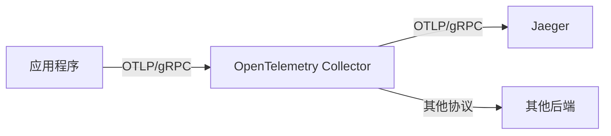

# OTLP协议集成

## 介绍

OTLP（OpenTelemetry Protocol）是OpenTelemetry项目定义的一种通用协议，用于在不同组件之间传输遥测数据（如追踪、指标和日志）。它是Jaeger与OpenTelemetry集成的核心协议，取代了旧版的Jaeger协议（如Thrift或HTTP/JSON）。<br />
通过OTLP，开发者可以更高效、更标准化地将数据从应用程序发送到Jaeger后端。

:::tip 为什么选择OTLP？
- **标准化**：OpenTelemetry是CNCF项目，已成为云原生可观测性的事实标准。
- **高性能**：基于gRPC或HTTP/1.1的二进制协议，比JSON更高效。
- **多语言支持**：所有OpenTelemetry支持的语言都实现了OTLP。
:::

## 核心概念

### 1. OTLP协议架构


### 2. 数据传输方式
- **gRPC**（默认）：高性能二进制协议，端口通常为 `4317`
- **HTTP/1.1**：JSON或Protobuf编码，端口通常为 `4318`

## 集成步骤

### 1. 配置OpenTelemetry SDK

以Python为例，配置OTLP导出器：

```python
from opentelemetry import trace
from opentelemetry.sdk.trace import TracerProvider
from opentelemetry.sdk.trace.export import BatchSpanProcessor
from opentelemetry.exporter.otlp.proto.grpc.trace_exporter import OTLPSpanExporter

# 设置TracerProvider
trace.set_tracer_provider(TracerProvider())

# 创建OTLP导出器（默认连接到localhost:4317）
otlp_exporter = OTLPSpanExporter()

# 添加批处理处理器
trace.get_tracer_provider().add_span_processor(
    BatchSpanProcessor(otlp_exporter)
)

# 现在所有追踪数据将通过OTLP发送
tracer = trace.get_tracer(__name__)
with tracer.start_as_current_span("example_span"):
    print("追踪数据将通过OTLP发送!")
```

### 2. 配置OpenTelemetry Collector

创建 `otel-collector-config.yaml`：

```yaml
receivers:
  otlp:
    protocols:
      grpc:
      http:

exporters:
  logging:
    logLevel: debug
  jaeger:
    endpoint: "jaeger:14250"
    tls:
      insecure: true

service:
  pipelines:
    traces:
      receivers: [otlp]
      exporters: [jaeger, logging]
```

### 3. 启动Jaeger接收OTLP数据

使用Docker Compose启动包含Jaeger和Collector的堆栈：

```yaml
version: "3"
services:
  jaeger:
    image: jaegertracing/all-in-one:latest
    ports:
      - "16686:16686"
  
  collector:
    image: otel/opentelemetry-collector
    command: ["--config=/etc/otel-config.yaml"]
    volumes:
      - ./otel-collector-config.yaml:/etc/otel-config.yaml
    ports:
      - "4317:4317"
    depends_on:
      - jaeger
```

## 实际案例：电商应用追踪

假设我们有一个电商应用，需要追踪订单处理流程：

```python
with tracer.start_as_current_span("process_order"):
    # 检查库存
    with tracer.start_as_current_span("check_inventory"):
        inventory.check(product_id)
    
    # 处理支付
    with tracer.start_as_current_span("process_payment"):
        payment.process(order_id)
    
    # 更新订单状态
    with tracer.start_as_current_span("update_order"):
        orders.update_status(order_id, "completed")
```

在Jaeger UI中，您将看到完整的调用链：

```mermaid
gantt
    title 订单处理追踪
    dateFormat  X
    axisFormat %s
    section 订单流程
    process_order      :a1, 0, 300
    check_inventory    :a2, after a1, 100
    process_payment    :a3, after a2, 150
    update_order       :a4, after a3, 50
```


## 常见问题解决

:::caution 连接问题
如果遇到连接错误，检查：
1. Collector是否运行并暴露了正确的端口（默认4317）
2. Jaeger是否配置了正确的gRPC接收器
3. 防火墙是否阻止了端口通信
:::

## 总结

OTLP协议为Jaeger和OpenTelemetry提供了现代化的集成方式：
- 取代了旧版协议，提供更好的性能和扩展性
- 通过Collector可以实现灵活的数据路由和处理
- 支持多语言和多种传输协议

## 扩展学习

1. 尝试修改Collector配置，将数据同时发送到Jaeger和Zipkin
2. 实验OTLP的HTTP协议与gRPC协议的性能差异
3. 阅读OpenTelemetry官方文档中的[OTLP规范](https://github.com/open-telemetry/opentelemetry-specification/blob/main/specification/protocol/otlp.md)

:::note 练习任务
1. 在本地搭建Jaeger+Collector环境
2. 修改示例代码，添加自定义属性到span中
3. 配置Collector对敏感数据进行过滤
:::