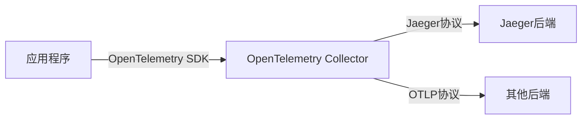

# Jaeger 与OpenTelemetry共存策略

## 介绍

在现代分布式系统中，链路追踪（Tracing）是监控和诊断性能问题的关键工具。Jaeger和OpenTelemetry是两个流行的开源项目，它们可以协同工作，提供强大的可观测性能力。本文将介绍如何制定**共存策略**，使两者在系统中互补共存。

:::note 关键概念
- **Jaeger**：专注于分布式追踪的端到端解决方案。
- **OpenTelemetry**：提供统一的API、SDK和工具，用于生成、收集和导出遥测数据（包括追踪、指标和日志）。
:::

## 为什么需要共存？

1. **平滑迁移**：从Jaeger逐步迁移到OpenTelemetry时，可能需要两者同时运行。
2. **功能互补**：OpenTelemetry提供标准化数据采集，Jaeger提供强大的可视化与分析。
3. **兼容性**：OpenTelemetry支持将数据导出到Jaeger后端。

## 共存架构



## 实现步骤

### 1. 配置OpenTelemetry SDK

在应用程序中初始化OpenTelemetry SDK，并配置Jaeger导出器：

```javascript
const { NodeTracerProvider } = require('@opentelemetry/sdk-trace-node');
const { JaegerExporter } = require('@opentelemetry/exporter-jaeger');

const provider = new NodeTracerProvider();
const exporter = new JaegerExporter({
  endpoint: 'http://jaeger-collector:14268/api/traces',
});

provider.addSpanProcessor(new SimpleSpanProcessor(exporter));
provider.register();
```

### 2. 使用OpenTelemetry Collector（可选）

OpenTelemetry Collector可以作为中间层，实现数据转换和路由：

```yaml
# otel-collector-config.yaml
receivers:
  otlp:
    protocols:
      grpc:
      http:

exporters:
  jaeger:
    endpoint: "jaeger-collector:14250"
    insecure: true

service:
  pipelines:
    traces:
      receivers: [otlp]
      exporters: [jaeger]
```

### 3. 验证数据流

1. 在应用程序中生成追踪数据：
```javascript
const tracer = trace.getTracer('example-tracer');
tracer.startActiveSpan('main', (span) => {
  // 业务逻辑
  span.end();
});
```

2. 检查Jaeger UI（通常位于 `http://localhost:16686`）是否显示追踪数据。

## 实际案例：电商系统

**场景**：一个微服务架构的电商平台需要同时支持：
- 使用OpenTelemetry自动检测所有服务
- 保留现有的Jaeger告警和仪表板

**解决方案**：
1. 所有服务改用OpenTelemetry SDK
2. 配置OpenTelemetry Collector将数据同时发送到：
   - Jaeger（供现有团队使用）
   - Prometheus（用于指标监控）

## 最佳实践

1. **统一采样策略**：在OpenTelemetry Collector中集中配置采样率，避免Jaeger和OpenTelemetry采样冲突。
2. **标签一致性**：确保资源标签（如 `service.name`）在两者中保持一致。
3. **逐步迁移**：
   - 第一阶段：OpenTelemetry导出到Jaeger
   - 第二阶段：引入OpenTelemetry Collector
   - 第三阶段：评估是否需要完全迁移

:::caution 注意
避免在同一个应用程序中同时使用Jaeger客户端和OpenTelemetry SDK，这会导致重复数据和高资源消耗。
:::

## 总结

通过合理的共存策略，Jaeger和OpenTelemetry可以协同工作，发挥各自优势。关键点包括：
- 使用OpenTelemetry作为统一的数据采集层
- 利用OpenTelemetry Collector实现灵活的路由
- 保持配置一致性

## 扩展资源

1. [OpenTelemetry官方文档](https://opentelemetry.io/docs/)
2. [Jaeger与OpenTelemetry集成指南](https://www.jaegertracing.io/docs/1.41/opentelemetry/)
3. 练习：尝试在本地Docker环境中部署Jaeger和OpenTelemetry Collector，并发送测试数据。