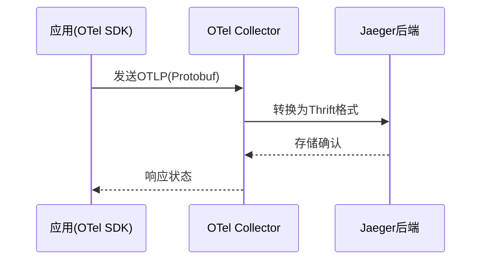

# 数据格式转换

## 介绍

在分布式追踪系统中，**数据格式转换**是不同组件之间传递和存储追踪数据的关键环节。Jaeger和OpenTelemetry（简称OTel）支持多种数据格式（如Thrift、Protocol Buffers、JSON等），理解它们的转换逻辑能帮助开发者更好地集成监控系统。

## 为什么需要数据格式转换？

1. **兼容性**：不同工具可能使用不同数据格式（如Jaeger原生使用Thrift，而OTel默认用Protocol Buffers）。
2. **性能优化**：二进制格式（如Protobuf）比文本格式（如JSON）传输效率更高。
3. **标准化**：OpenTelemetry作为CNCF项目，致力于统一观测数据格式。

---

## 常见格式对比

| 格式          | 编码类型   | 典型用途               | 优点                     | 缺点               |
|---------------|------------|------------------------|--------------------------|--------------------|
| Thrift        | 二进制     | Jaeger原生存储         | 紧凑高效                 | 需要IDL定义        |
| Protocol Buffers | 二进制  | OpenTelemetry默认       | 跨语言支持好             | 需要.proto文件     |
| JSON          | 文本       | 调试/人工阅读          | 人类可读                 | 体积大、解析慢     |

---

## 转换示例

### 场景：将Jaeger Thrift数据转换为OTel Protobuf

#### 输入（Jaeger Thrift格式片段）
```go
type Span struct {
  TraceID       []byte
  SpanID        []byte
  OperationName string
  References    []*SpanRef
  Flags         int32
  StartTime     int64
  Duration      int64
  Tags          []*Tag
}
```

#### 输出（OTel Protobuf格式片段）
```protobuf
message Span {
  bytes trace_id = 1;
  bytes span_id = 2;
  string name = 3;
  int64 start_time_unix_nano = 4;
  int64 end_time_unix_nano = 5;
  repeated KeyValue attributes = 6;
}
```

:::tip 转换关键点
1. 时间单位转换：Jaeger用微秒，OTel用纳秒
2. ID编码方式：Jaeger可能使用Base64，OTel要求原始字节
:::

---

## 实际案例

### 案例：在Kubernetes中集成Jaeger和OTel Collector



1. 应用使用OTel SDK生成Protobuf格式数据
2. Collector通过`jaegerexporter`进行格式转换
3. 转换后的Thrift数据发送到Jaeger后端

:::caution 注意
转换过程中可能丢失部分元数据，需检查字段映射表：
- Jaeger的`Process.Tags`会转为OTel的`Resource`
- OTel的`Events`对应Jaeger的`Logs`
:::

---

## 总结

1. 格式转换是分布式追踪系统集成的核心需求
2. 二进制格式适合生产环境，文本格式适合调试
3. OpenTelemetry正在成为事实标准，建议新项目优先采用OTel格式

## 延伸学习

1. 官方文档：
   - [Jaeger数据模型](https://www.jaegertracing.io/docs/latest/architecture/#data-model)
   - [OTel协议规范](https://github.com/open-telemetry/opentelemetry-proto)
2. 动手练习：
   - 使用`jaeger-thrift`和`otel-protobuf`定义文件手动转换一个示例Span
   - 在本地部署OTel Collector并配置Jaeger导出器