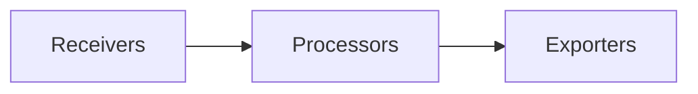

# Collector配置

## 简介

在分布式追踪系统中，**Collector** 是负责接收、处理和导出遥测数据（如 traces、metrics、logs）的核心组件。无论是使用 **Jaeger** 还是 **OpenTelemetry**，Collector 的配置都决定了数据的来源、处理方式以及最终存储或转发目标。本文将带你逐步了解 Collector 的基础配置，并通过实际案例演示其工作流程。

---

## Collector 的核心组件

一个典型的 Collector 配置包含以下关键部分：
1. **Receivers**：定义数据来源（如 Jaeger、OTLP、Zipkin）。
2. **Processors**：对数据进行过滤、转换或增强（如批处理、重试）。
3. **Exporters**：指定数据输出目标（如 Jaeger backend、Prometheus）。



---

## 基础配置示例

以下是一个简单的 OpenTelemetry Collector 配置文件（格式为 YAML）：

```yaml
receivers:
  otlp:
    protocols:
      grpc:
      http:

processors:
  batch:
    timeout: 5s
    send_batch_size: 1000

exporters:
  logging:
    logLevel: debug
  jaeger:
    endpoint: "jaeger-all-in-one:14250"
    tls:
      insecure: true

service:
  pipelines:
    traces:
      receivers: [otlp]
      processors: [batch]
      exporters: [logging, jaeger]
```

### 配置解析：
1. **Receivers**：通过 `otlp` 接收 gRPC 和 HTTP 协议的追踪数据。
2. **Processors**：使用 `batch` 处理器将数据打包（每 5 秒或满 1000 条时发送）。
3. **Exporters**：将数据输出到日志（调试用）和 Jaeger 后端。

:::tip
使用 `logging` exporter 可以快速验证数据是否被正确处理，适合开发环境。
:::

---

## 实际案例：处理多来源数据

假设你的应用同时使用 Jaeger 和 Zipkin 客户端，需要将数据统一转发到 OpenTelemetry Collector：

```yaml
receivers:
  jaeger:
    protocols:
      grpc:
  zipkin:
    endpoint: "0.0.0.0:9411"

exporters:
  otlp:
    endpoint: "otel-collector:4317"
    tls:
      insecure: true

service:
  pipelines:
    traces:
      receivers: [jaeger, zipkin]
      exporters: [otlp]
```

:::note
此配置将 Jaeger（gRPC）和 Zipkin（HTTP）的数据转换为 OTLP 格式，并转发到另一个 Collector。
:::

---

## 高级配置：数据采样

通过 `probabilistic_sampler` 处理器可以控制数据采样率，减少存储压力：

```yaml
processors:
  probabilistic_sampler:
    sampling_percentage: 30  # 只保留30%的请求数据
```

---

## 总结

1. Collector 通过 **receivers-processors-exporters** 流水线处理数据。
2. 基础配置需至少包含一个 receiver 和一个 exporter。
3. 使用 `batch` 处理器能显著提升性能。
4. 采样策略可平衡数据量与存储成本。

---

## 延伸练习

1. 在本地的 `docker-compose.yml` 中部署一个 Jaeger All-in-One 容器，并配置 Collector 向其发送数据。
2. 尝试添加 `attributes` 处理器，为所有 spans 添加一个 `environment=dev` 的标签。

## 附加资源
- [OpenTelemetry Collector 官方文档](https://opentelemetry.io/docs/collector/)
- [Jaeger 配置示例库](https://github.com/jaegertracing/jaeger/tree/main/examples)