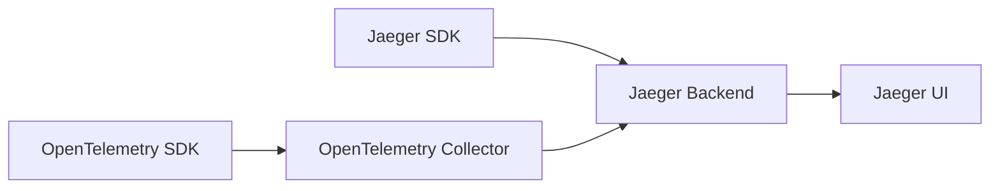

# 双向兼容

## 介绍

在分布式系统的可观测性领域，**Jaeger** 和 **OpenTelemetry** 是两个广泛使用的工具。Jaeger 是一个开源的端到端分布式追踪系统，而 OpenTelemetry 则是一套统一的 API、SDK 和工具集，用于生成、收集和管理遥测数据（如指标、日志和追踪）。  

**双向兼容** 是指 Jaeger 和 OpenTelemetry 能够互相协作，既可以将 OpenTelemetry 的数据发送到 Jaeger 后端，也可以将 Jaeger 的数据导入 OpenTelemetry 生态系统中。这种兼容性使得开发者可以灵活选择工具链，而无需担心数据孤岛问题。

:::note 为什么需要双向兼容？
- **平滑迁移**：团队可以从 Jaeger 逐步迁移到 OpenTelemetry，而不会中断现有监控。
- **工具链灵活性**：开发者可以混合使用 Jaeger 和 OpenTelemetry 的功能。
- **生态整合**：OpenTelemetry 支持多种后端（如 Prometheus、Jaeger），而 Jaeger 也可以接收 OpenTelemetry 格式的数据。
:::

---

## 实现双向兼容的方式

### 1. OpenTelemetry 导出数据到 Jaeger
OpenTelemetry 提供了 **Jaeger Exporter**，可以将追踪数据直接发送到 Jaeger 后端。以下是一个 Python 示例：

```python
from opentelemetry import trace
from opentelemetry.exporter.jaeger.thrift import JaegerExporter
from opentelemetry.sdk.trace import TracerProvider
from opentelemetry.sdk.trace.export import BatchSpanProcessor

# 设置 Jaeger Exporter
jaeger_exporter = JaegerExporter(
    agent_host_name="localhost",
    agent_port=6831,
)

# 配置 TracerProvider
trace.set_tracer_provider(TracerProvider())
tracer = trace.get_tracer(__name__)

# 将 Jaeger Exporter 添加到处理器
span_processor = BatchSpanProcessor(jaeger_exporter)
trace.get_tracer_provider().add_span_processor(span_processor)

# 创建一个简单的 span
with tracer.start_as_current_span("example_span"):
    print("This span will be exported to Jaeger!")
```

**输出**：  
在 Jaeger UI（通常访问 `http://localhost:16686`）中可以看到名为 `example_span` 的追踪数据。

---

### 2. Jaeger 接收 OpenTelemetry 格式的数据
Jaeger 支持直接接收 OpenTelemetry Protocol（OTLP）格式的数据。以下是配置 Jaeger 以接收 OTLP 的示例（使用 Docker 启动 Jaeger）：

```bash
docker run -d --name jaeger \
  -e COLLECTOR_OTLP_ENABLED=true \
  -p 16686:16686 \
  -p 4317:4317 \
  -p 4318:4318 \
  jaegertracing/all-in-one:latest
```

然后，使用 OpenTelemetry 的 OTLP Exporter 发送数据：

```python
from opentelemetry import trace
from opentelemetry.exporter.otlp.proto.grpc.trace_exporter import OTLPSpanExporter
from opentelemetry.sdk.trace import TracerProvider
from opentelemetry.sdk.trace.export import BatchSpanProcessor

# 设置 OTLP Exporter（默认指向 localhost:4317）
otlp_exporter = OTLPSpanExporter()

trace.set_tracer_provider(TracerProvider())
tracer = trace.get_tracer(__name__)

# 添加处理器
span_processor = BatchSpanProcessor(otlp_exporter)
trace.get_tracer_provider().add_span_processor(span_processor)

# 创建 span
with tracer.start_as_current_span("otlp_span"):
    print("This span is sent via OTLP to Jaeger!")
```

---

## 实际应用场景

### 案例：混合部署的微服务监控
假设一个团队的部分服务使用 Jaeger SDK 直接上报数据，而新服务则采用 OpenTelemetry SDK。通过双向兼容性：
1. OpenTelemetry 服务通过 OTLP 将数据发送到 Jaeger。
2. Jaeger 服务通过 Thrift 或 gRPC 将数据发送到 OpenTelemetry Collector（如果需要进一步处理）。



---

## 总结

- **双向兼容** 是 Jaeger 和 OpenTelemetry 协作的关键特性，支持数据互通。
- 通过 **Jaeger Exporter** 或 **OTLP Exporter** 可以实现双向数据传输。
- 实际场景中，这种兼容性允许团队逐步迁移或混合使用两种工具。

---

## 附加资源与练习

### 资源
- [Jaeger 官方文档](https://www.jaegertracing.io/docs/)
- [OpenTelemetry 文档](https://opentelemetry.io/docs/)

### 练习
1. 尝试将 OpenTelemetry 的追踪数据导出到本地 Jaeger 实例。
2. 配置 Jaeger 以接收 OTLP 数据，并验证是否能在 UI 中看到追踪信息。
3. （进阶）使用 OpenTelemetry Collector 将 Jaeger 数据转发到其他后端（如 Prometheus）。