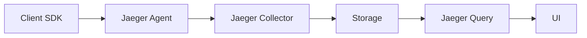
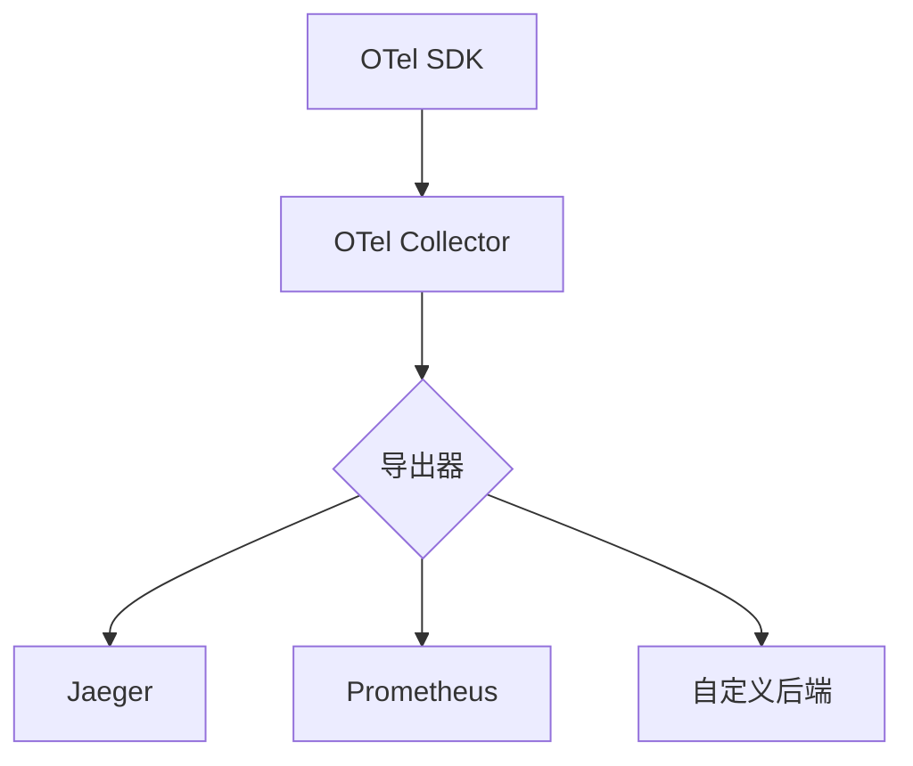

# 生态系统对比：Jaeger与OpenTelemetry

## 介绍

在现代微服务架构中，分布式追踪是理解系统行为的关键工具。Jaeger和OpenTelemetry是目前最流行的两种解决方案，但它们的定位和生态系统存在显著差异。本文将从架构、数据模型、集成方式等角度进行对比，并指导初学者如何选择。

:::note 关键概念
- **Jaeger**：专注于分布式追踪的端到端解决方案。
- **OpenTelemetry**：跨观测性数据的统一标准（追踪、指标、日志）。
:::

## 架构对比

### Jaeger 的架构
Jaeger采用传统单体式设计，主要包含以下组件：


### OpenTelemetry的架构
OpenTelemetry是模块化设计，强调标准化和互操作性：


:::tip 核心差异
Jaeger是完整的垂直解决方案，而OpenTelemetry是横向可扩展的生态系统。
:::

## 数据模型对比

### Jaeger 的数据模型
Jaeger使用专有的Span格式：
```go
type Span struct {
    TraceID       TraceID
    SpanID        SpanID
    OperationName string
    References    []SpanReference
    // ...其他字段
}
```

### OpenTelemetry的数据模型
OpenTelemetry采用OpenTelemetry Protocol (OTLP)：
```protobuf
message Span {
    bytes trace_id = 1;
    bytes span_id = 2;
    string name = 3;
    repeated SpanLink links = 4;
    // ...其他字段
}
```

## 代码示例对比

### Jaeger 的Python示例
```python
from jaeger_client import Config

config = Config(config={'sampler': {'type': 'const', 'param': 1}}, service_name='myapp')
tracer = config.initialize_tracer()

with tracer.start_span('say-hello') as span:
    span.log_kv({'event': 'name-request', 'value': 'John'})
```

### OpenTelemetry的Python示例
```python
from opentelemetry import trace
from opentelemetry.sdk.trace import TracerProvider

trace.set_tracer_provider(TracerProvider())
tracer = trace.get_tracer(__name__)

with tracer.start_as_current_span("say-hello") as span:
    span.set_attribute("user.name", "John")
```

## 生态系统集成

### Jaeger 的优势
- 开箱即用的UI和查询功能
- 简单的部署模式
- 成熟的存储后端支持（Cassandra, Elasticsearch等）

### OpenTelemetry的优势
| 特性                | OpenTelemetry | Jaeger |
|---------------------|---------------|--------|
| 多信号支持          | ✅            | ❌      |
| 供应商中立          | ✅            | ❌      |
| 自动仪表化          | ✅            | ❌      |
| 广泛的语言支持      | ✅            | ⚠️      |

## 实际应用场景

**案例1：多云环境监控**
> 某电商平台使用OpenTelemetry收集数据，然后同时导出到Jaeger（用于追踪分析）和Prometheus（用于指标监控）。

**案例2：快速问题诊断**
> 开发团队使用Jaeger的依赖图功能快速定位微服务调用链中的性能瓶颈。

## 如何选择？

:::warning 考虑因素
1. 是否需要统一处理追踪、指标和日志？
2. 是否计划切换监控后端？
3. 团队现有的技术栈是什么？
:::

**推荐选择：**
- 单一追踪需求 → Jaeger
- 多观测信号/长期灵活性 → OpenTelemetry + Jaeger后端

## 总结

Jaeger和OpenTelemetry各有侧重：
- Jaeger提供"完整解决方案"体验
- OpenTelemetry提供"未来证明"的灵活性

两者也可以协同工作，常见模式是使用OpenTelemetry收集数据，Jaeger作为后端存储和可视化。

## 扩展资源

1. OpenTelemetry官方文档：https://opentelemetry.io/docs/
2. Jaeger官方文档：https://www.jaegertracing.io/docs/
3. 实战练习：尝试将OpenTelemetry数据导出到Jaeger后端