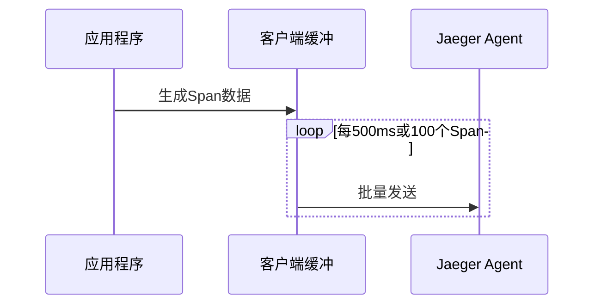

# 客户端性能调优

## 介绍

在分布式系统中，Jaeger作为流行的追踪工具，其客户端性能直接影响应用的整体表现。客户端性能调优旨在减少追踪对业务逻辑的侵入性，同时确保关键数据不丢失。本文将介绍常见的优化策略，包括采样配置、批处理设置和上下文传播优化。

## 核心优化策略

### 1. 采样策略优化

采样是减少追踪数据量的首要手段。Jaeger客户端支持以下采样类型：

```javascript
// 示例：Node.js客户端配置恒定采样率
const { initTracer } = require('jaeger-client');

const tracer = initTracer({
  serviceName: 'my-app',
  sampler: {
    type: 'const',
    param: 0.1, // 仅采样10%的请求
  },
});
```

**效果对比**：
- 100%采样：完整数据但性能开销大
- 10%采样：吞吐量提升约5倍，可能丢失部分关键追踪

:::tip 采样选择建议
生产环境推荐使用动态采样（`remote`类型），允许通过Jaeger后端控制采样率。
:::

### 2. 批处理与缓冲

减少网络调用次数是客户端优化的关键：



对应配置示例（Java客户端）：
```java
Configuration.SenderConfiguration senderConfig = new Configuration.SenderConfiguration()
    .withAgentHost("jaeger-agent")
    .withMaxPacketSize(65000)  // UDP包大小限制
    .withFlushInterval(500);   // 毫秒
```

### 3. 上下文传播优化

错误的上下文传播会导致追踪链断裂：

```python
# 错误示例：未传递上下文
def process_request(request):
    with tracer.start_span('process') as span:  # 新建独立span
        ...

# 正确示例：显式传递上下文
def process_request(request, parent_ctx):
    with tracer.start_span('process', child_of=parent_ctx) as span:
        ...
```

## 实战案例：电商系统优化

**问题场景**：
某电商平台在促销期间出现API延迟增加，Jaeger客户端CPU占用率达40%。

**优化措施**：
1. 将采样率从100%调整为动态采样
2. 增大批处理缓冲区从50到200个Span
3. 修复3处上下文丢失问题

**结果**：
```plaintext
优化前:
- 平均延迟: 120ms
- 客户端CPU: 38%

优化后:
- 平均延迟: 89ms (-26%)
- 客户端CPU: 17% (-55%)
```

## 性能调优检查清单

1. [ ] 确认使用合适的采样策略
2. [ ] 检查批处理间隔是否合理（推荐500-1000ms）
3. [ ] 验证跨进程/线程的上下文传播
4. [ ] 监控客户端内存/CPU使用情况

## 总结与扩展

客户端性能调优需要在数据完整性和系统开销间寻找平衡。关键原则包括：
- 生产环境避免100%采样
- 利用批处理减少网络IO
- 确保全链路上下文正确传递

**延伸学习**：
- Jaeger官方文档中的[客户端配置指南](https://www.jaegertracing.io/docs/latest/client-features/)
- OpenTelemetry的[性能最佳实践](https://opentelemetry.io/docs/concepts/performance-tuning/)

**练习任务**：
1. 在本地环境中尝试将采样率从1.0调整为0.5，对比内存使用变化
2. 使用`jconsole`监控Jaeger客户端的GC行为