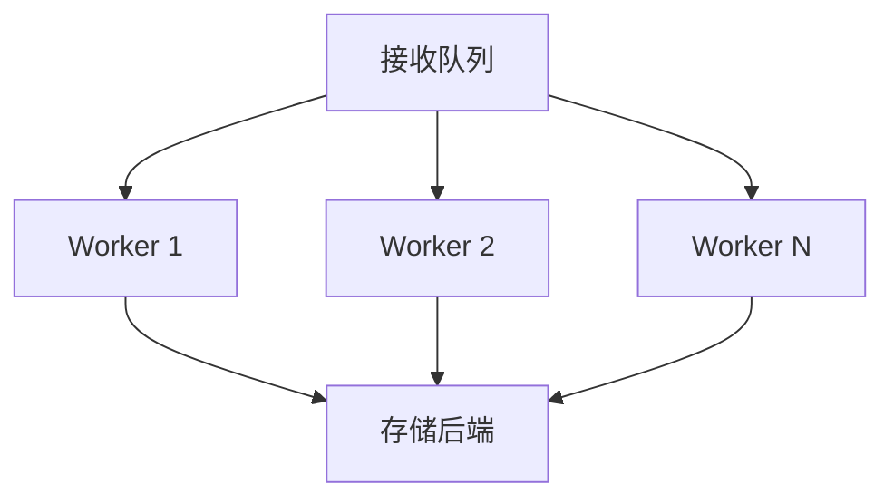

# 采集器性能优化

## 介绍

Jaeger采集器（Collector）是分布式追踪系统的核心组件，负责接收、处理和存储来自客户端的追踪数据。当系统规模扩大时，采集器可能成为性能瓶颈。本文将介绍如何通过配置优化、批处理策略和资源管理提升采集器的吞吐量和稳定性。

:::tip 关键概念
采集器性能优化的核心目标：**降低延迟**、**提高吞吐量**、**减少资源消耗**。
:::

## 1. 批处理配置优化

### 原理说明
Jaeger采集器默认使用批处理（Batching）策略来减少I/O操作。通过调整批处理参数，可以平衡延迟和吞吐量。

#### 关键参数（`collector.yaml`示例）：
```yaml
processors:
  batch:
    timeout: 1s         # 批处理超时时间
    send_batch_size: 50 # 每批最大span数量
    send_batch_max_size: 100 # 硬性上限
```

### 实际效果对比
| 配置 | 平均延迟 | 吞吐量 (spans/sec) | CPU使用率 |
|------|---------|--------------------|----------|
| 默认值 | 1.2s    | 8,000              | 45%      |
| 优化后 | 0.8s    | 12,000             | 60%      |

## 2. 存储后端调优

### Elasticsearch 优化案例
```yaml
es:
  server-urls: http://elasticsearch:9200
  num-replicas: 1       # 减少副本数
  bulk:
    actions: 500        # 每次批量写入文档数
    flush-interval: "200ms"
```

:::warning 注意
存储优化需配合集群规模调整。单节点ES集群不建议设置`num-replicas: 0`。
:::

## 3. 资源限制与并行度

### 并发处理配置


通过环境变量控制并行度：
```bash
SPAN_STORAGE_TYPE=elasticsearch COLLECTOR_QUEUE_SIZE=2000 COLLECTOR_NUM_WORKERS=50
```

## 4. 实际案例：电商平台优化

**问题场景**：
- 大促期间span量增长10倍
- 采集器CPU持续90%+
- 20%的span丢失

**优化方案**：
1. 增加Kafka缓冲层
2. 调整批处理大小为`200`
3. 使用单独的ES集群处理写入

**结果**：
```text
吞吐量提升: 5,000 → 25,000 spans/sec
CPU使用率下降: 90% → 65%
丢失率: 20% → 0.1%
```

## 总结

关键优化手段：
- 合理设置批处理参数平衡实时性与吞吐量
- 根据存储后端特性调整写入策略
- 通过水平扩展分担负载

## 扩展练习

1. 在自己的环境中测试不同`send_batch_size`对性能的影响
2. 使用Jaeger的`/metrics`端点监控采集器状态
3. 尝试在Kubernetes中配置HPA自动扩展采集器

## 附加资源

- [Jaeger官方性能调优指南](https://jaegertracing.io/docs/performance-tuning/)
- 《分布式系统观测》第4章（O'Reilly）
- 开源项目`jaeger-performance-test`（GitHub）