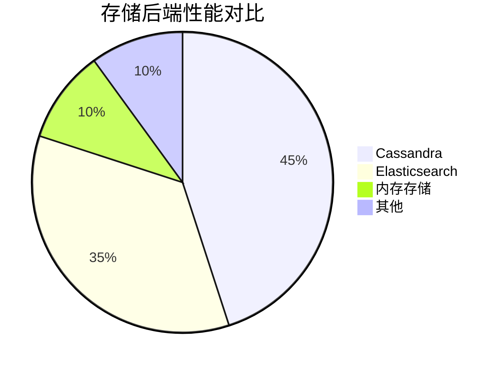
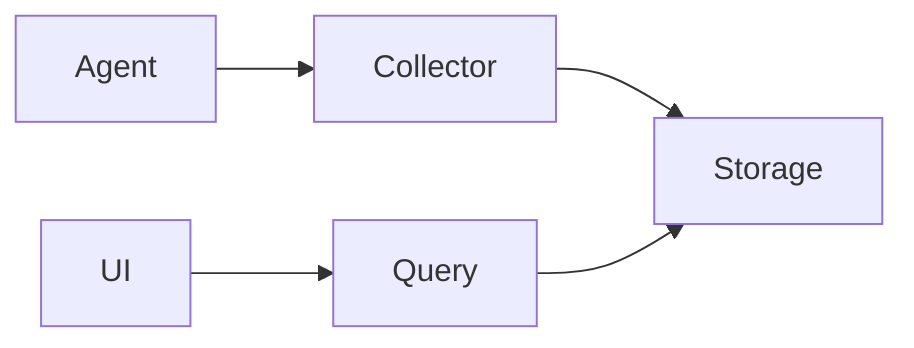

# 大规模部署调优

## 介绍

Jaeger是一个开源的分布式追踪系统，用于监控和排查微服务架构中的性能问题。当系统规模扩大时，Jaeger的默认配置可能无法高效处理大量的追踪数据。本文将介绍如何通过调整存储策略、采样率和组件配置来优化Jaeger的大规模部署。

:::note
**关键概念**：  
大规模部署通常指每天处理超过**10亿条span**的系统，需要特别关注存储、网络和计算资源的分配。
:::

---

## 核心优化策略

### 1. 采样率调整

通过降低采样率减少数据量，同时保留有代表性的追踪信息。以下是动态采样配置示例：

```yaml
sampling:
  strategies:
    - type: probabilistic
      param: 0.1  # 10%采样率
    - type: rate-limiting
      param: 100  # 每秒最多100条trace
```

:::tip
**何时使用动态采样**：  
- 生产环境中推荐组合使用概率采样和限流采样  
- 开发环境可设置为100%采样（`param: 1`）
:::

### 2. 存储优化

#### 存储后端选择


#### Cassandra调优示例
```yaml
storage:
  cassandra:
    servers: ["cassandra1:9042","cassandra2:9042"]
    keyspace: jaeger_v1
    replicationFactor: 3
    writeConsistency: LOCAL_QUORUM
```

### 3. 组件水平扩展

Jaeger组件架构：


扩展建议：
- **Collector**：根据span吞吐量横向扩展
- **Query**：根据查询QPS扩展
- 使用Kubernetes HPA自动扩缩容：
```yaml
# Collector的HPA配置示例
apiVersion: autoscaling/v2
kind: HorizontalPodAutoscaler
metadata:
  name: jaeger-collector
spec:
  scaleTargetRef:
    apiVersion: apps/v1
    kind: Deployment
    name: jaeger-collector
  minReplicas: 3
  maxReplicas: 10
  metrics:
    - type: Resource
      resource:
        name: cpu
        target:
          type: Utilization
          averageUtilization: 70
```

---

## 实际案例

### 电商平台优化实践

**问题**：  
黑色星期五期间流量激增，Jaeger集群出现：
1. 存储写入延迟 > 5秒
2. 查询超时率30%

**解决方案**：
1. 将采样率从100%调整为动态组合：
   - 基础采样率5%
   - 错误请求100%采样
2. Cassandra集群从6节点扩展到12节点
3. 添加Query服务缓存层

**效果**：
- 存储成本降低82%
- P99查询延迟从12s降至1.3s

---

## 总结

关键优化手段：
1. **合理采样**：平衡数据完整性和系统负载
2. **存储规划**：根据数据保留策略选择后端
3. **弹性架构**：组件可水平扩展
4. **监控调优**：持续观察性能指标

## 延伸学习

1. Jaeger官方文档：[性能调优指南](https://jaegertracing.io/docs/latest/performance-tuning/)
2. 练习：使用`jaeger-agent`的`--metrics-backend=prometheus`参数集成监控
3. 工具推荐：`jager-spark-dependencies`用于分析服务依赖关系