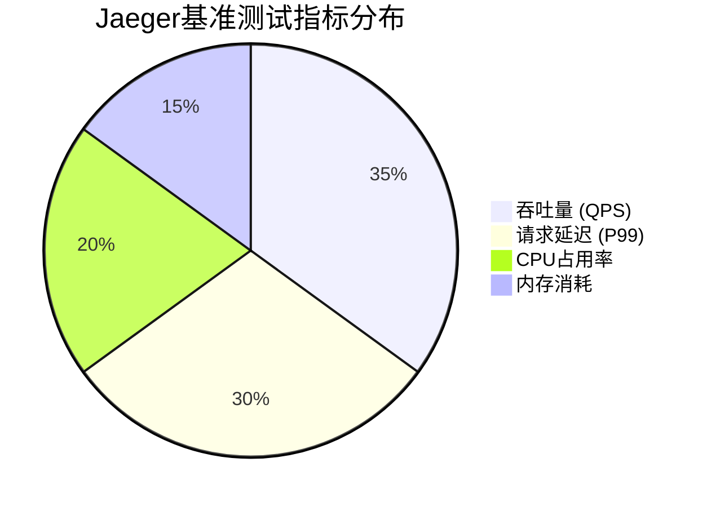
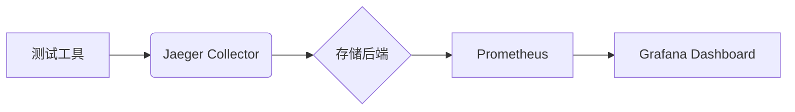

# 基准测试方法

## 什么是基准测试？

基准测试（Benchmarking）是通过标准化测试流程，量化系统性能指标（如吞吐量、延迟、资源占用率等）的方法。在分布式追踪系统如Jaeger中，基准测试帮助开发者识别性能瓶颈，验证优化效果。

:::note 为什么需要基准测试？
- 客观比较不同版本/配置的性能差异
- 发现高负载下的系统行为
- 为容量规划提供数据支持
:::

## 核心测试指标

Jaeger性能测试通常关注以下指标：



## 测试工具链

### 1. 负载生成工具

```go
// 示例：使用wrk生成HTTP负载
wrk -t4 -c100 -d30s --latency http://jaeger-collector:14268/api/traces
```

典型输出：
```
Running 30s test @ http://jaeger-collector:14268
  4 threads and 100 connections
  Latency   25.65ms (P99 102.33ms)
  Req/Sec   956.42
  114772 requests in 30.02s
```

### 2. 数据采集工具

推荐组合：
- `prometheus`：采集系统资源指标
- `jaeger-agent`：收集追踪数据自身性能数据

## 实施步骤

### 步骤1：建立基线

```bash
# 记录初始性能数据
curl -X GET "http://jaeger-query:16686/metrics" > baseline_metrics.txt
```

### 步骤2：设计测试场景

常见测试模式：
1. **峰值测试**：短时突发流量
2. **耐力测试**：长时间稳定负载
3. **压力测试**：逐步增加负载直到系统崩溃

### 步骤3：执行测试

:::warning 重要原则
- 每次只改变一个变量
- 确保测试环境一致（硬件/网络/数据量）
:::

## 实际案例：存储后端对比

测试不同存储方案时：

| 存储类型 | QPS (千次/秒) | P99延迟(ms) | CPU占用 |
|---------|--------------|------------|--------|
| Cassandra | 12.4 | 45 | 78% |
| Elasticsearch | 9.8 | 68 | 65% |
| Badger (本地) | 15.2 | 32 | 82% |

## 结果分析方法

1. 使用Jaeger自带的`/metrics`端点：
   ```bash
   # 获取关键指标
   curl -s http://localhost:14269/metrics | grep 'jaeger_storage_spans_total'
   ```

2. 通过Grafana可视化：



## 总结与进阶

### 关键要点
- 基准测试需要科学的对比方法
- 真实业务场景数据最具参考价值
- 长期监控比单次测试更重要

### 推荐练习
1. 使用`locust`模拟不同采样率的追踪数据
2. 对比开启/关闭索引时的查询性能差异
3. 测试gRPC与HTTP协议的传输效率差异

### 扩展阅读
- Jaeger官方性能测试报告
- 《Systems Performance: Enterprise and the Cloud》
- OpenTelemetry基准测试规范