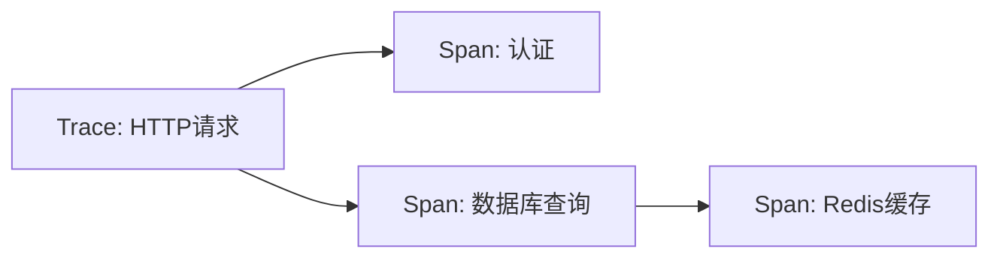
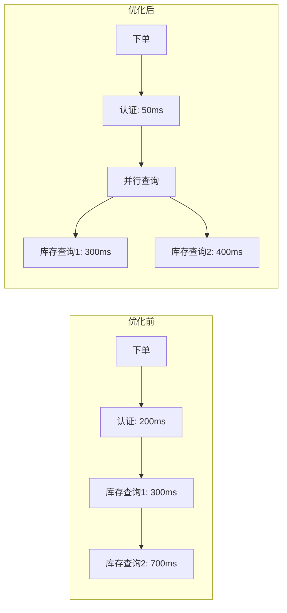

# 性能监控

## 简介

性能监控是分布式系统开发中不可或缺的一环，它帮助开发者识别瓶颈、优化资源分配并提升用户体验。Jaeger作为一款开源的分布式追踪系统，能够可视化请求链路，分析延迟问题。本文将介绍如何利用Jaeger进行性能监控，适合初学者快速上手。

---

## 核心概念

### 1. 追踪（Trace）与跨度（Span）
- **Trace**：代表一个完整的请求流程，由多个**Span**组成。<br />
- **Span**：单个操作（如API调用、数据库查询）的记录，包含时间戳、标签和日志。



### 2. 性能监控指标
- **延迟（Latency）**：请求从发起到完成的时间。
- **吞吐量（Throughput）**：单位时间处理的请求数。
- **错误率（Error Rate）**：失败请求的占比。

---

## 实践步骤

### 1. 安装与配置Jaeger
通过Docker快速启动Jaeger：
```bash
docker run -d --name jaeger \
  -p 16686:16686 \
  -p 6831:6831/udp \
  jaegertracing/all-in-one:latest
```

### 2. 代码示例：添加追踪
以下是一个Python Flask应用的示例，使用`jaeger-client`库：

```python
from jaeger_client import Config
from flask import Flask

app = Flask(__name__)

def init_tracer(service):
    config = Config(
        config={'sampler': {'type': 'const', 'param': 1}},
        service_name=service)
    return config.initialize_tracer()

tracer = init_tracer("my-flask-app")

@app.route("/")
def hello():
    with tracer.start_span('hello-request') as span:
        span.log_kv({'event': 'request_start'})
        return "Hello, World!"
```

**输出效果**：在Jaeger UI（`http://localhost:16686`）中查看请求链路和耗时。

:::tip
确保在代码中为关键操作（如数据库调用）添加Span，以细化监控粒度。
:::

---

## 实际案例：电商系统优化

### 问题场景
用户反馈“下单接口”响应慢，通过Jaeger分析发现：
1. 认证服务耗时200ms（预期50ms）。
2. 库存查询串行执行，总延迟高达1秒。

### 优化方案
1. **并行化调用**：将库存查询改为并行。
2. **缓存认证结果**：减少重复计算。

优化后追踪对比：


---

## 总结

- **性能监控的价值**：定位瓶颈、验证优化效果、提升系统可靠性。
- **Jaeger的核心功能**：分布式追踪、可视化分析、多语言支持。

### 扩展练习
1. 在本地部署Jaeger并集成到你的项目中。
2. 尝试为数据库查询添加Span，并分析耗时分布。

### 附加资源
- [Jaeger官方文档](https://www.jaegertracing.io/docs/)
- 《分布式系统观测：可观测性实践指南》

:::caution
避免在生产环境使用`const`采样（示例中为演示方便），建议根据负载动态调整采样率。
:::