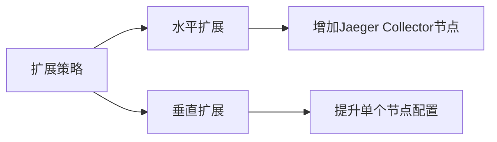

# 容量规划

## 介绍
容量规划是分布式追踪系统（如Jaeger）性能优化的核心环节，它通过科学估算系统资源需求（CPU、内存、存储等），确保系统在高负载下稳定运行。对于初学者来说，理解容量规划能帮助你在部署和运维Jaeger时避免资源浪费或性能瓶颈。

:::tip 关键目标
- 预测资源需求
- 避免过度配置（节省成本）
- 防止资源不足（保障稳定性）
:::

---

## 基础概念

### 1. 核心指标
Jaeger的容量规划主要关注以下指标：
- **吞吐量**：每秒处理的Span数量（Spans/sec）
- **存储需求**：Span数据占用的磁盘空间
- **资源利用率**：CPU、内存、I/O的消耗情况

### 2. 计算公式
基础资源估算公式：
```
所需存储（GB）= 平均Span大小（KB） × 每日Span数量 × 保留天数 ÷ 1024 ÷ 1024
```

---

## 实战示例

### 案例：电商平台容量规划
假设一个电商平台每日产生 `1亿` 条Span：
- 平均Span大小：`2KB`
- 数据保留周期：`7天`

存储需求计算：
```python
span_size_kb = 2
spans_per_day = 100_000_000
retention_days = 7

storage_gb = (span_size_kb * spans_per_day * retention_days) / (1024 * 1024)
print(f"所需存储: {storage_gb:.2f} GB")  # 输出: 1335.14 GB
```

:::note 输出结果
```
所需存储: 1335.14 GB
```
:::

---

## 扩展策略

### 水平扩展 vs 垂直扩展


### 推荐方案
- **短期爆发流量**：使用自动伸缩组（如Kubernetes HPA）
- **长期增长**：预先扩容存储集群（如Cassandra/Elasticsearch分片）

---

## 常见陷阱

:::warning 注意
1. **忽视采样率**：若采样率从1%调整为100%，存储需求可能暴增100倍
2. **低估元数据开销**：Jaeger的Tag和Process信息会额外占用20%~30%空间
3. **未监控实际使用**：需定期检查 `jaeger_collector_spans_received` 等指标
:::

---

## 总结
容量规划需要结合历史数据和业务增长预测。建议：
1. 从低采样率（如1%）开始监控
2. 定期审查资源使用情况
3. 使用Jaeger自带的指标接口（如 `/metrics`）

## 延伸练习
1. 使用Prometheus记录Jaeger的 `spans_received_total` 指标，绘制7天趋势图
2. 尝试在本地用Docker部署Jaeger，模拟不同Span吞吐量下的CPU消耗

## 资源推荐
- [Jaeger官方文档：生产建议](https://www.jaegertracing.io/docs/latest/deployment/)
- 《SRE实战》第10章：容量规划原则
