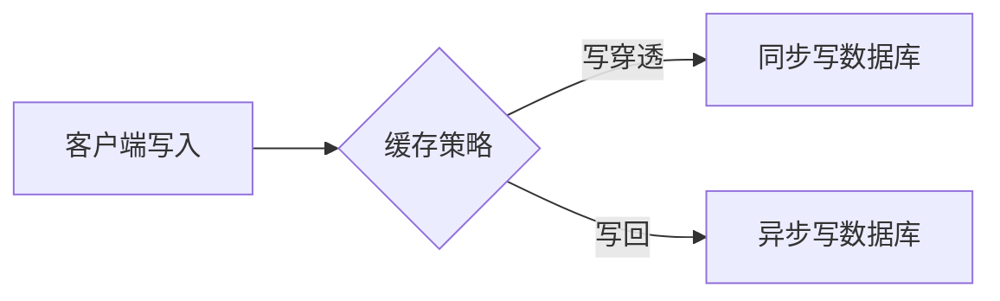

# 缓存策略

缓存是提升系统性能的关键技术之一，尤其在分布式追踪系统（如Jaeger）中，合理使用缓存能显著降低数据库压力并加快查询响应。本文将介绍缓存的基本原理、常见策略及在Jaeger中的实际应用。

## 什么是缓存？

缓存是一种临时存储数据的机制，用于保存频繁访问或计算成本高的数据副本。当后续请求需要相同数据时，系统可以直接从缓存中读取，而无需重复计算或访问原始数据源（如数据库）。

:::note 缓存的核心目标
- **减少延迟**：缓存通常位于更快的存储介质（如内存）中。
- **降低负载**：避免重复访问慢速后端（如磁盘或远程服务）。
:::

---

## 常见缓存策略

### 1. 最近最少使用（LRU）

LRU（Least Recently Used）会优先淘汰最久未被访问的数据。以下是Python的简单实现示例：

```python
from collections import OrderedDict

class LRUCache:
    def __init__(self, capacity):
        self.cache = OrderedDict()
        self.capacity = capacity

    def get(self, key):
        if key not in self.cache:
            return -1
        self.cache.move_to_end(key)  # 标记为最近使用
        return self.cache[key]

    def put(self, key, value):
        if key in self.cache:
            self.cache.move_to_end(key)
        self.cache[key] = value
        if len(self.cache) > self.capacity:
            self.cache.popitem(last=False)  # 移除最旧条目
```

**输入/输出示例**：
```python
cache = LRUCache(2)
cache.put(1, "Jaeger-Span-Data")
cache.put(2, "Trace-Metadata")
print(cache.get(1))  # 输出: "Jaeger-Span-Data"
cache.put(3, "New-Trace")      # 超出容量，淘汰key=2
print(cache.get(2))  # 输出: -1（已淘汰）
```

### 2. 写入策略

#### 写穿透（Write-Through）
数据同时写入缓存和后端存储，保证一致性但写入延迟较高。

#### 写回（Write-Back）
数据先写入缓存，稍后异步写入后端，性能更好但存在数据丢失风险。



---

## Jaeger 中的缓存实践

Jaeger在以下场景使用缓存优化性能：

### 案例：追踪数据查询
当用户频繁查询同一TraceID时，Jaeger可以将结果缓存在内存中：

```go
// 伪代码示例：使用Go的sync.Map实现简单缓存
var traceCache sync.Map

func GetTrace(traceID string) (*Trace, error) {
    if cached, ok := traceCache.Load(traceID); ok {
        return cached.(*Trace), nil
    }
    trace := fetchFromStorage(traceID)  // 昂贵操作
    traceCache.Store(traceID, trace)
    return trace, nil
}
```

:::tip 实际优化技巧
- 对**高频访问的小型数据**（如服务名列表）使用内存缓存
- 为缓存设置**合理的TTL**，避免内存泄漏或脏数据
:::

---

## 总结与练习

### 关键点总结
1. 缓存通过存储副本数据减少计算/IO开销
2. LRU等淘汰策略平衡缓存命中率与内存使用
3. 写入策略需在性能与一致性间权衡

### 练习建议
1. 实现一个支持TTL的缓存类，自动过期旧数据
2. 在Jaeger本地部署中，尝试调整`--query.max-clock-skew-adjustment`参数观察缓存效果

### 扩展阅读
- 《Designing Data-Intensive Applications》第3章
- Jaeger官方文档中的性能调优指南