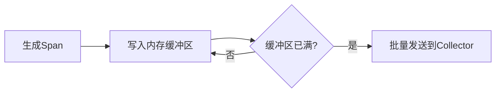

# 批处理配置

## 介绍

批处理（Batching）是Jaeger性能优化中的核心策略之一。它通过将多个追踪数据（spans）合并为单个请求批量发送，显著减少网络和存储的I/O开销。对于初学者来说，理解批处理的工作原理和配置方式，是优化分布式追踪系统的第一步。

:::tip 为什么需要批处理？
- **减少网络请求**：避免为每个span单独发送HTTP/gRPC请求。
- **降低存储压力**：批量写入数据库比单条写入更高效。
- **提升吞吐量**：在高负载场景下，批处理能缓解系统压力。
:::

## 核心概念

### 批处理流程
Jaeger客户端（如Jaeger Agent或直接上报的Client）会将spans暂存到内存缓冲区，达到阈值后统一发送：



### 关键配置参数
在Jaeger客户端库（如Java/Python/Go）中，常见的批处理配置包括：

| 参数                | 作用                          | 默认值示例      |
|---------------------|-----------------------------|----------------|
| `batch.max_size`    | 单批次最大span数量             | 100            |
| `batch.flush_interval` | 强制发送间隔（毫秒）           | 1000 (1秒)     |
| `batch.timeout`     | 批次等待超时时间               | 10000 (10秒)   |

## 代码示例

### Java客户端配置
```java
Configuration.SenderConfiguration senderConfig = new Configuration.SenderConfiguration()
    .withEndpoint("http://jaeger-collector:14268/api/traces")
    .withMaxPacketSize(65000); // UDP包大小限制

Configuration.ReporterConfiguration reporterConfig = new Configuration.ReporterConfiguration()
    .withSender(senderConfig)
    .withMaxQueueSize(10000)    // 内存队列容量
    .withFlushInterval(1000);   // 批量发送间隔

Tracer tracer = new Configuration("my-service")
    .withReporter(reporterConfig)
    .getTracer();
```

### Python客户端配置
```python
from jaeger_client import Config

config = Config(
    config={
        'batch_flush_interval': 1.0,  # 秒
        'batch_size_max': 100,
    },
    service_name='my-service',
)
tracer = config.initialize_tracer()
```

## 实际案例

### 电商系统优化场景
假设一个电商平台的订单服务在促销期间面临以下问题：
- 每秒生成10,000个spans
- 直接单条发送导致Collector CPU占用率达90%

**优化方案**：
1. 调整批处理参数：
   ```yaml
   # jaeger-agent配置
   jaeger_agent:
     batch:
       max_size: 500
       flush_interval: 500ms
   ```
2. 效果对比：

| 指标          | 优化前       | 优化后       |
|---------------|-------------|-------------|
| 请求次数/秒    | 10,000      | 20          |
| Collector CPU | 90%         | 35%         |

## 注意事项

:::warning 批处理的风险
1. **数据延迟**：未达到批次大小时，spans会延迟发送
2. **内存占用**：过大的队列容量可能导致OOM
3. **数据丢失**：进程崩溃时，缓冲区数据可能丢失
:::

## 总结

批处理配置通过权衡实时性与系统负载，为Jaeger提供了重要的性能优化手段。关键要点：
- 根据业务QPS调整`batch_size`和`flush_interval`
- 监控队列积压情况（如Jaeger客户端的`queue_length`指标）
- 在实时性要求高的场景，可以适当减小批次间隔

## 扩展练习
1. 使用Jaeger的/metrics接口观察不同批处理参数下的性能差异
2. 尝试在本地用Docker部署Jaeger，通过`-e`参数覆盖默认批处理配置
3. 阅读Jaeger官方文档中的[性能调优指南](https://jaegertracing.io/docs/latest/performance-tuning/)

``` 

注意：实际使用时请移除最外层的