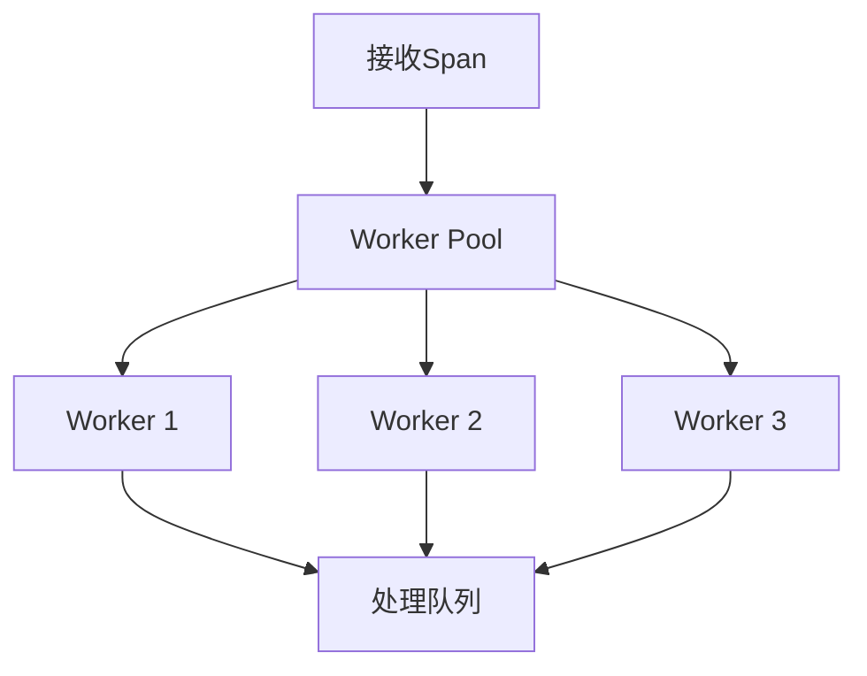

# CPU使用优化

## 介绍

在分布式系统中，Jaeger作为一款流行的追踪工具，其性能直接影响系统的整体表现。CPU使用优化是提升Jaeger性能的关键环节之一。本文将介绍如何通过配置调整、代码优化和资源管理来降低Jaeger的CPU占用率，适合初学者理解基础概念和实践方法。

---

## 为什么需要优化CPU使用？

Jaeger在收集、处理和存储追踪数据时可能消耗大量CPU资源，尤其是在高负载场景下。优化CPU使用可以：
- 降低系统延迟
- 提高吞吐量
- 减少基础设施成本
- 增强系统稳定性

---

## 基础优化策略

### 1. 采样率调整

通过合理设置采样率，减少不必要的追踪数据处理：

```go
// 示例：设置概率采样率为10%
sampler := jaeger.NewProbabilisticSampler(0.1)
tracer, err := cfg.NewTracer(
    config.Sampler(sampler),
)
```

:::tip
对于生产环境，通常建议从低采样率(如1%)开始，根据系统负载逐步调整。
:::

### 2. 批量处理优化

Jaeger客户端默认会批量发送span数据。调整批量大小和间隔可以平衡延迟和CPU使用：

```yaml
# jaeger-agent配置示例
processor:
  jaeger-compact:
    server:
      host-port: ":6831"
    workers: 4
    queue-size: 1000
    batch-size: 100
    batch-flush-interval: "1s"
```

---

## 高级优化技术

### 3. 减少序列化开销

Span数据的序列化/反序列化是CPU密集型操作。考虑以下优化：

```go
// 使用更高效的序列化格式
import "github.com/jaegertracing/jaeger/model/json"

// 替代默认的JSON编码
spanEncoder := json.NewSpanEncoder()
```

### 4. 并发处理优化



通过调整worker数量匹配CPU核心数：

```go
// 设置处理worker数量为CPU核心数的75%
numWorkers := int(float64(runtime.NumCPU()) * 0.75)
```

---

## 真实案例：电商平台优化

某电商平台在黑色星期五期间遇到Jaeger Collector CPU使用率过高问题，通过以下步骤解决：

1. **问题诊断**：使用 `pprof` 发现序列化占用40% CPU
2. **解决方案**：
   - 将JSON编码改为ProtoBuf
   - 增加批量处理大小从50到200
   - 调整采样率从100%到20%
3. **结果**：CPU使用降低65%，系统稳定性显著提升

:::caution
优化后务必进行负载测试，确保不影响关键业务追踪。
:::

---

## 监控与调优

持续监控关键指标：
- `jaeger_collector_cpu_usage`
- `jaeger_processor_spans_processed`
- `jaeger_queue_length`

使用Prometheus配置示例：

```yaml
scrape_configs:
  - job_name: 'jaeger'
    static_configs:
      - targets: ['jaeger-collector:14269']
```

---

## 总结

CPU使用优化是Jaeger性能调优的重要组成部分。关键要点包括：
- 合理设置采样率
- 优化批量处理参数
- 选择高效序列化格式
- 匹配并发度与硬件资源

## 延伸学习

1. Jaeger官方文档中的[性能调优指南](https://www.jaegertracing.io/docs/performance-tuning/)
2. 使用 `pprof` 进行CPU性能分析
3. 分布式系统追踪的最佳实践

**练习**：在测试环境中部署Jaeger，尝试调整采样率和批量大小，观察CPU使用率的变化。