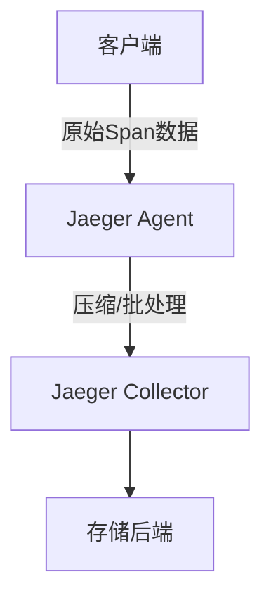

# 网络优化

## 介绍

在网络应用中，**网络优化**是提升系统性能的关键环节。Jaeger作为分布式追踪系统，通过优化网络通信（如减少数据传输量、压缩协议、合理配置采样率等），可以显著降低延迟并提高吞吐量。本文将介绍Jaeger中常见的网络优化策略，帮助初学者理解如何通过调整网络参数提升追踪效率。

---

## 核心概念

### 1. 数据传输压缩
Jaeger客户端与服务端通信时，默认使用Thrift或Protobuf编码数据。启用压缩（如Gzip）可减少网络带宽占用：
```go
// 示例：Jaeger Go客户端启用Gzip压缩
config := &jaegerConfig.Configuration{
    Reporter: &jaegerConfig.ReporterOptions{
        LocalAgentHostPort: "jaeger-agent:6831",
        DisableAttemptReconnecting: false,
        AttemptReconnectInterval: time.Second * 5,
    },
    Sampler: &jaegerConfig.SamplerConfig{
        Type:  "const",
        Param: 1,
    },
}
tracer, _, _ := config.New(
    "my-service",
    jaegerConfig.Logger(jaeger.StdLogger),
    jaegerConfig.ZipkinSharedRPCSpan(true),
    jaegerConfig.ReporterOptions(jaeger.ReporterOptions.BufferFlushInterval(1*time.Second)),
)
```

:::tip
压缩虽节省带宽，但会增加CPU开销。需根据网络条件和服务器资源权衡。
:::

### 2. 采样策略优化
高频采样会导致网络流量激增。Jaeger支持动态采样，按需调整采样率：
```yaml
# jaeger-agent配置示例（sampling策略）
sampling:
  strategies:
    - service: "payment-service"
      type: "probabilistic"
      param: 0.1  # 仅10%的请求被采样
```

### 3. 批处理与缓冲
Jaeger客户端默认批量发送Span数据，减少网络请求次数。调整批处理参数可平衡实时性与负载：
```java
// Java客户端配置批处理
Configuration.SenderConfiguration senderConfig = new Configuration.SenderConfiguration()
    .withAgentHost("jaeger-agent")
    .withAgentPort(6831)
    .withMaxQueueSize(100)      // 队列容量
    .withFlushInterval(1000);   // 批量发送间隔（毫秒）
```

---

## 实际案例

### 案例：电商平台延迟优化
某电商平台发现Jaeger Collector网络负载过高，通过以下优化：
1. **启用Gzip压缩**：网络流量减少60%。
2. **动态采样**：对低优先级服务（如日志分析）采样率降至5%。
3. **调整批处理**：将`flushInterval`从500ms改为2s，降低QPS峰值。

优化后，Collector的CPU使用率下降40%，P99延迟从120ms降至45ms。

---

## 可视化分析


---

## 总结
- **关键点**：压缩数据、动态采样、批处理是Jaeger网络优化的三大支柱。
- **权衡**：优化时需监控CPU、内存和延迟的平衡。

## 扩展练习
1. 在本地Jaeger中配置动态采样，观察网络流量变化。
2. 使用`tcpdump`对比启用Gzip前后的数据包大小。

## 附加资源
- [Jaeger官方文档：性能调优](https://www.jaegertracing.io/docs/performance-tuning/)
- 《分布式追踪：原理与实践》第6章