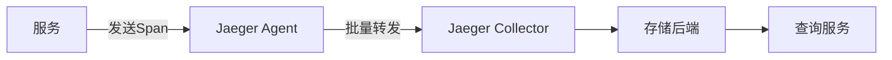
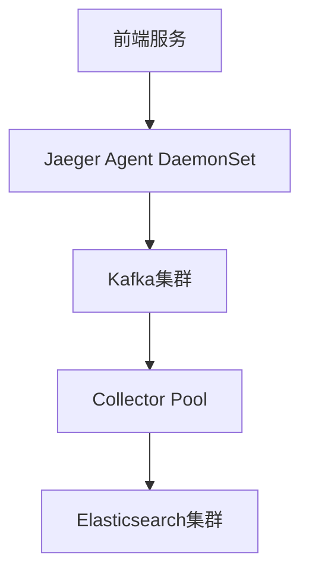

# Jaeger 最佳实践：生产环境部署

## 简介

在生产环境中部署Jaeger需要特别关注可靠性、性能和安全性。与开发环境不同，生产环境需要处理高流量、保证数据持久化，并与其他系统安全集成。本文将指导您完成从架构设计到监控的完整部署流程。

## 架构选择

Jaeger支持多种部署模式，生产环境通常选择以下两种：



### 1. 直接存储模式
- **适用场景**：中小规模部署
- **特点**：Collector直接写入Elasticsearch/Cassandra
- **示例配置：
```yaml
# jaeger-collector.yaml
collector:
  options:
    es:
      server-urls: http://elasticsearch:9200
```

### 2. Kafka缓冲模式
- **适用场景**：大规模高流量环境
- **特点**：通过Kafka解耦收集和存储过程
```yaml
# 带Kafka的配置示例
collector:
  options:
    kafka:
      producer:
        brokers: "kafka:9092"
```

:::tip 选择建议
- 日Span量 < 千万：直接存储模式
- 日Span量 > 千万：Kafka缓冲模式
:::

## 关键配置项

### 存储后端配置（以Elasticsearch为例）
```yaml
storage:
  type: elasticsearch
  elasticsearch:
    servers: http://es1:9200,http://es2:9200
    index-prefix: jaeger
    username: "生产环境用户名"
    password: "${ES_PASSWORD}"  # 推荐使用环境变量
```

### 采样策略配置
生产环境推荐动态采样：
```json
// sampling.json
{
  "default_strategy": {
    "type": "probabilistic",
    "param": 0.01
  },
  "service_strategies": [
    {
      "service": "payment",
      "type": "probabilistic",
      "param": 0.1
    }
  ]
}
```

## 安全实践

### 1. 传输加密
```yaml
# 启用TLS的Agent配置
agent:
  tls:
    enabled: true
    cert: /path/to/cert.pem
    key: /path/to/key.pem
```

### 2. 存储隔离
```sql
-- 为Jaeger创建专用数据库用户
CREATE USER jaeger WITH PASSWORD 'complexpassword';
GRANT SELECT, INSERT ON spans TO jaeger;
```

## 监控与维护

### 健康检查端点
```bash
# 检查Collector状态
curl http://jaeger-collector:14269/health
```

### 关键监控指标
| 指标名称                | 告警阈值          | 说明                  |
|-----------------------|------------------|---------------------|
| collector.spans.received | > 10,000/min     | 接收Span速率过高警告    |
| storage.write-errors  | > 5/min          | 存储写入失败            |

## 真实案例：电商平台部署

**场景**：某电商平台在黑色星期五期间部署Jaeger：

1. **架构**：采用Kafka缓冲模式，3个Collector实例
2. **采样**：
   - 核心支付服务：100%采样
   - 商品服务：1%采样
3. **扩展**：基于CPU利用率自动扩展Collector Pods



## 总结

生产环境部署Jaeger需要：
- 根据流量选择合适的架构模式
- 配置适当的采样策略平衡开销和可见性
- 实施严格的安全控制
- 建立完善的监控体系

## 延伸学习

1. **官方文档**：[Jaeger Production Guidelines](https://www.jaegertracing.io/docs/latest/deployment/)
2. **练习**：
   - 在Minikube中部署带Kafka的Jaeger
   - 配置动态采样策略并观察效果
3. **工具推荐**：
   - `jaeger-operator`：Kubernetes环境下的部署工具
   - `spark-dependencies`：生成服务依赖图

:::caution 注意事项
- 生产环境务必禁用调试接口(`--admin.http.host-port=:0`)
- 定期清理旧数据(设置`ES_TTL`环境变量)
:::